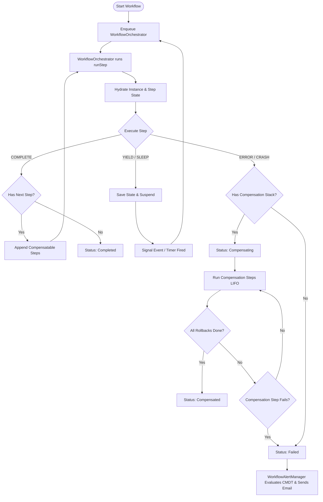

# Revenant: Durable Workflow Engine for Salesforce

Revenant is a native, database-backed durable execution engine for Salesforce Apex, inspired by Temporal and DBOS. By orchestrating native platform features—Queueable Apex, Platform Events, Transaction Finalizers, and Apex Cursors—Revenant allows developers to build complex, reliable, and resumable state machines that survive transaction failures, governor limit exhaustion, and platform limits.


---

## Key Features

### Core Orchestration

- **Resumable Execution (Yielding)**: Long-running processing loops or query pagination steps can call `shouldYield()` to monitor governor limits. If limits are exceeded, the step checkpoints its state to custom objects and resumes execution transparently in a fresh asynchronous transaction.
- **Scatter-Gather (Parallel Processing)**: Split execution flow across multiple parallel branches and rejoin their output payloads before moving to subsequent steps.
- **Continue-As-New (Perpetual Loops)**: Execute perpetual poller tasks or long-lived daemons. A step can request a transition to a new successor run linked via `Previous_Instance__c` to prevent storage footprint explosion and clear heap and debug log limits.

### Fault Tolerance & Safety

- **Distributed Transaction Rollbacks (Sagas)**: Steps implementing [CompensatableStep](force-app/main/default/classes/CompensatableStep.cls) register on a LIFO rollback stack upon successful forward completion. If a forward step fails permanently, the engine automatically executes their `compensate` methods in reverse order.
- **Watchdog Step Timeouts**: Steps can declare custom execution timeouts. A single global watchdog poller ([WorkflowWatchdog](force-app/main/default/classes/WorkflowWatchdog.cls)) sweeps the database for any timed-out steps or suspended instances, failing or resuming them cleanly without hitting Salesforce's 100 concurrent scheduled jobs limit.
- **Large Payload Offloading**: When input, output, or state serialization strings exceed 100,000 characters (approaching the 131,072-character long text area limit), the engine transparently offloads the payload to `ContentVersion` files and links them to the parent instance.

### Integration & Monitoring

- **Platform Event Signaling**: External integrations, webhook listeners, or human-in-the-loop approvals wake up suspended workflows by publishing `Workflow_Event__e` platform events. The resuming step reads the inbound signal name and payload directly from `StepContext` (e.g. `ctx.getSignal('Approve:Order')`), and the engine marks observed signals consumed at the step's `COMPLETE` transition so at-least-once redelivered duplicates are never double-processed.
- **Salesforce Flow Interoperability**: Launches or signals workflows using Invocable Actions from Salesforce Flow, or executes standard Autolaunched Flows as steps within a workflow using the generic `WorkflowFlowStep` wrapper.
- **Custom Metadata Alerts**: Supports operator-configurable failure notification thresholds (consecutive failures, sliding rate counts) using `Workflow_Alert_Config__mdt` custom metadata records.

---

## System Architecture



---

## Developer Guide

### 1. Define a Step

To create a step, implement the [WorkflowStep](force-app/main/default/classes/WorkflowStep.cls) interface (or [CompensatableStep](force-app/main/default/classes/CompensatableStep.cls) if rollback logic is required):

```java
public class ProvisionSandboxStep implements CompensatableStep {

    /**
     * Executes forward step logic.
     */
    public StepResult execute(StepContext ctx) {
        // Business logic execution
        String sandboxId = 'sb_98765';

        // Return COMPLETE action and output payload
        return StepResult.complete(null, new Map<String, Object>{'sandboxId' => sandboxId});
    }

    /**
     * Executes rollback logic if a subsequent step in the DAG fails.
     */
    public StepResult compensate(StepContext ctx) {
        // Hydrate forward step state from the context
        Map<String, Object> state = (Map<String, Object>)JSON.deserializeUntyped(ctx.stepStateJson);
        String sandboxId = (String)state.get('sandboxId');

        // De-provision resources
        System.debug('Deprovisioning sandbox: ' + sandboxId);
        return StepResult.complete(null, 'Deprovisioned');
    }
}
```

### 2. Define the Workflow DAG

Create a class implementing [WorkflowDefinition](force-app/main/default/classes/WorkflowDefinition.cls) to model step transitions:

```java
public class OnboardingWorkflow implements WorkflowDefinition {

    /**
     * Declares the complete list of steps involved in the workflow.
     */
    public List<String> getSteps() {
        return new List<String>{
            'VerifyOrderStep',
            'ProvisionSandboxStep',
            'SendWelcomeEmailStep'
        };
    }

    /**
     * Designates the starting step.
     */
    public String getInitialStep() {
        return 'VerifyOrderStep';
    }

    /**
     * Determines the next transition step based on the outcome of the active step.
     */
    public String getNextStep(String currentStepName, StepResult result) {
        if (currentStepName == 'VerifyOrderStep') {
            return 'ProvisionSandboxStep';
        }
        if (currentStepName == 'ProvisionSandboxStep') {
            return 'SendWelcomeEmailStep';
        }
        return null; // Null indicates terminal completion
    }
}
```

### 3. Initiate Execution

Execute the workflow asynchronously from any Apex context (Triggers, Controllers, or Queueables):

```java
// Parameters: WorkflowDefinition ClassName, Unique Correlation Key, JSON Input
Id instanceId = WorkflowEngine.start(
    'OnboardingWorkflow',
    'Opp_Onboarding_006As00000abcde',
    '{"accountId": "001As0000012345", "vipOnboarding": true}'
);
```

### 4. Read Inbound Signals & Approvals

A step that suspends for an approval (`StepResult.waitForApproval(...)`) or an external event (`StepResult.suspend()`) is woken by `WorkflowEngine.signal(keyOrId, name, payload)` (or a `SIGNAL:`-typed `Workflow_Event__e`). On resume, the step reads the signal that woke it directly from `StepContext` — no SOQL against engine-internal objects, and no hand-rolled "consumed" marker:

```java
public StepResult execute(StepContext ctx) {
    // Most recent signal of this name; never null.
    StepContext.Signal decision = ctx.getSignal('Approve:Order');

    if (!decision.isPresent()) {
        // First run (or resumed by a timer): nothing has signaled us yet.
        return StepResult.waitForApproval('Order', 'Manager');
    }

    Map<String, Object> payload =
        (Map<String, Object>) JSON.deserializeUntyped(decision.payload);
    Boolean approved = (Boolean) payload.get('approved');

    return approved
        ? StepResult.complete('ApproveStep', payload)
        : StepResult.complete('RejectStep', payload);
}
```

Accessors available inside `execute()` and `compensate()`:

| Accessor | Returns |
| --- | --- |
| `ctx.getSignals()` | All pending signals, in arrival order (never null). |
| `ctx.getSignals(name)` | Pending signals matching `name`, in arrival order. |
| `ctx.getSignal(name)` | The most recent pending signal of `name`, or a clean empty result (`isPresent() == false`, `payload == null`) when none is pending — never null. |
| `ctx.hasSignal(name)` | `true` if any pending signal matches `name`. |

Consumption is engine-managed and tied to the step's successful `COMPLETE` (or `SPLIT`) transition: signals the step observes are marked consumed only once the step completes, so a step that yields or retries before completing re-observes the same pending signal, and an at-least-once redelivered duplicate cannot be reprocessed by a later step. Transitions that suspend and **re-run the same step** — `SUSPEND`, `WAIT_FOR_APPROVAL`, `SLEEP`, and `START_CHILD` — intentionally do *not* consume, so the signal that resumes the step survives to be read. A `START_CHILD` step that also reads a kickoff signal should therefore check its child-completion signal before re-acting on the kickoff (or stash what it needs in step state). `Cancel` / `CancelWorkflow` control signals remain engine-handled and are never surfaced as readable payloads. See [`ApprovalSignalWorkflowExample`](examples/main/default/classes/ApprovalSignalWorkflowExample.cls) for a complete approve/reject example with a redelivery test.

#### Reading signals inside parallel branches

When a step reads a signal while running as one branch of a parallel (scatter-gather) fan-out, the engine **atomically claims** each signal it reads (moving it to an internal `Processing` state) so two concurrent branches can never both process the same payload; the claim is promoted to consumed when the branch completes, and rolled back if the branch yields/suspends/retries. Each branch consumes (and rolls back) only the signals it itself claimed, tracked per row, so it never disturbs a signal a sibling has claimed or merely observed. A parallel instance suspended on a signal is resumed branch-by-branch when the signal arrives, and a bulk signal to many parallel instances wakes their branches with a single platform-event publish.

Claims are bounded for governor safety: a single branch claims at most a few thousand signal rows and issues a bounded number of claim statements/queries per execution. A pathological fan-in that reads far beyond those bounds (thousands of pending rows, or hundreds of distinct names in one branch) degrades the overflow reads to **at-least-once** (read without claiming) rather than failing, and same-name duplicate cleanup is skipped when a read was truncated so backlog rows the branch never saw are preserved for a later read.

Because claiming writes uncommitted DML, a parallel-branch step that makes an **HTTP callout whose endpoint or body comes from the signal payload** must implement the [`CalloutStep`](force-app/main/default/classes/CalloutStep.cls) marker. Such a step reads signals *without* claiming (at-least-once delivery instead of exactly-once), so the callout is legal; use distinct signal names per branch or idempotent callouts when relying on this mode.

---

## Operations & Alerting Configuration

Revenant supports Custom Metadata-driven failure alerting. Operators can configure notifications directly in Salesforce Setup without code modifications by creating **Workflow Alert Config** (`Workflow_Alert_Config__mdt`) records:

### Mapping Workflow Definitions to Alert Configurations

The engine maps a workflow's class name to a custom metadata record's `DeveloperName` (Workflow Alert Config Name) by replacing all non-alphanumeric characters (such as dots) with underscores:

- **Standard Class**: `OnboardingWorkflow` maps to `OnboardingWorkflow`
- **Inner Class / Nested Class**: `CalloutTimeoutWorkflowExample.CalloutWorkflow` maps to `CalloutTimeoutWorkflowExample_CalloutWorkflow`
- **Global Fallback**: If no specific configuration record matches a failing workflow, the engine automatically falls back to a record named **`Default`**.

### Configuration Fields

1.  **Email Recipients** (`Email_Recipients__c`): A comma- or semicolon-separated list of target email addresses (e.g., `ops@example.com, alerts@example.com`).
2.  **Enable Alerts** (`Enable_Alerts__c`): Checkbox to toggle notifications for this configuration.
3.  **Threshold Customization** (Optional - if left blank, alerts fire immediately on any failure):
    - `Consecutive_Failures_Limit__c`: Trigger email alerts only after `N` consecutive executions fail.
    - `Failure_Count_Limit__c` and `Time_Window_Minutes__c`: Trigger email alerts if `N` failures occur within a sliding window of `M` minutes.

---

## Directory Structure

- `force-app/main/default/` - Core Engine & UI Components
  - `classes/` - Framework classes, queueables, finalizers, and scheduling utilities.
  - `objects/` - Core database schemas (`Workflow_Instance__c`, `Workflow_Step_Execution__c`), Platform Events, and Custom Metadata Types.
  - `lwc/` - Responsive visual monitoring timeline dashboard.
- `examples/main/default/` - Reference Architectures
  - `classes/` - Onboarding, Saga rollback, version upgrades, Apex Cursor parallel processing, and HTTP Callout/Timeout Watchdog implementations.
  - `triggers/` - Opportunity stage triggers demonstrating automated workflow instantiation.

---

## Development & Testing

Deploy the codebase to a scratch org:

```bash
sf project deploy start
```

Run the suite of unit tests to verify orchestration safety, yielding limits, parallel forks, Saga compensations, and watchdog timeouts:

```bash
sf apex run test -w 10
```

---

## Watchdog Poller Scheduling (Hybrid Model)

Revenant implements a **Hybrid Watchdog Model** for high-precision, fail-safe step timeouts, sleeps, and retries:
1. **Dynamic High-Precision Scheduling**: When a step sleeps, retries, or registers a timeout, the engine dynamically schedules a seconds-level Apex job (`WorkflowSleepJob`, `WorkflowRetryJob`, or `WorkflowTimeoutJob`) to run immediately.
2. **Delayed Queueable Optimization**: For delays that fall between 1 and 10 minutes (multiples of 60 seconds), the engine automatically routes scheduling through **Delayed Queueables** (`System.enqueueJob(job, delayMinutes)`) instead of standard scheduled Apex. This consumes **0 scheduled job slots** while still executing precisely.
3. **Graceful Degradation (Overflow Protection)**: If the system has reached Salesforce's limit of 100 concurrent scheduled jobs, any failed `System.schedule` call falls back gracefully to tracking the timeout/sleep deadlines in the database (`Sleep_Until__c` and `Timeout_At__c`).
4. **Durable Safety Poller (Watchdog Workflow)**: A native, durable workflow (`WatchdogWorkflow`) runs perpetually (using continue-as-new) to sweep the database and resume/fail any instances that were not dynamically scheduled. Because it uses the Delayed Queueable optimization, the watchdog itself consumes **0 scheduled job slots** in production.

---

## Operator Configuration (Revenant Config)

Revenant settings can be configured without code modifications by editing the **Default** record of the **Revenant Config** (`Revenant_Config__mdt`) Custom Metadata Type:

1. **Use Dynamic Scheduling** (`Use_Dynamic_Scheduling__c` - Checkbox, default `true`):
   - **`true`**: The engine attempts precise, second-level scheduling via `System.schedule` first, falling back to the database watchdog only if limits are reached.
   - **`false`**: The engine completely bypasses `System.schedule` and writes all sleep/retry/timeout states directly to the database. All operations are then processed sequentially by the watchdog poller.
2. **Watchdog Delay Minutes** (`Watchdog_Delay_Minutes__c` - Number, default `10`):
   - The delay interval (between 1 and 10 minutes) before the watchdog enqueues its next self-chaining execution.

### Architectural Trade-offs

| Metric / Aspect | Dynamic Precise Scheduling (Default) | Watchdog-Only (`Use_Dynamic_Scheduling__c = false`) |
| :--- | :--- | :--- |
| **Precision** | High-precision (down to the second). | Delayed by up to the watchdog delay (e.g., 10 minutes). |
| **Latency** | Low-latency (runs immediately at target time). | Coarse-grained polling latency. |
| **Scheduled Job Slots** | Consumes 1 slot per active sleep/retry/timeout job (max 100 concurrent). | Consumes **0** scheduled job slots. |
| **Limit Vulnerability** | Vulnerable to hitting the 100 scheduled jobs limit in high-volume orgs. | Completely immune to the 100 scheduled jobs limit. |
| **Use Case** | Low-volume, time-sensitive or interactive workflows. | High-volume, non-interactive batch or transactional processing workflows. |

---

## System Doctor (Dashboard Monitoring)

The Workflow Dashboard includes a **System Doctor** tab to monitor limits, check configuration settings, and audit watchdog health:

* **Watchdog Health**: Indicates whether the self-chaining watchdog Queueable chain is active (`Running`) or has stalled (`Stopped`).
* **Bootstrap Action**: Includes an **Enqueue Watchdog** button to manually trigger and restart the Queueable chain if it ever halts (e.g., during major platform maintenance windows).
* **Limits Auditing**: Displays active `CronTrigger` utilization (against the 100-job limit) and pending database sweeps (sleeping instances and step timeouts).

---

## Production Scaling & Platform Event Subscriber Configuration

By default, Salesforce Platform Event triggers (like `WorkflowEventTrigger`) execute sequentially under the context of the **Automated Process** system user with a batch size of **2,000**. To scale throughput and ensure governor limit safety in high-volume environments, configure a **[PlatformEventSubscriberConfig](https://developer.salesforce.com/docs/atlas.en-us.platform_events.meta/platform_events/platform_events_ps_config.htm)** record for `WorkflowEventTrigger` via the Tooling or Metadata API.

### Key Tuning Parameters

1. **Parallel Subscriptions (Partitioning)**
   - **`NumPartitions`**: Scale throughput by setting this between `1` and `10` to process events concurrently in parallel execution streams.
   - **`PartitionKey`**: Set this to `Workflow_Instance_Id__c`. The platform hashes this key to distribute events across partitions, ensuring events for the *same* workflow instance are processed sequentially (in-order) to prevent race conditions, while different instances run concurrently.

2. **Batch Size Tuning**
   - **`batchSize`**: Set a smaller chunk size (e.g., `50` or `100`) instead of the default `2,000`. This reduces the risk of hitting CPU time, heap, or SOQL limits within a single trigger execution block.

3. **Running User Context**
   - **`userId`**: Triggers delegate step execution to Queueable Apex (`WorkflowOrchestrator`). By default, these run under the `Automated Process` user. While `autoproc` can be assigned Named Credential/External Credential access using Anonymous Apex (`insert new PermissionSetAssignment(...)`), you can optionally specify a dedicated integration `userId` here to run the subscriber trigger and Queueables under a standard user context.

---

## License

Licensed under either of

- Apache License, Version 2.0 ([LICENSE-APACHE](LICENSE-APACHE))
- MIT License ([LICENSE-MIT](LICENSE-MIT))

at your option.
