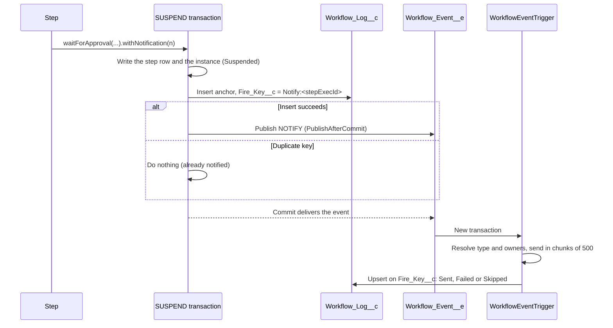

# Approver Notifications

Issue #123. A step that waits for a human can ask the engine to send a native Custom Notification (bell and mobile push). The engine sends it once for each logical suspend. You do not write `Messaging.*` code.

## Use

Add `withNotification(...)` to a `waitForApproval(...)` or `suspend(...)` result:

```java
public StepResult execute(StepContext ctx) {
    StepContext.Signal decision = ctx.signals().getSignal('Approve:PurchaseApproval');
    if (!decision.isPresent()) {
        return StepResult.waitForApproval('PurchaseApproval', null)
            .withNotification(
                WorkflowNotification.create('Purchase approval needed', 'Approve or reject the purchase.')
                    .toInputField('approverId')
            );
    }
    ...
}
```

`ApprovalWorkflowExample` is the reference.

## API

| Method | Effect |
|--------|--------|
| `WorkflowNotification.create(title, body)` | Makes a notification. Title: not blank, max 250 characters. Body: not blank, max 750 characters. |
| `.toRecipient(Id)` / `.toRecipients(Set<Id>)` | Static recipients: user, group or queue Ids. Max 500. |
| `.toInputField(key)` | The recipients in a top-level workflow input key. The value is one Id or a list of Ids. The engine reads it at the SUSPEND. It ignores a value that is not an Id. |
| `.toRecordOwner(recordId)` | The owner (user or queue) of a record. The engine reads the owner when it sends. The object must have `OwnerId`. |
| `.withTarget(recordId)` | The deep-link record. Default: the workflow instance. |
| `.withType(developerName)` | The `CustomNotificationType`. Default: `Revenant_Workflow_Notification`. |
| `StepResult.withNotification(n)` | Adds `n` to a SUSPEND or WAIT_FOR_APPROVAL result. Other actions, a null `n`, or no recipient source: `IllegalArgumentException`. |

You can use more than one recipient source. The engine sends to the union. For a large audience, use `toInputField` or a group. The engine sends in chunks of 500.

To read the request in a unit test, use `result.directive().notification`. See `ApprovalWorkflowExampleTest.testGateRequestsNotificationForApprover`.

## How it works



1. The SUSPEND handler writes the step row and the instance. Then, last, it calls `WorkflowNotifier.request`.
2. `request` inserts one anchor row in `Workflow_Log__c` (`Log_Type__c = Notification`, `Outcome__c = Requested`). The key is `Notify:<stepExecId>` in the unique `Fire_Key__c`. The insert uses `allOrNone = false`.
3. When the insert succeeds, `request` publishes one `NOTIFY` `Workflow_Event__e`.
4. `WorkflowEventTriggerHandler` sends `NOTIFY` events to `WorkflowNotifier.handleEvents` in a new transaction. It sends the notification. It sets the anchor row to `Sent`, `Failed` or `Skipped`.

## Once for each logical suspend

A logical suspend is one `Workflow_Step_Execution__c` row. A resume uses the same row again. A new visit of the step writes a new row.

| Case | Result |
|------|--------|
| `execute()` runs again before the SUSPEND commits (rollback, retry, crash) | The anchor row and the event roll back. Nothing is sent. The next run sends once. |
| A signal wakes the step and it suspends again on the same row | The anchor insert fails on the duplicate key. Nothing is sent. |
| An operator re-drive or resume that uses the same row | Nothing is sent. |
| A new visit of the step (a loop) | A new row. One new notification. |

You do not supply a dedup token.

## Fire-and-forget

- No notify code throws. A notify error never stops the SUSPEND, the signal wake or the trigger batch.
- Before its DML, `request` checks the DML budget. It keeps a reserve for later DML (10 statements, 20 rows). When the budget is low, it sends nothing.
- A publish error sets the anchor row to `Failed` (`Level__c = Error`).
- In the trigger, each request has its own `try`/`catch`.

`Outcome__c` values:

| Value | Meaning |
|-------|---------|
| `Requested` | The SUSPEND published the request. The trigger did not run yet. |
| `Sent` | The trigger sent the notification. |
| `Failed` | The publish or the send failed. `Message__c` has the reason: type not found, no recipient, or the error. |
| `Skipped` | `Send_Notifications__c` was off at send time. |

`Message__c` holds the request as JSON, with a `result` key after the send.

## Configuration

| Item | Default | Effect |
|------|---------|--------|
| `Revenant_Config__mdt.Send_Notifications__c` | on | Off: the engine publishes no request and writes no anchor row. A request that is already published is logged as `Skipped`. |
| `CustomNotificationType` `Revenant_Workflow_Notification` | shipped | Desktop and mobile. `force-app` deploys it. |

In an Apex test, set `WorkflowEngine.sendNotifications`.

## Prerequisites

- The recipient must have access to the target record to open the deep link. For the default target, give the recipient read access to `Workflow_Instance__c` (for example, the `Revenant_Operator` permission set).
- Mobile push needs the Salesforce mobile app with notifications on.
- The `WorkflowEventTrigger` runs as the Automated Process user. That user sends the notification. To use another user, set `userId` in a `PlatformEventSubscriberConfig` for `WorkflowEventTrigger`.

## Cost

On a SUSPEND with a notification:

- 0 SOQL.
- Max 3 DML statements and 3 DML rows: the anchor insert, the publish, and a status update only after a publish error.

A SUSPEND with no notification costs nothing.

In the trigger, for each batch: one SOQL for the types that are not in the cache, one SOQL for each object type of `toRecordOwner` records, and one upsert.

## Testing

Test context does not call `Messaging.CustomNotification.send()`. `WorkflowNotifier.sentNotifications` records each send call. `WorkflowNotifier.publishedEvents` records each request. A test cannot always query `CustomNotificationType`. Seed `WorkflowNotifier.typeIds` to test a `Sent` result. Else the row is `Failed` with "type not found".

## Known limits

- The notification links to the instance, not to a decision screen. Use a Flow screen, a quick action or the Signal Workflow invocable action to publish the decision.
- When a matching signal is already buffered, the step resumes at once. The approver still gets the notification.
- A send to more than 500 recipients uses more than one call. When a later call fails, the row is `Failed`, but the earlier recipients got the notification.
- Salesforce limits custom notifications for each org and each hour. A send over the limit is `Failed`.
- `CleanupWorkflow` does not delete the anchor rows. When it deletes the instance, the row stays with a blank instance lookup.
