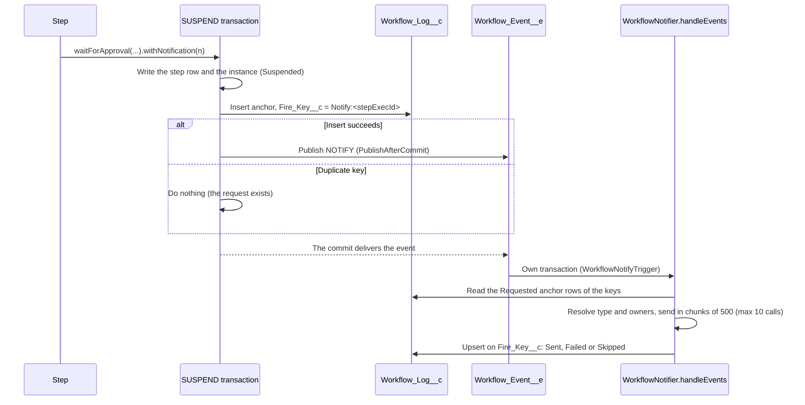

# Approver Notifications

Issue #123. A step that waits for a human can ask the engine to send a native Custom Notification (bell and mobile push). The engine sends it one time for each logical suspend. You do not write `Messaging.*` code.

## Use

Add `withNotification(...)` to a `waitForApproval(...)` or `suspend(...)` result:

```java
public StepResult execute(StepContext ctx) {
    StepContext.Signal decision = ctx.signals().getSignal('Approve:PurchaseApproval');
    if (!decision.isPresent()) {
        return StepResult.waitForApproval('PurchaseApproval', null)
            .withNotification(
                WorkflowNotification.create('Purchase approval needed', 'Approve or reject the purchase.')
                    .toInputKey('approverId')
            );
    }
    ...
}
```

`ApprovalWorkflowExample` is the reference. A `compensate()` method can also return a wait with a notification (for example, an approval before an undo). When the input has no `approverId`, the example sends the notification to the owner of the instance.

## API

| Method | Effect |
|--------|--------|
| `WorkflowNotification.create(title, body)` | Makes a notification. Title: not blank, maximum 250 characters. Body: not blank, maximum 750 characters. |
| `.toRecipient(Id)` / `.toRecipients(Set<Id>)` | Static recipients: user, group or queue Ids. Maximum 500. For more, use a public group. |
| `.toInputKey(key)` | The recipients in a top-level workflow input key. The value is one Id or a list of Ids. The engine reads it at the SUSPEND. |
| `.toRecordOwner(recordId)` | The owner (user or queue) of a record. The engine reads the owner when it sends. |
| `.withTarget(recordId)` | The deep-link record. Default: the workflow instance. |
| `.withNotificationType(developerName)` | The `CustomNotificationType`. Default: `Revenant_Workflow_Notification`. |
| `StepResult.withNotification(n)` | Adds `n` to a SUSPEND or WAIT_FOR_APPROVAL result. It throws `IllegalArgumentException` for another action, a null `n`, no recipient source, or a second call on the same result. |

The read accessors (`recipientIds`, `inputKeys`, `ownerRecordIds`) return copies.

You can use more than one recipient source. The engine sends one notification to each recipient from all sources.

The engine ignores these values:

- An input value that is not an Id.
- An Id that is not a user or group Id. A queue is a group.
- A record with no `OwnerId`, or a record that the engine does not find.

To read the request in a unit test, use `result.directive().notification`. See `ApprovalWorkflowExampleTest.testGateRequestsNotificationForApprover`.

## How it works



1. The SUSPEND handler writes the step row and the instance. Then, last, it calls `WorkflowNotifier.request`.
2. `request` inserts one anchor row in `Workflow_Log__c` (`Log_Type__c = Notification`, `Outcome__c = Requested`). The key is `Notify:<stepExecId>` in the unique `Fire_Key__c`. `Message__c` holds the request. The insert uses `allOrNone = false`.
3. When the insert succeeds, `request` publishes one `NOTIFY` `Workflow_Event__e`. The event holds only the key (`Idempotency_Key__c`).
4. `WorkflowNotifyTrigger` calls `WorkflowNotifier.handleEvents`. This trigger is a separate subscriber from the engine trigger (`WorkflowEventTrigger`). It runs in its own transaction with its own limits. The engine trigger ignores `NOTIFY` events.
5. `handleEvents` reads max 10 keys in a pass (the send-call cap). It reads the request from the `Requested` anchor row of each key, not from the event. An event with no such row sends nothing: a replay, a copy or a forged event. It sends only while the step waits. It makes max 10 send calls in a pass. It publishes the other keys again for a later pass. It sets each row to `Sent`, `Failed` or `Skipped`.

## One time for each logical suspend

A logical suspend is one `Workflow_Step_Execution__c` row. A resume uses the same row again. A new visit of the step writes a new row.

| Case | Result |
|------|--------|
| `execute()` runs again before the SUSPEND commits (rollback, retry, crash) | The anchor row and the event roll back. The engine sends nothing. The next run sends one time. |
| A signal wakes the step and it suspends again on the same row | The anchor insert fails on the duplicate key. The engine sends nothing. |
| An operator resume on the same row | The engine sends nothing. |
| The platform delivers the `NOTIFY` event again | The row is not `Requested`, or the copy is in the same pass. The engine sends nothing. |
| A user publishes a forged `NOTIFY` event | No `Requested` row has its key. The engine sends nothing. With a real key, the engine sends the content of the row, not of the event. |
| A new visit of the step (a loop) | A new row. One new notification. |
| A buffered signal wakes the instance in the SUSPEND transaction | The engine writes no request. When the step waits again, that suspend sends. |
| The step completes before the send | The step row is not `Pending`. The row is `Skipped`. The engine sends nothing. |
| A signal wakes the instance, but the step did not run again yet | The step row is `Pending` and the instance is active. The engine sends. A parallel instance is `Running` while a branch waits, so this is also a wait. |

You do not supply a dedup token.

A step that waits again on the same row with a new notification (for example, a second approval level in one step) does not send it. For a second notification, route to a new step.

## Fire-and-forget

- A notification error never stops the SUSPEND or the engine trigger. The notify trigger has its own transaction.
- Before its DML, `request` checks the DML budget. It keeps a reserve for later DML (10 statements, 20 rows). When the budget is low, `request` publishes no request and writes no row.
- When the anchor insert fails for a reason other than a duplicate key, `request` writes a `Notification` error row.
- A publish error sets the anchor row to `Failed` (`Level__c = Error`).
- In the trigger, each request has its own `try`/`catch`. A failed row update writes one error row.
- Before a send, the trigger claims the row (`Outcome__c = Sending`) and locks it (`FOR UPDATE`). It sends only the rows whose claim succeeded. A row whose claim failed waits for a later pass.
- The notify trigger checks its query and DML budget before it sends. When the budget is low, or an error occurs before the first send (for example, a row lock time-out), it throws `EventBus.RetryableException`: the platform delivers the batch again (max 5 times). It never throws after a send.
- When the type or owner queries cannot run, the requests wait for a later pass.
- When the publish for a later pass fails, the row is `Failed`.

`Outcome__c` values:

| Value | Meaning |
|-------|---------|
| `Requested` | The SUSPEND published the request. The trigger did not run yet. |
| `Sending` | The trigger claimed the row, then the send or the result update stopped. The engine never reads the row again, so it never sends it two times. |
| `Sent` | The platform accepted the send. It does not prove delivery. |
| `Failed` | The publish or the send failed. `Message__c` has the reason: type not found, no recipient, too many recipients, a request that is not readable, or the error. |
| `Skipped` | `Send_Notifications__c` was off at send time, or the wait ended before the send. |

`Message__c` holds the request as JSON. After the send, it also has a `result` key.

To see the notification state of an instance, query `Workflow_Log__c` where `Log_Type__c = 'Notification'`.

## Configuration

| Item | Default | Effect |
|------|---------|--------|
| `Revenant_Config__mdt.Send_Notifications__c` | on | Off: the engine publishes no request and writes no anchor row. A request that the engine published before is logged as `Skipped`. |
| `CustomNotificationType` `Revenant_Workflow_Notification` | shipped | Desktop and mobile. `force-app` deploys it. |

In an Apex test, set `WorkflowEngine.sendNotifications`.

## Prerequisites

- The recipient must have access to the target record to open the deep link. For the default target, give the recipient read access to `Workflow_Instance__c` (for example, the `Revenant_Operator` permission set).
- Mobile push needs the Salesforce mobile app with notifications on.
- `WorkflowNotifyTrigger` runs as the Automated Process user. That user sends the notification. A `PlatformEventSubscriberConfig` for `WorkflowNotifyTrigger` with a `userId` changes this user. It does not change the engine trigger.

## Cost

On a SUSPEND with a notification:

- 1 SOQL: the instance status after signal redelivery. When no SOQL is left, the engine writes no request.
- Maximum 3 DML statements and 3 DML rows: the anchor insert, the publish, and one update or error row only after an error.

A SUSPEND with no notification costs nothing.

In `WorkflowNotifyTrigger`, for each pass: one SOQL for the anchor rows, one SOQL for the step rows that still wait, one SOQL for the types that are not in the cache, one SOQL for each object type of `toRecordOwner` records, one claim update, one result update, max 10 send calls, and one publish for the keys that wait for a later pass. The trigger also runs for engine events. It ignores them.

## Data

- The title, body and recipient Ids are plaintext in `Workflow_Log__c.Message__c`. The payload codec does not encode them. Do not put sensitive data in the title or the body. The event holds only the key.
- `CleanupWorkflow` does not delete the anchor rows. When it deletes the instance, the row stays with a blank instance lookup. Each logical suspend with a notification adds one row. Delete old rows with your own retention job.

## Testing

Test context does not call `Messaging.CustomNotification.send()`. In the engine tests, `WorkflowNotifier.sentNotifications` records each send call and `WorkflowNotifier.publishedEvents` records each request. Seed `WorkflowNotifier.typeIds` to make a test independent of org metadata. When the engine does not find the type, the row is `Failed` with "type not found".

These members are `@TestVisible private`. In your own tests, read `result.directive().notification`.

## Known limits

- A signal can arrive after the SUSPEND commits and before the send. When the step did not run again yet, the approver still gets the notification. It opens the instance, which shows the new state.

- In rare cases a row stays `Requested` with no event (for example, a platform publish error after the commit). No sweep sends it again yet. See issue #274.

- The notification opens the instance or the target record, not a decision screen. Use a Flow screen, a quick action or the Signal Workflow invocable action to publish the decision.
- A send to more than 500 recipients uses more than one call. When a later call fails, the row is `Failed`, but the earlier recipients got the notification.
- One request can send to max 5,000 recipients (10 calls of 500). Else the row is `Failed`. For a larger audience, use a public group.
- `Message__c` holds max 131,000 characters. A `toInputKey` list of more than approximately 6,000 Ids makes the request not readable (`Failed`). For a large audience, use a public group.
- The engine does not parse a workflow input of more than 1,000,000 characters for `toInputKey`. Then the input gives no recipient.
- Salesforce limits custom notifications for each org and each hour (10,000). Over the limit, the platform can drop a notification. The row can still be `Sent`.
