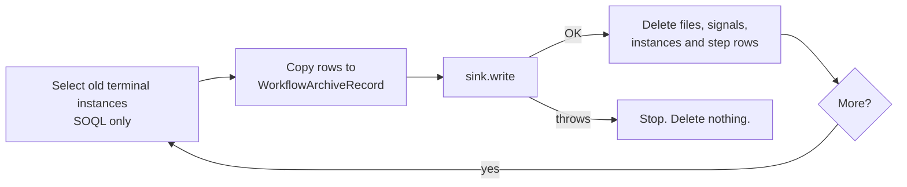

# Archive Before Purge

`CleanupWorkflow` deletes old terminal instances and their step history.
Archival copies that history to cold storage first. Cold storage does not use
primary data storage. Operators can read the history for years.

Archival is off by default. When it is off, `CleanupWorkflow` works as before.

## How it works



- The sweep selects `Completed`, `Failed`, `Compensated`, `Cancelled` and
  `ContinuedAsNew` instances that are older than the age threshold.
- Each batch has at most 20 instances and 1000 step rows. The first instance
  always goes, so the sweep moves forward.
- The sweep reads the rows. It never changes a `Workflow_Step_Execution__c`
  row. `Compensation_Stack__c` and `Terminal_At__c` do not change.
- The sweep runs as a workflow, not on the orchestrator hot path.

## Turn it on

Edit the **Default** record of `Revenant_Config__mdt`:

| Field | Value |
|---|---|
| `Archive_Enabled__c` | Checked. |
| `Archive_Sink__c` | Blank for `BigObjectArchiveSink`, or `CsvArchiveSink`, or your class. |
| `Archive_After_Days__c` | Default age for `ArchiveWorkflow`. Blank is 30. |

Then start the sweep. For example, schedule it once a day:

```apex
WorkflowEngine.start(
  'ArchiveWorkflow',
  'Archive_' + Date.today(),
  new Map<String, Object>{ 'archiveAfterDays' => 90 }
);
```

| Input | Default | Rule |
|---|---|---|
| `archiveAfterDays` | `Archive_After_Days__c`, else 30 | 0 or more |
| `batchSize` | 20 | More than 0. Maximum 20. |

`CleanupWorkflow` also archives first when archival is on. It uses its own
`retentionDays` input. So a scheduled cleanup never purges history that is
not archived.

## Read archived history

```apex
// By instance Id: one sink read.
WorkflowArchiveRecord r = WorkflowArchive.getArchivedHistory(instanceId);
for (WorkflowArchiveRecord.Step s : r.steps) {
  System.debug(s.sequence + ' ' + s.stepName + ' ' + s.status);
}

// By correlation key: at most 50 records.
List<WorkflowArchiveRecord> runs = WorkflowArchive.findArchivedHistory('order-42');
```

Reads work also when archival is off. A step has the same facts as
`WorkflowEngine.StepHistoryEntry`: name, status, attempt, start, end,
duration and the compensation flag. It also has the stored error details.

`isTruncated()` is true when the reader got fewer steps than the sweep
archived. The Big Object sink reads at most 10 000 rows in one call.

## Payload policy

| Data | Archive |
|---|---|
| Inline `Input__c`, `Output__c`, step `Error_Details__c` | Copied in stored form. Codec ciphertext stays ciphertext. |
| Offloaded payload (`{"$attachmentId":...}`) | Not copied. Replaced by `{"$archiveDropped":"offloaded payload not archived"}`. `droppedPayloadCount` counts it. |
| Offloaded `failureData` in `Error_Details__c` | The reason is kept. The data part is replaced by the marker and counted. |
| Step `Input__c`, `Output__c`, `Captured_Values__c`, signals | Not archived. `getHistory` does not show them either. |

The purge then deletes the engine files, as `CleanupWorkflow` does today.

## Shipped sinks

### `BigObjectArchiveSink` (default)

- `Workflow_Archive__b`: index (`Instance_Id__c`, `Sequence__c`). Row 0 is the
  instance. Rows 1 and up are the steps.
- `Workflow_Archive_Key__b`: index (`Key_Hash__c`, `Instance_Id__c`). A Big
  Object index holds at most 100 text characters, so the key is the SHA-256
  hex of the correlation key. Reads compare the full key.
- `insertImmediate` overwrites a row with the same index. A retry makes no
  duplicate.
- A read by Id uses 1 SOQL query. A read by key uses 2.

### `CsvArchiveSink`

- One CSV file (`ContentVersion`) for each instance. Files use file storage,
  not data storage.
- Title: `WorkflowArchive_<instanceId>_<correlationKey>`.
- The file is not linked to the instance, so the purge does not delete it.
- The sweep user owns the file. A reader needs file access, for example
  "Query All Files" or a library share.
- Format: see `WorkflowArchiveCsv`. A value that starts with `=`, `+`, `-`,
  `@`, a tab, a carriage return or `'` gets a `'` prefix, so a spreadsheet
  does not run it as a formula.

## Write your own sink

Implement `WorkflowArchiveSink`:

```apex
public class S3ArchiveSink implements WorkflowArchiveSink {
  public void write(List<WorkflowArchiveRecord> records) {
    for (WorkflowArchiveRecord r : records) {
      HttpRequest req = new HttpRequest();
      req.setEndpoint('callout:Archive_S3/' + r.instanceId + '.csv');
      req.setMethod('PUT');
      req.setBody(WorkflowArchiveCsv.toCsv(r));
      HttpResponse res = new Http().send(req);
      if (res.getStatusCode() >= 300) {
        throw new WorkflowArchive.ArchiveException('S3 PUT failed');
      }
    }
  }
  public List<WorkflowArchiveRecord> readByInstanceIds(Set<Id> ids) { /* GET */ }
  public List<WorkflowArchiveRecord> readByCorrelationKey(String key) { /* GET */ }
}
```

Rules:

- `write` must be idempotent for each instance Id.
- `write` must throw when a record is not stored. The sweep then deletes
  nothing.
- A callout sink works only in `ArchiveWorkflow`. Its step is a
  `CalloutStep`, and the sweep does no DML before `write`. `CleanupWorkflow`
  has DML before `write`, so a callout there fails and nothing is deleted.
- Each batch calls `write` once. Keep the callouts per batch below the limit
  of 100.

## Limits

- Tests cannot write Big Objects. `BigObjectArchiveSink` has a test seam
  (`Store`). The real `insertImmediate` and Big Object SOQL run only in an org.
- Do not run two sweeps at the same time. The CSV sink can then write two
  files for one instance.
- Re-hydrating an archived instance is not supported.

See [ADR 0003](adr/0003-archive-sink-api.md).
