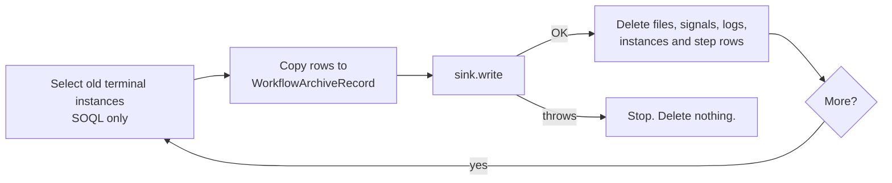

# Archive Before Purge

`CleanupWorkflow` deletes old terminal instances and their step history.
Archival copies that history to cold storage first. Cold storage does not use
primary data storage. Operators can read the history for years.

Archival is off by default. When it is off, `CleanupWorkflow` purges as it
did before archival existed.

## How it works



- The sweep selects `Completed`, `Failed`, `Compensated`, `Cancelled` and
  `ContinuedAsNew` instances that were created more than N days ago. The
  oldest go first.
- A batch has at most 20 instances and 500 step rows. A new instance starts
  only below a sixth of the heap. The first instance always goes, so the
  sweep moves forward.
- The copy loads step error details 10 rows at a time and checks the heap
  before each chunk.
- An instance is not archived and not purged when it has more than 500 step
  rows, or when its copy alone passes a quarter of the heap. The run output
  lists it in `skippedInstanceIds` (at most 2000 Ids).
- A cursor (`CreatedDate`, `Id`) moves past the leading instances that a
  batch purged or skipped. The next batch starts after the cursor, so skipped
  instances cannot block newer ones. Each run starts again at the oldest
  instance.
- The sweep reads the rows. It never changes a `Workflow_Step_Execution__c`
  row. `Compensation_Stack__c` and `Terminal_At__c` do not change.
- The sweep runs as a workflow, not on the orchestrator hot path.
- Both sweep steps are `CalloutStep`s. The engine does no DML before the
  step, and the sweep does no DML before `write`. So
  `Database.insertImmediate` and callout sinks work.

## Turn it on

Edit the **Default** record of `Revenant_Config__mdt`:

| Field | Value |
|---|---|
| `Archive_Enabled__c` | Checked. |
| `Archive_Sink__c` | Blank for `BigObjectArchiveSink`, or `CsvArchiveSink`, or your class. |
| `Archive_After_Days__c` | Default age for `ArchiveWorkflow`. Blank or negative is 30. |

If the config cannot be read, the sweep throws and deletes nothing. If the
`Default` record does not exist, archival is off.

Then start the sweep. For example, run this from a daily scheduled job:

```apex
WorkflowEngine.start(
  'ArchiveWorkflow',
  'Archive_' + Date.today(),
  new Map<String, Object>{ 'archiveAfterDays' => 90 }
);
```

| Input | Default | Rule |
|---|---|---|
| `archiveAfterDays` | `Archive_After_Days__c`, else 30 | 0 or more |
| `batchSize` | 20 | More than 0. Maximum 20. |

With archival on, `CleanupWorkflow` also archives first. It uses its own
`retentionDays` input. So a scheduled cleanup does not purge history that the
archive does not have.

Run the sweep as one dedicated integration user.

## Read archived history

```apex
// By instance Id: one sink read.
WorkflowArchiveRecord r = WorkflowArchive.getArchivedHistory(instanceId);
if (r != null) {
  for (WorkflowArchiveRecord.Step s : r.steps) {
    System.debug(s.sequence + ' ' + s.stepName + ' ' + s.status);
  }
}

// By correlation key (case does not matter, as in Correlation_Key__c): at most 10 records.
List<WorkflowArchiveRecord> runs = WorkflowArchive.findArchivedHistory('order-42');
```

Reads work also when archival is off. A step has the same facts as
`WorkflowEngine.StepHistoryEntry`: name, status, attempt, start, end,
duration and the compensation flag. It also has the stored error details.

`isTruncated()` is true when the reader got fewer steps than the sweep
archived.

## Payload policy

| Data | What the archive does |
|---|---|
| Inline `Input__c`, `Output__c`, step `Error_Details__c` | The archive copies the stored form. Codec ciphertext stays ciphertext. |
| Offloaded payload (`{"$attachmentId":...}`) | The archive does not copy it. It writes `{"$archiveDropped":"offloaded payload not archived"}` and adds 1 to `droppedPayloadCount`. |
| Offloaded `failureData` in `Error_Details__c` | The archive keeps the reason and replaces the data part with the marker. It adds 1 to `droppedPayloadCount`. |
| Step `Input__c`, `Output__c`, `Captured_Values__c`, signals | The archive does not copy them. `getHistory` does not show them either. |

Then the purge deletes the engine files, signals and instance logs, as
`CleanupWorkflow` does without archival. The delete uses
`WorkflowInstanceTeardown`, the same routine as `WorkflowInstancePurge`. See
[instance-purge.md](instance-purge.md). A log row with `Schedule__c` or
`Schedule_Name__c` stays. The archive does not copy logs. Export them first
if you need them. When an instance has more than 5000 signal and log rows,
the batch deletes them in pages and writes the same records again. The sink
contract makes that safe. The files and the instance go in the last page.

## Shipped sinks

### `BigObjectArchiveSink` (default)

- `Workflow_Archive__b`: index (`Instance_Id__c`, `Sequence__c`). Row 0 is the
  instance. Rows 1 and up are the steps.
- `Workflow_Archive_Key__b`: index (`Key_Hash__c`, `Instance_Id__c`). A Big
  Object index holds at most 100 text characters, so the key is the SHA-256
  hex of the lower-case correlation key. Reads compare the full key, and
  case does not matter, as in `Correlation_Key__c`.
- `insertImmediate` overwrites a row with the same index. A retry makes no
  duplicate.
- A read by Id uses 1 SOQL query. A read by key uses 1 query, then 1 query for
  each match.
- Only the sweep writes, in system mode. The permission sets give read access
  only.

### `CsvArchiveSink`

- One CSV file (`ContentVersion`) for each instance. Files use file storage,
  not data storage.
- The sink marks each file with `Revenant_Archive_Instance_Id__c` and
  `Revenant_Archive_Key_Hash__c`, and finds files only by these fields. No
  permission set gives access to them, so a user cannot plant a file that the
  sink trusts. A new version that a user uploads has no mark, so the sink
  ignores it.
- The file is not linked to the instance, so the purge does not delete it.
- File access: create a library with the API name `Revenant_Archive`. Add
  the sweep user and the readers as members. The sink then puts each file in
  it. Without the library, only the sweep user and users with "Query All
  Files" see the files.
- Format: see `WorkflowArchiveCsv`. A value that starts with `=`, `+`, `-`,
  `@`, a tab, a carriage return or `'` gets a `'` prefix, so a spreadsheet
  does not run it as a formula.

## Write your own sink

Implement `WorkflowArchiveSink`. The sink, `WorkflowArchiveRecord` and the
`WorkflowArchive` reads are `global`. A subscriber org uses the package
namespace, for example `implements rvn.WorkflowArchiveSink`. See
[global-api.md](global-api.md).

```apex
public class S3ArchiveSink implements WorkflowArchiveSink {
  public void write(List<WorkflowArchiveRecord> records) {
    for (WorkflowArchiveRecord r : records) {
      HttpRequest req = new HttpRequest();
      req.setEndpoint('callout:Archive_S3/' + r.instanceId + '.csv');
      req.setMethod('PUT');
      req.setBody(WorkflowArchiveCsv.toCsv(r));
      HttpResponse res = new Http().send(req);
      if (res.getStatusCode() >= 300) {
        throw new WorkflowArchive.ArchiveException('S3 PUT failed');
      }
    }
  }
  public List<WorkflowArchiveRecord> readByInstanceIds(Set<Id> ids) { /* GET */ }
  public List<WorkflowArchiveRecord> readByCorrelationKey(String key) { /* GET */ }
}
```

Rules:

- `write` must be idempotent for each instance Id.
- `write` must throw when a record is not stored. The sweep then deletes
  nothing.
- `write` can make callouts. Each batch calls `write` once, with at most 20
  records. Keep below the limit of 100 callouts.
- Do not put payload text in an exception message. The message goes to the
  step error, which operators can read.

## Limits

- Tests cannot write Big Objects. `BigObjectArchiveSink` has a test seam
  (`Store`). The real `insertImmediate` and Big Object SOQL run only in an org.
- Do not run two sweeps at the same time. The CSV sink can then write two
  files for one instance.
- Re-hydrating an archived instance is not supported.

See [ADR 0003](adr/0003-archive-sink-api.md).
