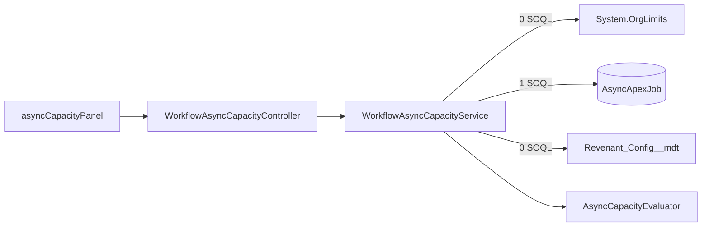

# Async Apex Capacity

Issue #129. The Queueable chain is the heartbeat of the engine.
`WorkflowOrchestrator` enqueues the next hop before it stops. When the org has
no async Apex capacity, `System.enqueueJob()` throws. The chain stops and the
instance becomes an orphan. This panel shows the capacity that is left, before
the chain stops. It is read only. It sends no alert.

## Where To Find It

Workflow Dashboard → **System Doctor** → **Async Apex Capacity**. The panel
reads on open and on **Refresh Status**.

## Metrics And Org Values

| Panel metric                   | Source                                                              | Where an admin sees it                                                                                  |
| ------------------------------ | ------------------------------------------------------------------- | ------------------------------------------------------------------------------------------------------- |
| Daily async Apex executions    | `System.OrgLimits` key `DailyAsyncApexExecutions` (used / limit)    | REST resource `/services/data/vXX.X/limits`, key `DailyAsyncApexExecutions`. CLI: `sf org list limits`. |
| Apex flex queue (Holding)      | `AsyncApexJob` rows with `Status = 'Holding'`, limit 100            | **Setup → Apex Flex Queue** (the list of held batch jobs).                                              |
| Job counts (detail, no status) | `AsyncApexJob` rows with `Status` `Holding`, `Queued`, `Processing` | **Setup → Apex Jobs**. Filter on the status.                                                            |

- The daily value is a rolling 24 hour count. The default limit is 250,000 or
  200 × the number of user licenses, whichever is larger.
- `Limits.getAsyncCalls()` and `Limits.getLimitAsyncCalls()` are "reserved
  for future use". They do not give the daily org count. The panel uses
  `System.OrgLimits` for this reason. `OrgLimits` costs no SOQL.
- The flex queue holds max 100 batch jobs in `Holding`. Queueables do not go
  into the flex queue.
- `Queued` and `Processing` have no fixed org ceiling. The panel shows them as
  counts. They show the backlog.
- The panel values can be a few minutes old. Salesforce updates the org limit
  values at intervals.

## Status

Percent = used / limit × 100, rounded to 2 places. The status uses the
percent that the panel shows.

| Status       | Rule                                    | What to do                                                                                                              |
| ------------ | --------------------------------------- | ----------------------------------------------------------------------------------------------------------------------- |
| **Healthy**  | percent < warn                          | No action is necessary.                                                                                                 |
| **Degraded** | warn ≤ percent < crit                   | Find the jobs that use async capacity (**Setup → Apex Jobs**). Decrease new starts or move batch work to a later time.  |
| **Critical** | percent ≥ crit                          | Pause definitions that are not critical. Stop or move batch jobs. After recovery, look for orphaned instances.          |
| **Unknown**  | No limit, a limit of 0, or a read error | Examine the REST `/limits` resource (`sf org list limits`) and **Setup → Apex Jobs**. An Unknown status is not Healthy. |

- The overall status is the worst metric. Rank: Critical, Degraded, Unknown,
  Healthy.
- When one or more metrics are **Critical**, the panel shows a red **Chain
  handoff at risk** alert.
- Orphaned instances: the watchdog reclaims them (see
  [watchdog-liveness.md](watchdog-liveness.md)). To pause a definition, use
  **Pause** on the dashboard.

## Configure

`Revenant_Config__mdt` record `Default`, field `Async_Capacity_Thresholds__c`
(Text). Format: `warn,crit` in percent. Example: `80,95`.

- Rule: 0 < warn < crit ≤ 100. Decimals are permitted (`70.5,90`).
- Blank: the panel uses `80,95`.
- Text that is not valid: the panel uses `80,95` and shows a red note.
- No deploy is necessary. The next read uses the new value.

## Cost

- 1 SOQL: one `AsyncApexJob` aggregate, `COUNT(Id)` with `GROUP BY Status`.
  Max 3 query rows (one for each status group).
- `System.OrgLimits.getMap()` and `Revenant_Config__mdt.getInstance()`: no
  SOQL.
- No DML. No event. No job. The read writes no audit record.
- `WorkflowOrchestrator` does not call the read. The enqueue path does not
  change.
- The view gate (`WorkflowDashboardSupport.checkAuthorization`) can add its
  own SOQL. That cost is the same for all panels.

## Limits

- The panel is a snapshot. It does not alert. Alerts are #127.
- The panel does not throttle starts. Throttling is #91 and #28.
- A burst can change the status from Degraded to Critical in minutes. Open
  the panel again to see the new values.
