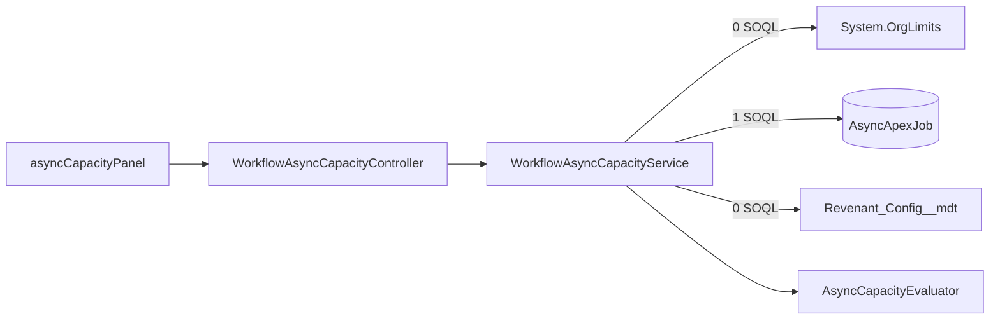

# Async Apex Capacity

Issue #129. The engine runs each instance as a chain of Queueable jobs.
`WorkflowOrchestrator` enqueues the next hop before it stops. When the org has
no async Apex capacity, `System.enqueueJob()` throws. The chain stops and the
instance becomes an orphan. This panel shows the capacity that is left, before
the chain stops. It is read-only. It sends no alert.

## Where To Find It

Workflow Dashboard → **System Doctor** → **Async Apex Capacity**. The panel
reads on open and on **Refresh Status**.

## Metrics And Org Values

| Panel metric                    | Used / limit                                                          | Where an admin sees it                                                                                  |
| ------------------------------- | --------------------------------------------------------------------- | ------------------------------------------------------------------------------------------------------- |
| Daily async Apex executions     | `System.OrgLimits` key `DailyAsyncApexExecutions`                     | REST resource `/services/data/vXX.X/limits`, key `DailyAsyncApexExecutions`. CLI: `sf org list limits`. |
| Apex flex queue (Holding)       | `AsyncApexJob` rows in `Holding` / 100                                | **Setup → Apex Flex Queue**.                                                                            |
| Pending jobs vs executions left | `Holding` + `Queued` + `Processing` rows / (daily limit − daily used) | **Setup → Apex Jobs** (filter on the status) and the daily value above.                                 |

- No Setup page shows the daily count. Use the REST `/limits` resource or
  `sf org list limits`.
- The daily value is a rolling 24 hour count. The default limit is 250,000 or
  200 × the number of user licenses, whichever is larger.
- `Limits.getAsyncCalls()` and `Limits.getLimitAsyncCalls()` are "reserved
  for future use". They do not give the daily org count. The panel uses
  `System.OrgLimits` for this reason. `OrgLimits` costs no SOQL.
- The flex queue holds a maximum of 100 batch jobs in `Holding`. Queueable
  jobs do not go into the flex queue.
- Queueable jobs in `Queued` have no queue limit. A maximum of 5 batch jobs
  can be `Queued` or `Processing`. Thus the panel does not give `Queued` and
  `Processing` their own limit. It compares all pending jobs with the daily
  executions that are left. Each pending job uses one or more executions. A
  value near 100% tells you that the backlog can use all capacity that is
  left.
- Batch jobs in `Preparing` are not counted.
- When the org has an elastic limit (`DailyAsyncApexElasticExecutions`), the
  panel does not add it. The org can continue above 100% of the daily limit.
  The **Elastic Async Apex Limit** tile in System Doctor shows it.

## Status

Percent = used / limit × 100, rounded half up to 2 places. The status uses
the percent that the panel shows.

| Status       | Rule                                                            | What to do                                                                                                                       |
| ------------ | --------------------------------------------------------------- | -------------------------------------------------------------------------------------------------------------------------------- |
| **Healthy**  | percent < warn                                                  | No action is necessary.                                                                                                          |
| **Degraded** | warn ≤ percent < crit                                           | Find the jobs that use async capacity (**Setup → Apex Jobs**). Start fewer new instances. Move batch work to a later time.       |
| **Critical** | percent ≥ crit                                                  | Pause definitions that are not critical. Stop or move batch jobs. When capacity is normal again, look for orphaned instances.    |
| **Unknown**  | No limit, a limit of 0 or less, or a failed `AsyncApexJob` read | Capacity data is not available. Examine the org limits (`sf org list limits`) and **Setup → Apex Jobs**. Unknown is not Healthy. |

- When no daily executions are left, the pending jobs metric is Unknown. The
  daily metric is then Critical.
- The overall status is the worst metric. Rank: Critical, Degraded, Unknown,
  Healthy.
- When one or more metrics are **Critical**, the panel shows a red **Chain
  handoff at risk** alert.
- When the `OrgLimits` read fails, the panel shows "Async Apex capacity is
  not available" and the error.
- Orphaned instances: the watchdog reclaims them (see
  [watchdog-liveness.md](watchdog-liveness.md)). To pause a definition, use
  **Pause** on the dashboard.

## Configure

`Revenant_Config__mdt` record `Default`, field `Async_Capacity_Thresholds__c`
(Text). Format: `warn,crit` in percent. Example: `80,95`. The thresholds
apply to all metrics.

- Rule: 0 < warn < crit ≤ 100. You can use decimals (`70.5,90`).
- Blank: the panel uses `80,95`.
- Text that is not valid: the panel uses `80,95` and shows a red note.
- No deploy is necessary. The next read uses the new value.

## Cost

- 1 SOQL for the read: one `AsyncApexJob` aggregate, `COUNT(Id)` with
  `GROUP BY Status`. The SOQL reference gives one query row for each group,
  so max 3 query rows. A test measures this with 5 jobs in one group.
- `System.OrgLimits.getMap()` and `Revenant_Config__mdt.getInstance()`: no
  SOQL.
- No DML. No event. No job. The read writes no audit record.
- `WorkflowOrchestrator` and the classes that call `System.enqueueJob()` do
  not call the read. A test examines their source.
- The view gate (`WorkflowDashboardSupport.checkAuthorization`) can add its
  own SOQL. That cost is the same for all panels.

## Limits

- The panel is a snapshot. It does not alert. Alerts are #127.
- The panel does not throttle starts. Throttling is #91 and #28.
- A burst can change the status from Degraded to Critical in minutes. Click
  **Refresh Status** to see the new values.
