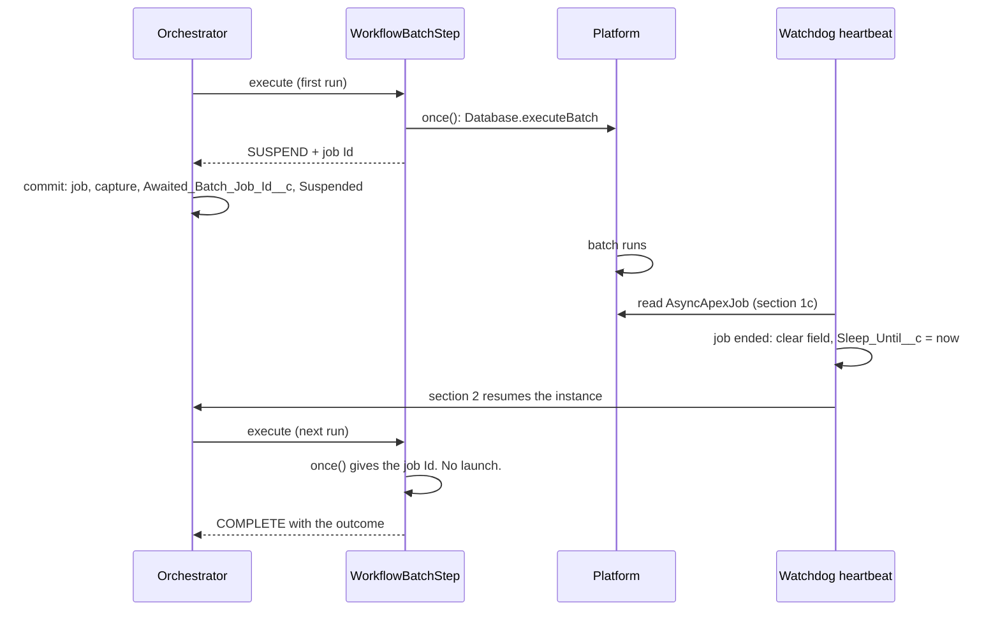

# Batch Apex Step

Issue #138. `WorkflowBatchStep` runs a `Database.Batchable` as one durable step. The step launches the job one time. The instance waits. The watchdog resumes the instance when the job ends. The step then completes with the job outcome, and `getNextStep()` can branch on it. The `Batchable` needs no Revenant code.

## Bind a Batchable

Extend `WorkflowBatchStep` and override `bind()`:

```apex
public class TagAccountsStep extends WorkflowBatchStep {
  protected override WorkflowBatchStep.Binding bind(StepContext ctx) {
    return new WorkflowBatchStep.Binding(
      'ExampleAccountTagBatch',                       // Batchable class
      200,                                            // scope size, 1 to 2000
      JSON.deserializeUntyped(ctx.workflowInputJson)  // Batchable fields
    );
  }
}
```

Or use `WorkflowBatchStep` as the step name. The step reads its input JSON (the output of the step before it):

| Key           | Type    | Required | Meaning                                                                 |
| ------------- | ------- | -------- | ----------------------------------------------------------------------- |
| `batchClass`  | String  | Yes      | The `Batchable` class name.                                             |
| `scopeSize`   | Integer | No       | Records for each `execute()` call. 1 to 2000. Default 200.              |
| `input`       | Object  | No       | JSON for the `Batchable` fields. No value: the no-arg constructor runs. |
| `failOnError` | Boolean | No       | `true`: the step fails when the job does not succeed. Default `false`.  |

The engine makes the `Batchable` with `JSON.deserialize(input, type)`. Thus, the `Batchable` needs a no-arg constructor and fields that JSON can set.

## Branch on the outcome

The step completes with this output. The keys use the `AsyncApexJob` names.

| Key                 | Meaning                                                                         |
| ------------------- | ------------------------------------------------------------------------------- |
| `jobId`             | The `AsyncApexJob` Id.                                                          |
| `status`            | `Completed`, `Failed`, `Aborted`, or `NotFound` (the platform deleted the row). |
| `succeeded`         | `true` only for `Completed` with 0 errors.                                      |
| `totalJobItems`     | Number of batches (`execute()` calls). Not records.                             |
| `jobItemsProcessed` | Number of batches that ran. Not records.                                        |
| `numberOfErrors`    | Number of batches that failed.                                                  |
| `firstError`        | `ExtendedStatus`: the first error, or null.                                     |

The platform does not give record counts. To get them, the `Batchable` must count them.

```apex
public String getNextStep(String currentStepName, StepResult result) {
  if (currentStepName == TAG_ACCOUNTS) {
    Map<String, Object> outcome = (Map<String, Object>) JSON.deserializeUntyped(
      result.directive().outputJson
    );
    return outcome.get('succeeded') == true ? CONFIRM : ROLLBACK_STEP;
  }
  return null;
}
```

A job that does not succeed is an outcome, not a stall. To compensate the steps before it, route to a step that returns `StepResult.fail(...)`, or set `failOnError`. See [BatchStepWorkflowExample](../examples/main/default/classes/BatchStepWorkflowExample.cls).

## How it works



1. **Launch one time.** `ctx.captures().once()` launches the job and keeps its Id. The job Id, the capture and the `Suspended` status commit in one transaction. A rollback removes the job. A retry, a resume or a re-drive reads the captured Id. It does not launch a second job.
2. **Track.** The `SUSPEND` result carries the job Id. The engine writes it to `Workflow_Instance__c.Awaited_Batch_Job_Id__c` (Text 18, External ID, thus indexed). Each other step outcome clears the field.
3. **Resume.** Heartbeat section 1c (`WorkflowBatchAwaitSweep`) reads each `Suspended` instance that has the field set and no `Sleep_Until__c`. For each job that ended, it locks the row, clears the field and sets `Sleep_Until__c` to now. Section 2 resumes the instance in the same heartbeat. Section 2 applies the pause, hold and global-park rules.
4. **Complete.** The step reads the ended job and keeps the outcome with `once()`. A running job gives a new `SUSPEND`.

Resume latency: not more than one heartbeat interval after the job ends.

## Cost

| Place              | Cost                                                                                   |
| ------------------ | -------------------------------------------------------------------------------------- |
| Heartbeat, no wait | 1 SOQL.                                                                                |
| Heartbeat, waits   | 1 more SOQL on `AsyncApexJob`. When a job ended: 1 more SOQL (`FOR UPDATE`) and 1 DML. |
| Step, first run    | 1 SOQL (parallel check) and the launch.                                                |
| Step, next runs    | 2 SOQL (parallel check, job read).                                                     |

No new Platform Event, scheduled job or Queueable. No change to the orchestrator handoff.

## Limits

- **Serial steps only.** One field holds one job. In a parallel branch, the step fails before it launches.
- **Cancel does not abort the job.** The job runs to its end. The engine ignores the outcome.
- **No restart from a failed chunk.** A failed job is an outcome only. Batch Apex restart is Salesforce behavior.
- **Platform limits apply.** Not more than 5 running jobs and 100 in the flex queue. When the launch fails, the step throws. The retry policy of the step applies.
- **Strict determinism.** The engine does not compare a batch wait. The job status is not a step input.
- **Test seams.** Tests cannot insert `AsyncApexJob`. `WorkflowBatchJobs.stubLaunchId` and `WorkflowBatchJobs.stubJobs` are `@TestVisible`. See `WorkflowBatchStepTest`.
