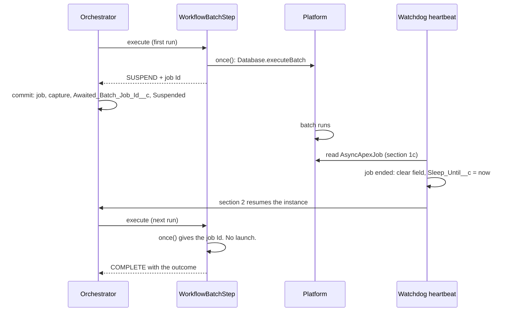

# Batch Apex Step

Issue #138. `WorkflowBatchStep` runs a `Database.Batchable` as one durable step. The step launches the job one time. The instance waits. The watchdog resumes the instance when the job ends. The step then completes with the job outcome, and `getNextStep()` can branch on it. The `Batchable` needs no Revenant code.

## Bind a Batchable

There are two ways to bind a `Batchable`.

**Subclass (package namespace only).** Extend `WorkflowBatchStep` and override `bind()`. `WorkflowBatchStep` is `public`, so a subscriber org cannot extend it. `docs/global-api.md` lists it as a candidate.

```apex
public class TagAccountsStep extends WorkflowBatchStep {
  protected override WorkflowBatchStep.Binding bind(StepContext ctx) {
    // Batchable class, scope size (1 to 2000), Batchable fields.
    return new WorkflowBatchStep.Binding(
        'ExampleAccountTagBatch',
        200,
        JSON.deserializeUntyped(ctx.workflowInputJson)
      )
      .withFailOnError(false);
  }
}
```

**Input JSON (all orgs).** Use `WorkflowBatchStep` as the step name. The step reads its input JSON (the output of the step before it):

| Key           | Type    | Required | Meaning                                                                 |
| ------------- | ------- | -------- | ----------------------------------------------------------------------- |
| `batchClass`  | String  | Yes      | The `Batchable` class name.                                             |
| `scopeSize`   | Integer | No       | Number of records for each `execute()` call. 1 to 2000. Default 200.    |
| `input`       | Object  | No       | JSON for the `Batchable` fields. No value: the no-arg constructor runs. |
| `failOnError` | Boolean | No       | `true`: the step fails when the job does not succeed. Default `false`.  |

The engine makes the `Batchable` with `JSON.deserialize(input, type)`. Thus, the `Batchable` needs a no-arg constructor and fields that JSON can set. The engine refuses a class that is not a `Database.Batchable`.

**Security.** The input names the class to launch. Do not put untrusted user input in `batchClass`, for example the start input of a workflow that a user starts from a Flow. For user input, use a subclass with a fixed class name.

## Branch on the outcome

The step completes with this output. The keys use the `AsyncApexJob` names.

| Key                 | Meaning                                                                         |
| ------------------- | ------------------------------------------------------------------------------- |
| `jobId`             | The `AsyncApexJob` Id.                                                          |
| `status`            | `Completed`, `Failed`, `Aborted`, or `NotFound` (the platform deleted the row). |
| `succeeded`         | `true` only for `Completed` with 0 errors.                                      |
| `totalJobItems`     | Number of batches (`execute()` calls). Not records.                             |
| `jobItemsProcessed` | Number of batches that ran. Not records.                                        |
| `numberOfErrors`    | Number of batches that failed.                                                  |
| `firstError`        | `ExtendedStatus`: the first error, or null.                                     |

The platform does not give record counts. To get them, the `Batchable` must count them.

```apex
public String getNextStep(String currentStepName, StepResult result) {
  if (currentStepName == TAG_ACCOUNTS) {
    Map<String, Object> outcome = (Map<String, Object>) JSON.deserializeUntyped(
      result.directive().outputJson
    );
    return outcome.get('succeeded') == true ? CONFIRM : ROLLBACK_STEP;
  }
  return null;
}
```

A job that does not succeed is an outcome, not a stall. To compensate the steps before it, route to a step that returns `StepResult.fail(...)`, or set `failOnError`. See [BatchStepWorkflowExample](../examples/main/default/classes/BatchStepWorkflowExample.cls).

## How it works



1. **Launch one time.** `ctx.captures().once()` launches the job and keeps its Id. The job Id, the capture and the `Suspended` status commit in one transaction. A rollback removes the job. A retry, a resume or a re-drive reads the captured Id. It does not launch a second job.
2. **Track.** The `SUSPEND` result carries the job Id. The engine writes it to `Workflow_Instance__c.Awaited_Batch_Job_Id__c` (Text 18, External ID, thus indexed). Each other step outcome, each compensation outcome, a cancel, a failure and the sweep clear the field. Thus, an old job cannot wake a later wait.
3. **Resume.** Heartbeat section 1c (`WorkflowBatchAwaitSweep`) reads each `Suspended` instance that has the field set and no `Sleep_Until__c`. For each job that ended, it locks the row, clears the field and sets `Sleep_Until__c` to now. Section 2 resumes the instance in the same heartbeat. Section 2 applies the pause, hold and global-park rules.
4. **Complete.** The step reads the ended job and keeps the outcome with `once()`. A running job gives a new `SUSPEND`.

Resume latency: usually the next heartbeat after the job ends. A pause, a hold, a global park or the section 2 batch limit (200 instances) can make it longer.

## Cost

| Place              | Cost                                                                                   |
| ------------------ | -------------------------------------------------------------------------------------- |
| Heartbeat, no wait | 1 SOQL.                                                                                |
| Heartbeat, waits   | 1 more SOQL on `AsyncApexJob`. When a job ended: 1 more SOQL (`FOR UPDATE`) and 1 DML. |
| Step, first run    | 1 SOQL (parallel check) and the launch.                                                |
| Step, next runs    | 2 SOQL (parallel check, job read).                                                     |

The step adds no Platform Event, scheduled job or Queueable. It does not change the orchestrator handoff.

## Limits

- **Serial steps only.** One field holds one job. In a parallel branch, the step fails before it launches.
- **Cancel does not abort the job.** The job runs to its end. The engine ignores the outcome.
- **No restart from a failed chunk.** A failed job is an outcome only. The step does not run the failed batches again.
- **Platform limits apply.** Not more than 5 running jobs and 100 in the flex queue. When the launch gets an `AsyncException`, the step returns `RETRY` with `RetryPolicy.fromConfig()`. The step keeps no job Id, so the retry launches again. Other launch errors throw.
- **Not the initial step.** The engine locks the step row before it runs a step again. The first run of the initial step has no row to lock. Two first deliveries at the same time can launch two jobs. Put a step before the batch step.
- **Stale run.** When a concurrent path moves the instance to another step while the first run launches, the engine discards the result of the run. The job still runs, and nothing waits for it.
- **Re-drive after `failOnError`.** The step keeps the outcome with `once()`. An operator re-drive gives the same failure. It does not launch the job again. To continue, skip the step.
- **Job visibility.** The engine reads `AsyncApexJob` in system mode. A missing row gives `NotFound`.
- **Strict determinism.** In strict determinism mode, the engine does not compare a batch wait on replay, because the job status can change between runs.
- **Error text.** `firstError` goes to the step output. With `failOnError`, it also goes to `Error_Message__c`, alerts and the lifecycle event. A platform error text can contain record Ids and validation rule text.
- **Test seams.** Tests cannot insert `AsyncApexJob`. `WorkflowBatchJobs.stubLaunchId`, `stubLaunchError` and `stubJobs` are `@TestVisible`. Only tests in the package namespace can use them. See `WorkflowBatchStepTest`.
