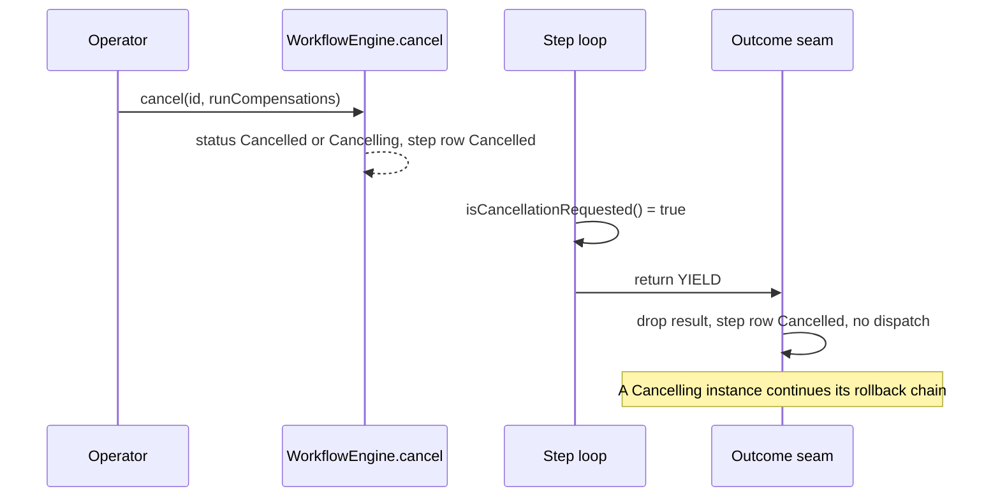

# Cooperative Cancellation

Issue #143. A long step loop can see that an operator cancelled its instance. The loop stops at its next check. It does not run to the end of its batch.

Decision record: [ADR 0017](adr/0017-cooperative-cancellation.md).

## API

```apex
global Boolean isCancellationRequested();                     // reuses a false answer for 1000 ms
global Boolean isCancellationRequested(Integer maxAgeMillis); // 0 reads each time
```

Both are on `StepContext`. The flag is `true` when the instance or one of its five nearest ancestors has the status `Cancelled` or `Cancelling`. `WorkflowEngine.cancel(id)` sets `Cancelled`. `WorkflowEngine.cancel(id, true)` sets `Cancelling` when a rollback is necessary.

## Use it in a loop

```apex
public StepResult execute(StepContext ctx) {
  LoopState state = readState(ctx.stepStateJson);
  for (Account acc : nextScope(state)) {
    process(acc, state);
    // Check every N records, not for each record.
    if (Math.mod(state.count, 50) == 0 && (ctx.isCancellationRequested() || ctx.shouldYield())) {
      return StepResult.yield(JSON.serialize(state));
    }
  }
  return StepResult.complete(null, state.count);
}
```

After a cancel, return a result at once. Use the result that you use at a checkpoint (usually `YIELD`). The engine drops it.

See [CooperativeCancelWorkflowExample](../examples/main/default/classes/CooperativeCancelWorkflowExample.cls).

## Cost

| Case                                         | SOQL | DML |
| -------------------------------------------- | ---- | --- |
| The step does not call the flag              | 0    | 0   |
| A check that reads                           | 1    | 0   |
| A check within `maxAgeMillis` of a `false`   | 0    | 0   |
| A check after a `true`                       | 0    | 0   |
| A check with fewer than 20 SOQL queries left | 0    | 0   |

A `true` answer stays `true` for the rest of the run. With fewer than 20 queries left, the check gives its last answer. `null` or a negative `maxAgeMillis` means 0.

## What the engine does



When the step saw `true`, the seam does this:

1. Instance `Cancelled` or `Cancelling`: it drops the result. It releases the signals that the step claimed. It sets the step row to `Cancelled`. It does not write `Completed`. It does not enqueue a forward hop. `cancel()` already enqueued the rollback when the cancel asked for it.
2. Instance still active and an ancestor cancelled: it does step 1. Then it cancels the instance. A `Cancelling` ancestor gives a cancel with compensations. A `Cancelled` ancestor gives a cancel without compensations.
3. Else: the normal seam path.

The work that the step did before it returned commits. This is at most one check interval of work after the cancel became visible.

## Rules

- **Advisory.** Apex cannot stop a running `execute()`. A step that does not call the flag works as before. When its instance is cancelled while it runs, the seam rejects its result and the transaction rolls back.
- **Only in `execute()`.** In `compensate()`, the flag is always `false`. A rollback must finish.
- **Ancestors.** The read covers five parent levels (the SOQL limit for a parent path). `cancel()` marks all active descendants in the same transaction. So a deeper descendant sees its own status.
- **Replay.** The flag is not replay-safe. Use it only to return early. See [strict-determinism.md](strict-determinism.md).

## Row locks (platform limit)

A running step holds its step row `FOR UPDATE` until its transaction ends. `cancel()` locks the same row. So in an org, a `cancel()` that starts while a step runs waits for that transaction (10 seconds at most, then `UNABLE_TO_LOCK_ROW`). The flag sees a cancel only after the cancel commits. See ADR 0017 for the effect and the follow-up.

## Test a step

`StepContextTestBuilder` gives the flag with no SOQL:

```apex
StepContext ctx = new StepContextTestBuilder().requestCancellationAfter(1).build();
StepResult result = new TagAccountsStep().execute(ctx); // check 1: false, check 2: true
```

`requestCancellation()` makes each check `true`. The built context reads on each check (no cache).
