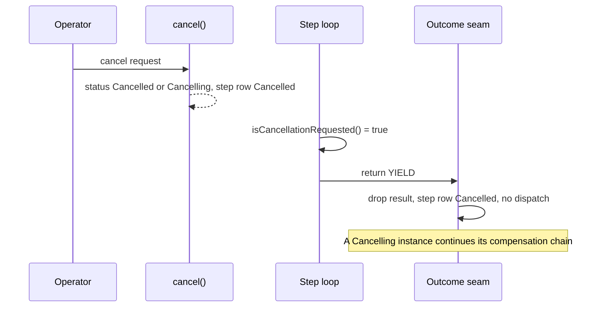

# Cooperative Cancellation

Issue #143. A long step loop can see that its instance has a cancel request. The loop stops at its next check. It does not run to the end of its batch.

**Limit:** a cancel request from another transaction must commit before a step can see it. A running step holds row locks that `cancel()` also needs. So today, a step does not see a request from another transaction during `execute()`. See [Row locks](#row-locks-platform-limit).

Decision record: [ADR 0017](adr/0017-cooperative-cancellation.md).

## API

```apex
global Boolean isCancellationRequested();                     // keeps a false answer for 1000 ms
global Boolean isCancellationRequested(Integer maxAgeMillis); // 0 reads each time
```

Both are on `StepContext`. This page calls their result "the flag". The flag is `true` when the instance or one of its five nearest ancestors has the status `Cancelled` or `Cancelling`:

- `WorkflowEngine.cancel(id)` sets `Cancelled`.
- A cancel with compensations (the Cancel Workflow action or the `Cancel` signal) sets `Cancelling` when the instance has steps to compensate.

A `Failed` ancestor does not set the flag. The cascade cancel (issue #94) must cancel the instance first.

## Use it in a loop

```apex
public StepResult execute(StepContext ctx) {
  // readState, nextBatches and tag are your helpers.
  LoopState state = readState(ctx.stepStateJson);
  for (List<Account> batch : nextBatches(state)) {
    tag(batch, state);
    // One check for each batch. The batch size limits the SOQL cost.
    if (ctx.isCancellationRequested(0) || ctx.shouldYield()) {
      return StepResult.yield(JSON.serialize(state));
    }
  }
  return StepResult.complete(null, state.count);
}
```

- Check every N records, not for each record. When N already limits the cost, use `isCancellationRequested(0)`. When the check is in a loop for each record, use `isCancellationRequested()`: it keeps a `false` answer for 1000 ms.
- After a `true` answer, return `StepResult.yield(...)` at once. The engine drops the result. If the request goes away before the seam, the engine runs the YIELD, and the step checks again.

See [CooperativeCancelWorkflowExample](../examples/main/default/classes/CooperativeCancelWorkflowExample.cls).

## Cost

| Case                                         | SOQL | DML |
| -------------------------------------------- | ---- | --- |
| The step does not call the flag              | 0    | 0   |
| A check that reads                           | 1    | 0   |
| A check within `maxAgeMillis` of a `false`   | 0    | 0   |
| A check after a `true`                       | 0    | 0   |
| A check with the SOQL reserve (or less) left | 0    | 0   |

- The context keeps a `true` answer for the rest of the run.
- The SOQL reserve is 20 queries, or 20% of the limit when that is more (40 in async). With the reserve left, the check gives its last answer. It cannot see a new request. `shouldYield()` usually gives `true` first.
- `null` for `maxAgeMillis` means the default age. A negative value means 0.

## What the engine does



When the step saw `true`, the seam does this:

1. Instance `Cancelled` or `Cancelling`: it drops the result. It releases the signals that the step claimed. It sets the step row to `Cancelled`. It does not write `Completed`. It does not enqueue a forward hop. `cancel()` already enqueued the compensations when the request asked for them.
2. Instance active and an ancestor `Cancelled` or `Cancelling`: it does item 1. Then it cancels the instance. A `Cancelling` ancestor gives a cancel with compensations. A `Cancelled` ancestor gives a cancel without compensations.
3. Else: the normal seam path.

## What stays

- The DML that the step did before it returned commits. After the check that sees the request, the step does no more work. So the work after the request became visible is one check interval at most.
- The engine does not compensate the stopped step, because it did not complete. This is the same as a cancel between two runs of a yielding step. Make each batch safe to keep, or undo it in a later step.

## Rules

- **Advisory.** Apex cannot stop a running `execute()`. A step that does not call the flag works as before. When its instance gets a cancel request while it runs, the seam rejects its result, and Salesforce discards the step DML.
- **Only in `execute()`.** In `compensate()`, the flag is always `false`. A compensation must finish.
- **Ancestors.** The read covers five parent levels (the SOQL limit for a parent path). `cancel()` marks all active descendants in the same transaction. So a deeper descendant sees its own status.
- **Parallel branches.** Each branch checks on its own. The seam releases the signals that a stopped branch claimed.
- **Replay.** The flag is not replay-safe. Use it only to return early. See [strict-determinism.md](strict-determinism.md).

## Row locks (platform limit)

`cancel()` locks the instance and the active step rows. The engine inserts the step row before each run. A running step locks that row until its transaction ends.

| Run of the step                   | Locks during `execute()` | Cancel from another transaction                                                           |
| --------------------------------- | ------------------------ | ----------------------------------------------------------------------------------------- |
| Each run                          | Step row                 | Waits for the step row. The step then waits for the instance at the seam. One side fails. |
| A timed run (not a `CalloutStep`) | Step row and instance    | Waits for the instance: 10 seconds at most, then `UNABLE_TO_LOCK_ROW`.                    |
| A run with a concurrency ceiling  | Step row and instance    | Waits for the instance, as above.                                                         |

So today, a request from another transaction commits only after the running transaction ends. The next run then stops before `execute()`. The flag sees a request during `execute()` only when the request comes from the same transaction. ADR 0017 records the follow-up: a cancel request that does not wait for the lock of the running step row.

## Test a step

`StepContextTestBuilder` gives the flag with no SOQL:

```apex
StepContext ctx = new StepContextTestBuilder().requestCancellation().build();
StepResult result = new TagAccountsStep().execute(ctx); // check 1: true
```

- `requestCancellation()` makes each check `true`.
- `requestCancellationAfterChecks(n)` makes the first `n` checks `false`, and each later check `true`.
- The built context reads on each check. It does not keep a `false` answer.
- Do not use it to test `compensate()`. There, the engine always gives `false`.
- `StepContextTestBuilder` is `@IsTest`. A subscriber org cannot use it yet ([global-api.md](global-api.md)).
