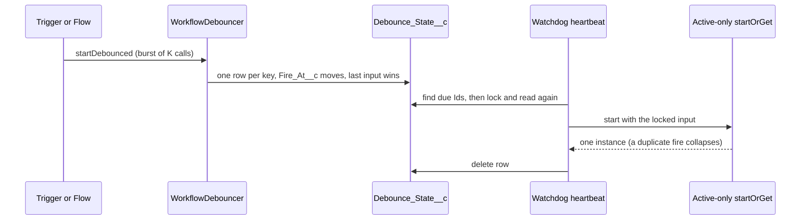

# Debounced Starts

Issue #140. A bulk load, a sync or fast edits can fire the same trigger
many times in a few seconds. A debounced start runs the workflow one time
after the triggers stop. The run gets the input of the last trigger.

## How It Works



1. **Key.** `(workflowName, correlationKey)`, case-insensitive. One
   `Debounce_State__c` row for each key.
2. **Arm.** The first call inserts the row. Each call after the first
   writes the new input and sets `Fire_At__c = now + debounceSeconds`.
3. **Cap.** `maxWaitSeconds` limits `Fire_At__c` to
   `first trigger + maxWaitSeconds`. Blank or 0 gives no cap. The value of
   the last call applies.
4. **Whole second.** `Fire_At__c` rounds up to the next whole second. A row
   never fires before its quiet window ends.
5. **Fire.** The watchdog heartbeat runs the sweep. The sweep finds up to
   100 due rows, locks them and reads them again. It skips a row that a
   trigger moved. It starts each row, then deletes it.
6. **Start.** The start matches only an active instance for the key. When
   the key has an active instance, the fire goes to that instance and the
   new input is not used. When the last run is terminal, the fire starts a
   new run. The dedup window (`Dedup_Window_Minutes__c`) does not apply.
7. **Retry.** A failed start retries at the first heartbeat 1 minute after
   the failure, then 2 minutes after. After 3 failures, the row goes to
   quarantine. `Error_Message__c` shows the error. The row stays until a
   new trigger for the key resets it, or until you delete it.

## Use From Apex

```apex
WorkflowDebouncer.startDebounced(
  new WorkflowDebouncer.DebounceRequest('OrderSyncWorkflow', 'order-' + o.Id, JSON.serialize(o))
    .withDebounce(10)
    .withMaxWait(300)
);
```

In a trigger, use the `List<DebounceRequest>` overload. One call costs 1
SOQL query and at most 2 DML statements for any batch size. A key that a
parallel transaction inserted first costs 1 more of each. A DML of 10,000
records runs the trigger 50 times, so the cost is 50 times more.

In a subscriber org, put the namespace before each type, for example
`rvn.WorkflowDebouncer`. A subscriber can set only the windows. Attributes
and a causation id are available only from Flow.

The method throws `WorkflowEngine.WorkflowException` for an invalid entry
and writes no row. See
[CaseDebounceTriggerHandler](../examples/main/default/classes/CaseDebounceTriggerHandler.cls).

## Use From Flow

In a record-triggered Flow, add the **Start Workflow** action. Set
**Debounce Seconds**. Set **Max Wait Seconds** if you need a cap. The
action gives `Is Valid = true`, `Is New = false` and no instance Id. The
sweep makes the instance later. The input contract check runs at sweep
time. A failed check counts as a failed start (see Retry).

## Limits

- **Latency.** The sweep runs in the watchdog heartbeat
  (`Watchdog_Delay_Minutes__c`, 1 to 10 minutes, default 10). A row fires
  within one heartbeat after `Fire_At__c` when fewer than 100 rows are due.
- **Scheduled jobs.** 0 new slots. The arm path enqueues no job.
- **Running instance.** A new burst for a key with an active instance does
  not go to that instance. Use a signal for that.
- **Throughput.** One sweep fires at most 100 rows.
- **Locks.** The sweep holds its row locks until the heartbeat ends. A
  save that re-arms a due key during a sweep waits. After about 10 seconds
  the save fails with `UNABLE_TO_LOCK_ROW`. The sweep runs late in the
  heartbeat to keep this time short. Two saves that insert the same new
  key at the same time can also wait for each other.

## Global API

`WorkflowDebouncer`, `DebounceRequest(String, String, String)`,
`withDebounce`, `withMaxWait` and both `startDebounced` overloads are
`global`. See [global-api.md](global-api.md) and
[ADR 0014](adr/0014-debounced-start.md).
