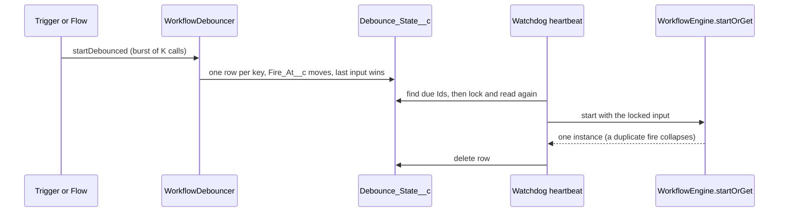

# Debounced Starts

Issue #140. A bulk load, a sync or fast edits can fire the same trigger
many times in a few seconds. A debounced start runs the workflow one time
after the triggers stop. The run gets the input of the last trigger.

## How It Works



1. **Key.** `(workflowName, correlationKey)`, case-insensitive. One
   `Debounce_State__c` row for each key.
2. **Arm.** The first call inserts the row. Each next call writes the new
   input and sets `Fire_At__c = now + debounceSeconds`.
3. **Cap.** `maxWaitSeconds` limits `Fire_At__c` to
   `first trigger + maxWaitSeconds`. Blank or 0 gives a pure trailing edge.
   The value of the last call applies.
4. **Whole second.** `Fire_At__c` rounds up to the next whole second. A row
   never fires before its quiet window ends.
5. **Fire.** The watchdog heartbeat runs the sweep. The sweep finds up to
   100 due rows, locks them and reads them again. It skips a row that a
   trigger moved. It starts each row with `startOrGet`, then deletes it.
6. **Retry.** A failed start retries after 1 and 2 minutes. After 3
   failures, the row goes to quarantine. `Error_Message__c` shows the error.
   A new trigger for the key resets the retry count.

## Use From Apex

```apex
WorkflowDebouncer.startDebounced(
  new WorkflowDebouncer.DebounceRequest('OrderSyncWorkflow', 'order-' + o.Id, JSON.serialize(o))
    .withDebounce(10)
    .withMaxWait(300)
);
```

Use the `List<DebounceRequest>` overload in a trigger. One call costs 1
SOQL query and at most 2 DML statements for any batch size. A key that a
parallel transaction inserted first costs 1 more of each.

See [CaseDebounceTriggerHandler](../examples/main/default/classes/CaseDebounceTriggerHandler.cls).

## Use From Flow

In a record-triggered Flow, add the **Start Workflow** action. Set
**Debounce Seconds**. Set **Max Wait Seconds** if you need a cap. The
action gives `Is Valid = true` and no instance Id. The sweep makes the
instance later. Input contract checks run at sweep time.

## Limits

- **Latency.** The sweep runs in the watchdog heartbeat
  (`Watchdog_Delay_Minutes__c`, 1 to 10 minutes, default 10). A row fires
  within one heartbeat after `Fire_At__c`.
- **Scheduled jobs.** 0 new slots. The arm path enqueues no job.
- **Running instance.** When the key has an active instance, the fire
  collapses into it (`startOrGet`). The new input does not go to that
  instance. Use a signal for that.
- **Throughput.** One sweep fires at most 100 rows.
- **Locks.** A trigger that re-arms a key while a sweep fires it waits for
  the sweep. Then it arms a new row.

## Global API

`WorkflowDebouncer`, `DebounceRequest(String, String, String)`,
`withDebounce`, `withMaxWait` and both `startDebounced` overloads are
`global`. See [global-api.md](global-api.md) and
[ADR 0014](adr/0014-debounced-start.md).
