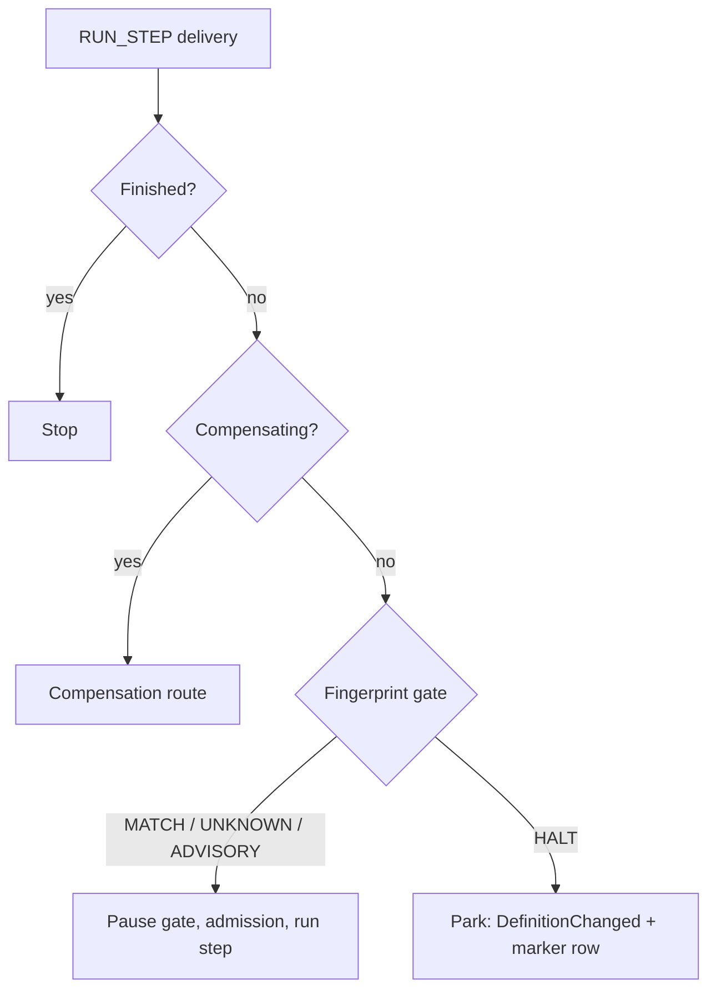

# Definition Change Detection

Issue #89. The engine stops an in-flight instance when its definition step list changes. It does not run a step against the new list.

## What the engine records

At start, the engine writes two fields on `Workflow_Instance__c`:

| Field | Value |
|-------|-------|
| `Definition_Fingerprint__c` | `v1:` plus the SHA-256 hex digest of the `getSteps()` names. The names are trimmed and lower case. Order is part of the digest. |
| `Definition_Shape__c` | The `getSteps()` names as a JSON list, with their original case. The dashboard shows this list. |

The engine stamps these fields at start, child start, bulk child start and continue-as-new. A compensating instance copies them from its target.

## What the engine checks

Each forward hop compares the stored fingerprint with the live fingerprint. The check runs before the step runs.

| Stored fingerprint | Compare with live | Definition | Result |
|--------------------|-------------------|------------|--------|
| blank | - | any | Continue. The instance started before this feature. |
| set | live cannot be computed | any | Continue. |
| set | other version prefix | any | Continue. |
| set | equal | any | Continue. |
| set | not equal | `VersionedWorkflow` | Continue. Write a debug log line. |
| set | not equal | plain `WorkflowDefinition` | Park. |

A match costs no SOQL and no DML. The gate reads the stored value from the instance query that the engine already runs. It computes the live value in memory.

## What a park does

1. It sets `Status__c` to `DefinitionChanged` and writes a short reason in `Error_Message__c`.
2. It appends one `Workflow_Step_Execution__c` row. `Step_Name__c` is `Workflow_Definition_Changed`. `Status__c` is `DefinitionChanged`. `Output__c` holds the stored and live fingerprints, the live step list and the current step.
3. It writes a Warn `Workflow_Log__c` line.

A park does not change prior step rows. A park does not change `Compensation_Stack__c`. A parked instance keeps its correlation key. It keeps its concurrency slot, if it holds one. The watchdog does not time out its steps. The engine holds a signal to it until release.

## How to release an instance

1. Correct the definition. For example, restore the old step list, or accept the new list.
2. Open the instance on the dashboard. The panel shows the current step, the stored list and the live list. It shows added steps in green and removed steps with a line through them.
3. Click **Release**. Or call `WorkflowDefinitionChangeService.release(instanceId)` from Apex.

Release writes the live fingerprint and shape, sets `Running`, re-arms step timeouts and enqueues the current step. Release fails when a current step is not in the live list. In that case, restore the step or cancel the instance.

## Limits

- The fingerprint covers the step list only. It does not cover `getNextStep()` logic or step code.
- The engine does not migrate an instance to the new shape.
- To change a shape without a park, implement `VersionedWorkflow` and route by version.
