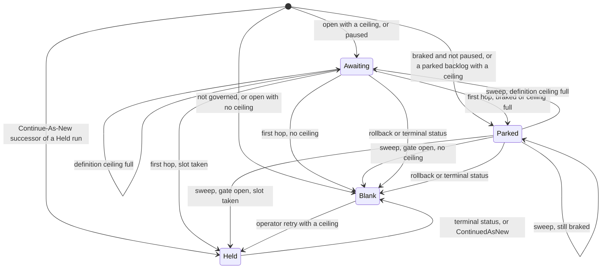
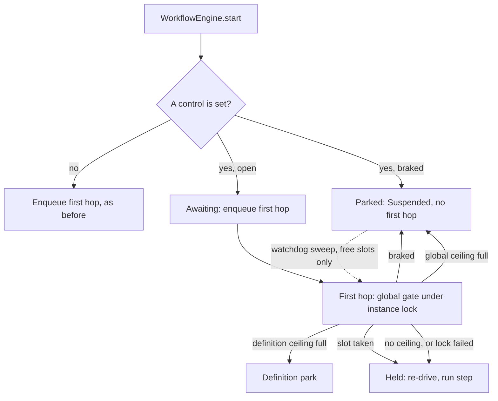

# Global Admission Brake

Issue #136. The engine runs each instance as a chain of Queueable jobs. The
org shares its async Apex capacity with all other Apex and packages. When the
capacity is full, `System.enqueueJob()` throws, the chain stops and the
instance becomes an orphan.

The global admission brake parks **new** starts for all definitions. It does
not stop an in-flight instance. In-flight chains continue and drain. The gate
admits a parked start later. The engine does not drop it. The start does not
throw.

## Controls

Set the controls on `Revenant_Config__mdt` record `Default`. No deploy is
necessary. The next start uses the new value.

| Field                            | Type     | Effect                                                                                                             |
| -------------------------------- | -------- | ------------------------------------------------------------------------------------------------------------------ |
| `Emergency_Stop__c`              | Checkbox | Parks all new starts.                                                                                              |
| `Auto_Brake_On_Capacity__c`      | Checkbox | Parks new starts while the #129 capacity status is **Critical**. **Unknown** does not park.                        |
| `Global_Max_Active_Instances__c` | Number   | Org-wide maximum of global slots. A new start parks when the count is at this value. Blank, 0 or less: no ceiling. |

- To stop all new starts, go to **Setup → Custom Metadata Types → Revenant
  Config → Manage Records → Default**. Select **Emergency Stop**. This is one
  change, not one pause for each definition.
- To admit the parked starts again, clear **Emergency Stop**. The next
  watchdog sweep sends them to the gate.
- The emergency stop is not the definition pause (#78). The pause also parks
  in-flight instances of the definition. The emergency stop parks only new
  starts.
- The capacity status is the overall status of the System Doctor **Async Apex
  Capacity** panel. The brake uses the same #129 read. It adds no new read.
  The thresholds are `Async_Capacity_Thresholds__c`. See
  [async-capacity.md](async-capacity.md).
- With all three controls off, admission is the same as before this feature.

## States

The engine keeps the state in `Workflow_Instance__c.Global_Admission__c`. Do
not edit it.

| Value      | Meaning                                                       |
| ---------- | ------------------------------------------------------------- |
| (blank)    | No global slot and no wait.                                   |
| `Awaiting` | A new start that must pass the global gate at its first hop.  |
| `Parked`   | A new start that the brake parked. The status is `Suspended`. |
| `Held`     | The instance holds one global slot.                           |

## How It Works

1. **Start.** The start reads the brake.
   - Braked: the start gets status `Suspended` and marker `Parked`. The engine
     does not enqueue the first hop.
   - Open with a ceiling: the start gets `Awaiting`. Its first hop takes the
     slot.
   - Open with a ceiling, and parked starts wait: the new start sends the
     oldest parked starts to the gate (RUN_STEP events, max the free slots
     and max 10). The new start parks behind them when they fill the free
     slots, or when the read finds 10 of them. Thus a new start cannot take
     the slot of an older start, and a free slot does not wait for the
     watchdog sweep.
   - In one transaction (for example a bulk start), each `Awaiting` start
     also counts as a used slot. When the free slots are used, the next
     starts park. Thus a bulk start does not send more first hops than free
     slots.
2. **First hop.** The gate locks the instance row. Then:
   - Braked: the start parks. It takes no definition slot.
   - If the brake is open, the definition gate (#91) runs as before.
   - Then the gate takes the global slot under a `FOR UPDATE` lock on the
     `$global` counter row. If the ceiling is full, the start parks and gives
     back its definition slot.
   - The gate re-drives the start in a new transaction, as #91 does.
3. **Resume.** A parked start has a due sleep time and no timer job. The
   watchdog sleep sweep sends parked starts to the gate, oldest start first.
   It sends only as many as the free global slots. While braked, it sends
   none. The main sleep query does not select parked starts, so a parked
   backlog cannot delay in-flight sleepers.
4. **Release.** The instance trigger gives back the slot on the first
   transition into `Completed`, `Failed`, `Cancelled` or `Compensated`.
   `CompensationFailed` keeps the slot.
5. **Continue-As-New.** The successor takes the slot of its predecessor. The
   trigger does not release it on `ContinuedAsNew`. A chain holds one slot.
6. **Operator retry.** A retry of a failed top-level instance gets `Held`. It
   does not park and takes no counter lock. The next reconcile counts it. The
   count can go above the ceiling until work completes.
7. **Reconcile.** Near the end of each watchdog sweep, after the last instance
   lock, the engine sets the count to the number of non-terminal `Held`
   instances. This corrects the count after a crash. If the transaction has
   too little SOQL, DML or query-row budget left (it keeps 5,000 query rows
   for the rest of the sweep), the reconcile does not change the count.

Lock order: the instance row, then the definition row, then `$global`. In the
watchdog sweep, a terminal transition does not lock `$global`. The reconcile
applies it. If the reconcile does not run, the sweep applies it at its end.

## What The Brake Does Not Stop

- An in-flight instance. Only a start with the `Awaiting` or `Parked` marker
  goes through the global gate. Only the start sets the marker.
- A child workflow, or a start with a parent (`StartRequest.withParent`). The
  parent holds a slot and waits for the child. A child that waits for a slot
  can cause a deadlock.
- A Continue-As-New successor.
- The rollback instance of a manual compensate (the dashboard **Compensate**
  action, `WorkflowCompensation.compensate`).
- Engine workflows: `WatchdogWorkflow`, `CleanupWorkflow`,
  `BulkRedriveWorkflow`, `BulkCancelWorkflow` and `ArchiveWorkflow`.

## Cost

Start path, for each transaction. The engine keeps the decision for the
transaction. A bulk start reads the brake one time.

| Controls          | SOQL                                 | DML                                             | Async                 |
| ----------------- | ------------------------------------ | ----------------------------------------------- | --------------------- |
| All off           | 0                                    | 0                                               | Same as before        |
| Emergency stop on | 0                                    | 0 (scalar), +1 (bulk, if no definition ceiling) | 1 less (no first hop) |
| Auto-brake on     | +1 (`AsyncApexJob`, max 2,001 rows)  | Same as emergency stop                          | 1 less when braked    |
| Ceiling set       | +1 (`$global` row), +1 (parked rows) | Same as emergency stop                          | 1 less when braked    |

A start that finds a parked backlog publishes one RUN_STEP event for each
backlog row (max 10), one time for each transaction (+1 DML, the publish). It
uses no Queueable. A failed publish does not fail the start. A parked start
also calls the watchdog bootstrap, as a normal start does in its enqueue.

- Max +3 SOQL. The config is custom metadata (no SOQL).
- The parked-row read runs only below the ceiling. It is indexed and reads
  max 10 rows. When it finds rows, the start publishes max 10 RUN_STEP
  events.
- First hop of an `Awaiting` or `Parked` start:
  - the instance lock (1 SOQL);
  - the brake read (as above);
  - the counter lock (1 SOQL, plus 1 insert on first use);
  - the counter update (1 DML) and the instance update (1 DML);
  - one re-drive hop.
- An in-flight instance pays nothing.
- Watchdog sweep, in each org:
  - the parked-start read (1 SOQL, indexed) when the budget is above 0;
  - the `$global` lock in the reconcile (1 SOQL).
- Watchdog sweep, when a control is set: the brake read (as above).
- Watchdog sweep, when the `$global` row exists, or a ceiling or the
  emergency stop is set:
  - +1 `COUNT()` (one query row for each held slot);
  - +1 insert of the row on first use;
  - +1 counter update when the count or the emergency stop changes;
  - +1 audit insert when the emergency stop changes.
- System Doctor read: max 3 SOQL. No DML.

## Fail Open

The brake must not drop the chain that it protects.

- A capacity read that fails, or the status **Unknown**: the brake does not
  brake on capacity.
- A counter read that fails at the start: the start is `Awaiting`. The gate
  decides.
- A counter lock that fails at the gate: the gate admits the start as `Held`.
  The next reconcile counts it.
- No brake method throws into the start path.

## Emergency Stop Audit

At the end of each watchdog sweep, the engine compares `Emergency_Stop__c`
with the last value that it saw (`Concurrency_State__c.Emergency_Stop_Seen__c`
on the `$global` row). On a change, it writes one `Workflow_Log__c` row:

- `Log_Type__c` = `OperatorIntervention`
- `Workflow_Name__c` = `GlobalAdmissionBrake`
- `Outcome__c` = `Engaged` or `Released`

The row has the time that the watchdog saw the change. **Setup → View Setup
Audit Trail** shows the user who changed the record.

This repository has no separate operator audit log (#62). The brake uses the
`OperatorIntervention` rows that operator skip and reclaim also write.

## System Doctor

Workflow Dashboard → **System Doctor** → **Global Admission**.

- **Open** or **Braked**, with each reason: Emergency stop, Async capacity
  critical, Global ceiling reached.
- The controls, the global slots used and the ceiling.
- The number of starts that the brake parked (max 10,000, then "10,000+").

## Time To Admit

The first watchdog sweep after the brake opens sends parked starts to the gate
(`Watchdog_Delay_Minutes__c`, default 10). One sweep sends max 200 parked
starts. With a ceiling, it sends max the number of free slots. A backlog of
more than 200 starts takes more than one sweep.

## Limits

- An operator retry is `Held` before the reconcile counts it. If it
  completes first, its release makes the count too low until the next
  reconcile. Then the gate can admit more starts than the ceiling for one
  watchdog interval.
- Different start transactions can send RUN_STEP events for the same parked
  starts. The gate admits each start one time.
- The ceiling counts the instances that took a slot at the gate or at an
  operator retry. Instances from before the ceiling, children and engine
  workflows do not count. When you set a ceiling on a busy org, the count is
  exact after that work completes. #91 has the same limit.
- With a ceiling, a new start parks when parked starts fill the free slots.
  It sends the oldest parked starts to the gate. If no new start arrives, the
  watchdog sweep sends the backlog.
- A parked row that is held (#119) or on a paused definition is not a
  backlog. It does not make new starts park.
- Priority (#132) applies in one definition only. The brake admits parked
  starts in start order, for all definitions.
- The brake sends no alert. Alerts are #127 and #42.
- The watchdog polls the emergency stop. If an operator engages and releases
  it between two sweeps, no audit row is written. The row update and the
  audit row commit together, so a failed insert does not lose a change.
- While braked, some paths still send one hop for each start. The gate then
  parks the start again. These paths are: the pause drainer after a
  definition resume, a hold release, and a #91 retry timer of a start that
  waits for a definition slot.
- The System Doctor **Concurrency Limits** parked count includes starts that
  the brake parked on a governed definition.
- With a ceiling, each terminal transition of a `Held` instance locks the
  `$global` row until its transaction commits. Under a high completion rate,
  transitions can wait for this lock. A release that fails does not stop the
  save. The next reconcile corrects the count.
- If a gate waits for the `$global` lock too long, it admits the start as
  `Held` (fail open).
- The brake writes no step row and does not change the compensation stack.

See [ADR 0010](adr/0010-global-admission-brake.md).
