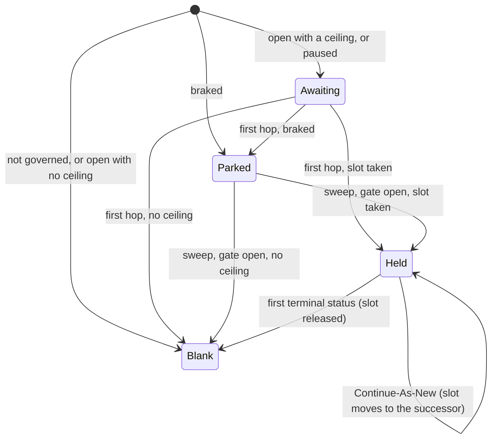
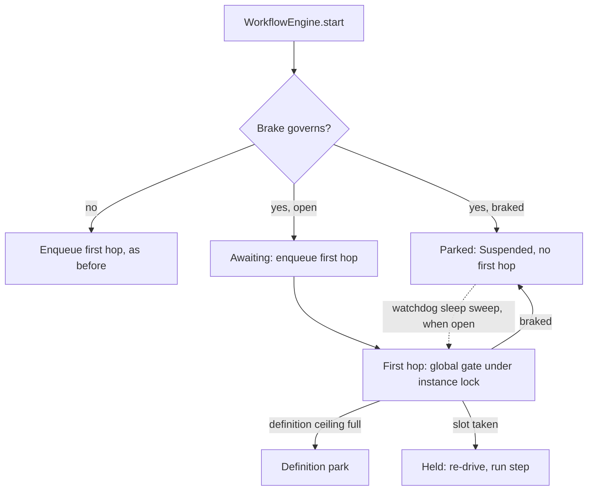

# Global Admission Brake

Issue #136. The engine runs each instance as a chain of Queueable jobs. The
org shares its async Apex capacity with all other Apex and packages. When the
capacity is full, `System.enqueueJob()` throws, the chain stops and the
instance becomes an orphan.

The global admission brake parks **new** starts for all definitions. It does
not stop an in-flight instance. In-flight chains continue and drain. A parked
start is admitted later. It is not dropped and the start does not throw.

## Controls

Set the controls on `Revenant_Config__mdt` record `Default`. No deploy is
necessary. The next start uses the new value.

| Field                            | Type     | Effect                                                                                                             |
| -------------------------------- | -------- | ------------------------------------------------------------------------------------------------------------------ |
| `Emergency_Stop__c`              | Checkbox | Parks all new starts. Clear it to admit them again.                                                                |
| `Auto_Brake_On_Capacity__c`      | Checkbox | Parks new starts while the #129 capacity status is **Critical**. **Unknown** does not park.                        |
| `Global_Max_Active_Instances__c` | Number   | Org-wide maximum of global slots. A new start parks when the count is at this value. Blank, 0 or less: no ceiling. |

- To stop all new starts, go to **Setup → Custom Metadata Types → Revenant
  Config → Manage Records → Default** and select **Emergency Stop**. This is
  one change, not one pause for each definition.
- The emergency stop is not the definition pause (#78). The pause also parks
  in-flight instances of the definition. The emergency stop parks only new
  starts.
- The capacity status is the overall status of the System Doctor **Async Apex
  Capacity** panel. The thresholds are `Async_Capacity_Thresholds__c`. See
  [async-capacity.md](async-capacity.md).
- With all three controls off, admission is the same as before this feature.

## States

The engine keeps the state in `Workflow_Instance__c.Global_Admission__c`. Do
not edit it.

| Value      | Meaning                                                                   |
| ---------- | ------------------------------------------------------------------------- |
| (blank)    | Not governed. In-flight instances and instances from before this feature. |
| `Awaiting` | A new start that must pass the global gate at its first hop.              |
| `Parked`   | A new start that the brake parked. Status `Suspended`.                    |
| `Held`     | The instance holds one global slot.                                       |

## How It Works

1. **Start.** The start reads the brake. Braked: the start is `Suspended`,
   `Parked`, and the engine does not enqueue the first hop. Open with a
   ceiling: the start is `Awaiting` and the first hop takes the slot.
2. **First hop.** The gate locks the instance row. Then:
   - Braked: the start parks again. It takes no definition slot.
   - Else the definition gate (#91) runs as before.
   - Then the gate takes the global slot under a `FOR UPDATE` lock on the
     `$global` counter row. If the ceiling is full, the start parks and gives
     back its definition slot.
   - The gate re-drives the start in a new transaction, as #91 does.
3. **Resume.** A parked start has a due sleep time and no timer job. The
   watchdog sleep sweep sends it to the gate again. While the brake is on, the
   sweep does not select parked starts, so a braked backlog uses no async job.
4. **Release.** The instance trigger gives back the slot on the first
   transition into `Completed`, `Failed`, `Cancelled` or `Compensated`.
   `CompensationFailed` keeps the slot.
5. **Continue-As-New.** The successor takes the slot of its predecessor. The
   trigger does not release it on `ContinuedAsNew`. A chain holds one slot.
6. **Reconcile.** Each watchdog sweep sets the count to the number of
   non-terminal `Held` instances. This gives back a slot that a crash leaked.

## What The Brake Does Not Stop

- An in-flight instance. Only a start with the `Awaiting` or `Parked` marker
  goes through the global gate. The start sets the marker. No other path sets
  it.
- A child workflow, or a start with a parent (`StartRequest.withParent`). The
  parent holds a slot and waits for the child. A child that waits for a slot
  can cause a deadlock.
- A Continue-As-New successor.
- Engine workflows: `WatchdogWorkflow`, `CleanupWorkflow`,
  `BulkRedriveWorkflow`, `BulkCancelWorkflow` and `ArchiveWorkflow`.

## Cost

Start path, for each transaction. The decision is cached, so a bulk start
pays once.

| Controls          | SOQL                                | DML | Async                 |
| ----------------- | ----------------------------------- | --- | --------------------- |
| All off           | 0                                   | 0   | Same as before        |
| Emergency stop on | 0                                   | 0   | 1 less (no first hop) |
| Auto-brake on     | +1 (`AsyncApexJob`, max 2,001 rows) | 0   | 1 less when braked    |
| Ceiling set       | +1 (`$global` row, no lock)         | 0   | 1 less when braked    |

- Max +2 SOQL. The config is custom metadata (no SOQL). The marker fields go
  in the update that the start already does.
- First hop of an `Awaiting` or `Parked` start: the instance lock (1 SOQL),
  the brake read (as above), the counter lock (1 SOQL, plus 1 insert on first
  use), the counter update (1 DML), the instance update (1 DML) and one
  re-drive hop. An in-flight instance pays nothing.
- Watchdog: 1 SOQL for the `$global` row. When the row exists, +1 `COUNT()`
  (one query row for each held slot).
- System Doctor read: max 3 SOQL. No DML.

## Fail Open

The brake must not drop the chain that it protects.

- A capacity read that fails, or the status **Unknown**: the brake does not
  brake on capacity.
- A counter read that fails at the start: the start is `Awaiting`. The gate
  decides.
- A counter lock that fails at the gate: the start is admitted with no slot.
- No brake method throws into the start path.

## Emergency Stop Audit

Each watchdog sweep compares `Emergency_Stop__c` with the last value that it
saw (`Concurrency_State__c.Emergency_Stop_Seen__c` on the `$global` row). On a
change, it writes one `Workflow_Log__c` row:

- `Log_Type__c` = `OperatorIntervention`
- `Workflow_Name__c` = `GlobalAdmissionBrake`
- `Outcome__c` = `Engaged` or `Released`

The row has the time that the watchdog saw the change. **Setup → View Setup
Audit Trail** shows the user who changed the record.

## System Doctor

Workflow Dashboard → **System Doctor** → **Global Admission**.

- **Open** or **Braked**, with each reason: Emergency stop, Async capacity
  critical, Global ceiling reached.
- The controls, the global slots used and the ceiling.
- The number of starts that the brake parked (max 10,000, then "10,000+").

## Time To Admit

A parked start is admitted at the first watchdog sweep after the brake opens
(`Watchdog_Delay_Minutes__c`, default 10). One sweep re-drives max 200 rows.

## Limits

- The ceiling counts the instances that took a slot at the gate. Instances
  from before the ceiling, children and engine workflows do not count. When
  you set a ceiling on a busy org, the count is exact after that work
  completes. #91 has the same limit.
- Priority (#132) applies in one definition only. The brake has no order
  across definitions.
- The brake sends no alert. Alerts are #127 and #42.
- The emergency stop audit row is written at the next watchdog sweep, not at
  the change.
- The System Doctor **Concurrency Limits** parked count includes starts that
  the brake parked on a governed definition.
- The brake writes no step row and does not change the compensation stack.

See [ADR 0010](adr/0010-global-admission-brake.md).
