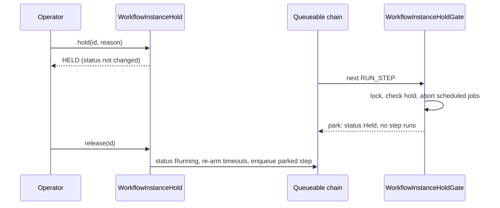

# Per-Instance Hold

Issue #119. An operator can stop one workflow instance at its next step boundary and then let it continue from the same step. The hold does not cancel the instance. It does not pause the definition. Other instances of the definition continue.

## API

```apex
WorkflowInstanceHold.HoldResult held = WorkflowInstanceHold.hold(instanceId, 'Downstream outage');
WorkflowInstanceHold.HoldResult released = WorkflowInstanceHold.release(instanceId);
```

Each call returns a `HoldResult` with an `Outcome` and a short `message`. For an expected state, the call returns an outcome. It does not throw an exception. A null `instanceId` throws `WorkflowEngine.WorkflowException`.

| Call      | Instance state                                                      | Outcome                    | Writes                                                           |
| --------- | ------------------------------------------------------------------- | -------------------------- | ---------------------------------------------------------------- |
| `hold`    | not found                                                           | `NOT_FOUND`                | none                                                             |
| `hold`    | already held                                                        | `ALREADY_HELD`             | none                                                             |
| `hold`    | `Completed`, `Failed`, `Compensated`, `Cancelled`, `ContinuedAsNew` | `REJECTED_TERMINAL`        | none                                                             |
| `hold`    | `Compensating`, `Cancelling`, `CompensationFailed`                  | `REJECTED_COMPENSATING`    | none                                                             |
| `hold`    | engine workflow (for example `WatchdogWorkflow`)                    | `REJECTED_ENGINE_WORKFLOW` | none                                                             |
| `hold`    | other                                                               | `HELD`                     | `Held_At__c`, `Hold_Reason__c`, one log row                      |
| `release` | not found                                                           | `NOT_FOUND`                | none                                                             |
| `release` | not held                                                            | `NOT_HELD`                 | none                                                             |
| `release` | status `Held`                                                       | `RELEASED`                 | clear hold, `Running` (1), re-arm timeouts, enqueue, one log row |
| `release` | held, not parked yet                                                | `RELEASED`                 | clear hold, one log row                                          |

(1) A run that waits for a concurrency slot gets `Suspended`. The admission gate then decides. A timer in the future (a sleep that ended in the park) also gives `Suspended`. The sleep sweep wakes it.

## How the hold works



1. `hold` writes `Held_At__c` and `Hold_Reason__c`. It does not change `Status__c`. If a step runs when you hold the instance, the step finishes.
2. The next delivery reaches the gate in `WorkflowStepRunner`. The gate runs after the definition-change gate and before the pause gate. It sets `Status__c` to `Held`.
3. The park writes no step row. It does not change `Current_Step__c`, `Compensation_Stack__c` or the signals.
4. `release` of a parked instance sets `Running` (see note 1), re-arms step timeouts and enqueues the parked step (or each open parallel branch). A completed step does not run again.

A hold on a `Suspended` instance waits. When a signal, sleep or retry wakes it, the gate parks it. The signal stays `Received`. The step reads it after release. The watchdog does not route a held timed wait to its fallback step. After release, the next heartbeat routes it.

A parallel branch that ran before the park can finish. The engine keeps its result. A branch that suspends, sleeps or retries keeps the `Held` status. Release starts each open branch.

The runner reads the formula field `Held__c`. DML ignores formula fields, so a step outcome cannot overwrite a hold that an operator made while the step ran.

## While an instance is held

- The correlation key stays reserved. `startOrGet` returns the held instance.
- The engine stores a signal as `Received`. The signal does not wake a parked instance.
- Cancel works. The trigger clears the hold when the status leaves the forward path.
- The watchdog does not re-drive a parked instance. The timeout sweep and the execution-deadline sweep skip it.
- The instance keeps its concurrency slot, the same as `Paused` and `DefinitionChanged`.
- Continue-As-New copies the hold to the successor. The successor parks at its first gate.
- The park cancels the scheduled jobs of the instance. Release arms the timeouts of the active steps again, the same as a definition resume. Thus hold and release add no scheduled job.

## Dashboard

- The status filter has **Held**. A parked instance has a cyan badge.
- A hold that waits for the next step boundary shows **HOLD WAITING** in the list.
- The detail pane shows the reason and the held-since time.
- **Hold** (with an optional reason) and **Release Hold** need dashboard access and the `Workflow_Operator_Action` permission. `Workflow_Admin` or Modify All Data also gives access.
- The dashboard shows **Hold** only when the engine accepts a hold for the instance.
- The **Held** filter finds parked instances and holds that wait.

## Limits

- A hold applies to the forward path only. It does not stop compensation.
- A hold applies to one instance. It does not hold child instances.
- A hold has no timer. Only `release` or cancel ends it.
- The execution deadline (`Deadline_At__c`) does not stop during a hold. After release, the watchdog can fail a run that is past its deadline. A definition pause has the same limit.
- A park cancels the scheduled jobs of the instance. After release, a parked timed wait starts its timeout again. The park also stops a branch sleep or retry wait. Release starts that branch immediately.
- Release starts each branch that is not complete. A branch that runs at that time can get a second delivery. The step-execution lock stops a second run of a finished step.
- Hold rejects a rollback. This includes a rollback step in `Suspended` status.
- A hold on a `Suspended` sleeper waits for the sleep job. The watchdog sweep does not wake a held sleeper. If the sleep job is lost, the instance shows **HOLD WAITING** until release.
