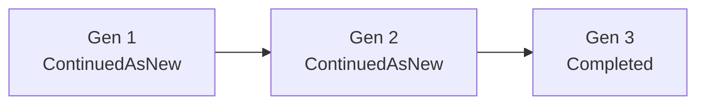

# Instance Purge

Issue #142. An operator selects terminal workflow instances. One call deletes
each instance and all records that hang off it. No orphan stays. Decision
record: [ADR 0016](adr/0016-instance-purge.md).

The engine does not find the instances of a data subject. Payloads are your
JSON, and a correlation key is not a subject index. Your process finds the
Ids. The engine deletes what you give it.

## API

```apex
// One instance.
WorkflowInstancePurge.PurgeResult r = WorkflowInstancePurge.purge(instanceId);

// A set, at most 50 Ids. Related instances are not added.
WorkflowInstancePurge.PurgeResult r = WorkflowInstancePurge.purge(ids);

// A set and the full family of each Id.
WorkflowInstancePurge.PurgeResult r = WorkflowInstancePurge.purge(ids, true);

for (WorkflowInstancePurge.InstanceResult row : r.results) {
  // row.instanceId, row.outcome, row.message, row.requested
}
```

A null set, a null Id, or more than 50 Ids throws
`WorkflowEngine.WorkflowException`. An empty set does nothing. Each other
case gives an outcome. The call does not throw for it.

The API runs SOQL and DML in system mode. Call it only from trusted code.
It is `public`, not `global` ([ADR 0006](adr/0006-frozen-global-api.md)).

## What one purge deletes

| Record                                                       | How                                                                                      |
| ------------------------------------------------------------ | ---------------------------------------------------------------------------------------- |
| `Workflow_Instance__c`                                       | Explicit delete.                                                                         |
| `Workflow_Step_Execution__c`, `Workflow_Search_Attribute__c` | Cascade (MasterDetail).                                                                  |
| `Workflow_Signal__c`                                         | Explicit delete (SetNull lookup).                                                        |
| `Workflow_Log__c` with no `Schedule__c`                      | Explicit delete (SetNull lookup).                                                        |
| Engine files (`ContentDocument`)                             | Explicit delete. Same title-prefix allowlist and shared-link check as `CleanupWorkflow`. |

What stays:

- A file with no engine title prefix (a user file).
- A file that is linked to a record outside this purge.
- A log row with `Schedule__c`. It is schedule fire history. The platform
  clears its instance lookup.
- Archive copies (`Workflow_Archive__b`, CSV archive files). To keep the
  audit trail, archive first ([archive.md](archive.md)). To erase it too,
  delete the archive copy yourself.
- Side effects in external systems. Use `idempotencyKey` to find them.

`CleanupWorkflow` and `ArchiveWorkflow` use the same delete routine
(`WorkflowInstanceTeardown`). So they also delete instance logs now.

## Outcomes

| Outcome                   | Meaning                                                                                  | What to do                                                                    |
| ------------------------- | ---------------------------------------------------------------------------------------- | ----------------------------------------------------------------------------- |
| `PURGED`                  | Deleted with its satellites.                                                             | Nothing.                                                                      |
| `NOT_FOUND`               | No instance has this Id.                                                                 | Nothing. It is possibly purged already.                                       |
| `REJECTED_NOT_TERMINAL`   | The status is not `Completed`, `Failed`, `Compensated`, `Cancelled` or `ContinuedAsNew`. | Cancel it or let it finish. Then purge it.                                    |
| `REJECTED_RELATED`        | The purge would leave a child or a chain generation without its link.                    | Add the named Ids, or set `includeRelated`.                                   |
| `REJECTED_RELATED_ACTIVE` | A related instance is not terminal. It still reads this one.                             | Purge when the related instance is terminal.                                  |
| `REJECTED_TOO_LARGE`      | The group passes the bounds of one call.                                                 | Purge the oldest generations or the children first, without `includeRelated`. |
| `DEFERRED`                | This call is full.                                                                       | Call `purge` again for this Id.                                               |

`PurgeResult` also gives `purgedCount`, `deletedSignalCount`,
`deletedLogCount` and `deletedFileCount`. `get(id)` and `outcomeOf(id)` read
one row.

## Rules

For each instance X in the purge set:

1. X is terminal.
2. Each child of X is in the set.
3. The predecessor of X (`Previous_Instance__c`) is in the set.
4. A successor of X that is not in the set is terminal.
5. The parent of X, when not in the set, is terminal.

`Previous_Instance__c` links Continue-As-New generations. It also links a
compensating instance to the instance that it compensates.



- Purge `{Gen 1}` or `{Gen 1, Gen 2}`: passes. The oldest generations go.
  The next generation becomes the first.
- Purge `{Gen 2}` or `{Gen 3}`: `REJECTED_RELATED`. Gen 1 would have no
  successor.
- Purge `{Gen 2}` with `includeRelated`: all three go.
- Purge `{Gen 1}` when Gen 2 is `Running`: `REJECTED_RELATED_ACTIVE`.

### Mixed sets and groups

The call purges each group that passes. It reports each Id that it skips.

Linked instances in the set form a group (parent and child,
predecessor and successor). A group is purged in full or not at all. When
one member breaks a rule, each member gets a rejection. The message names
the cause.

### `includeRelated`

The call adds the full family of each Id first: all generations in both
directions, all children, and their families. It does not add a parent.
Each added instance must be terminal. The result lists each added Id that
it purged, with `requested = false`.

## Bounds

| Bound                            | Value                                                                                                       |
| -------------------------------- | ----------------------------------------------------------------------------------------------------------- |
| Ids in one call                  | 50 (`MAX_INSTANCES_PER_CALL`). More throws.                                                                 |
| Instances purged in one call     | 50. Other groups get `DEFERRED`.                                                                            |
| Linked files in one call         | 100 (`CleanupDocumentPurger.MAX_DOCS_PER_CHUNK`). The first group always goes. Other groups get `DEFERRED`. |
| Link levels for `includeRelated` | 20 (`MAX_LINK_ROUNDS`).                                                                                     |
| Related rows read                | 2000 (`MAX_RELATED_ROWS`).                                                                                  |

A group larger than a bound gets `REJECTED_TOO_LARGE`.

## Concurrency

The call locks the rows that it deletes (`FOR UPDATE`). Then it reads their
links and statuses again. A redrive or a rollback that starts first wins:
the purge sees the new status and rejects the row.
