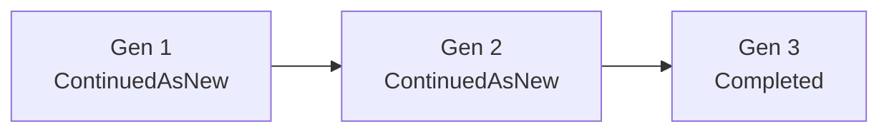

# Instance Purge

Issue #142. An operator selects terminal workflow instances. One call deletes
each instance and its satellites. No orphan stays. Decision record:
[ADR 0016](adr/0016-instance-purge.md).

Satellites are the records that refer to an instance: step rows, search
attributes, signals, logs and engine files.

The engine does not find the instances that hold data about a person. Your
process finds the Ids. The engine deletes the instances that you give it.

## API

```apex
// One instance.
WorkflowInstancePurge.PurgeResult r = WorkflowInstancePurge.purge(instanceId);

// A set, at most 50 Ids. Related instances are not added.
WorkflowInstancePurge.PurgeResult r = WorkflowInstancePurge.purge(ids);

// A set and the full family of each Id.
WorkflowInstancePurge.PurgeResult r = WorkflowInstancePurge.purge(ids, true);

for (WorkflowInstancePurge.InstanceResult row : r.results) {
  // row.instanceId, row.outcome, row.message, row.requested
}
```

A null set, a null Id, or more than 50 Ids throws
`WorkflowEngine.WorkflowException`. An empty set does nothing. For all other
input, the call returns an outcome. It does not throw an exception.

The API runs SOQL and DML in system mode. The caller must check permissions.
A message can name related instances that the caller cannot see. Show only
the outcome to a user who has no access to them. The API is `public`, not
`global` ([ADR 0006](adr/0006-frozen-global-api.md)).

## What one purge deletes

| Record                                                       | How                                                                                      |
| ------------------------------------------------------------ | ---------------------------------------------------------------------------------------- |
| `Workflow_Instance__c`                                       | Explicit delete.                                                                         |
| `Workflow_Step_Execution__c`, `Workflow_Search_Attribute__c` | Cascade (MasterDetail).                                                                  |
| `Workflow_Signal__c`                                         | Explicit delete (SetNull lookup).                                                        |
| `Workflow_Log__c` with no schedule                           | Explicit delete (SetNull lookup).                                                        |
| Engine files (`ContentDocument`)                             | Explicit delete. Same title-prefix allowlist and shared-link check as `CleanupWorkflow`. |

What stays:

- A file with no engine title prefix (a user file).
- A file with a link to a record outside this purge, or to a user who is not
  the owner.
- A log row with `Schedule__c` or `Schedule_Name__c`. It is schedule fire
  history. The platform clears its instance lookup.
- Archive copies (`Workflow_Archive__b`, CSV archive files). To keep the
  audit trail, archive first ([archive.md](archive.md)). The archive does not
  copy logs. Export them first if you need them. To erase the archive copy
  too, delete it yourself.
- Side effects in external systems. Use `idempotencyKey` to find them.

`CleanupWorkflow` and `ArchiveWorkflow` use the same delete routine
(`WorkflowInstanceTeardown`). They also delete instance logs. They select by
age and do not apply the rules below.

## Outcomes

| Outcome                   | Meaning                                                                                                     | What to do                                                                                                       |
| ------------------------- | ----------------------------------------------------------------------------------------------------------- | ---------------------------------------------------------------------------------------------------------------- |
| `PURGED`                  | Deleted with its satellites.                                                                                | Nothing.                                                                                                         |
| `NOT_FOUND`               | No instance has this Id. An Id of another object type also gets it.                                         | Nothing, if you purged it before.                                                                                |
| `REJECTED_NOT_TERMINAL`   | The status is not `Completed`, `Failed`, `Compensated`, `Cancelled` or `ContinuedAsNew`.                    | Cancel it or let it finish. Then purge it.                                                                       |
| `REJECTED_RELATED`        | The purge would remove the link of a child or a chain generation.                                           | Add the named Ids, or set `includeRelated`. If the message names a rejected group member, fix that member first. |
| `REJECTED_RELATED_ACTIVE` | A related instance can still run and read this one.                                                         | Purge again when it has a final status.                                                                          |
| `REJECTED_TOO_LARGE`      | The related group is larger than the bounds of one call.                                                    | Purge the oldest generations or the children first, without `includeRelated`.                                    |
| `DEFERRED`                | The call cannot purge it now: the call is full, a row is locked, a link check is cut, or satellites remain. | Call `purge` again for this Id. The message tells which case.                                                    |

`PurgeResult` also gives `purgedCount`, `deletedSignalCount`,
`deletedLogCount` and `deletedFileCount`. `get(id)` and `outcomeOf(id)` read
one row.

## Rules

A final status is `Completed`, `Compensated`, `Cancelled` or
`ContinuedAsNew`. `Failed` is terminal, but not final: an operator can retry
it.

For each instance X in the purge set:

1. X is terminal.
2. Each child of X is in the set.
3. The predecessor of X (`Previous_Instance__c`) is in the set.
4. A successor of X that is not in the set has a final status.
5. The parent of X, when not in the set, has a final status.

`Previous_Instance__c` links Continue-As-New generations. It also links a
compensating instance to the instance that it compensates. To purge a
compensating instance, add the instance that it compensates. You can purge a
compensated instance alone when its compensating instance has a final
status.



- Purge `{Gen 1}` or `{Gen 1, Gen 2}`: the call accepts it. The oldest
  generations go. The next generation becomes the first.
- Purge `{Gen 2}` or `{Gen 3}`: `REJECTED_RELATED`. Gen 1 would have no
  successor.
- Purge `{Gen 2}` with `includeRelated`: all three go.
- Purge `{Gen 1}` when Gen 2 is `Running`: `REJECTED_RELATED_ACTIVE`.

### Mixed sets and groups

The call purges each group that obeys the rules. It reports each other Id.

Linked instances in the set form a group (parent and child, predecessor and
successor). The call purges a group as one unit. When one member breaks a
rule, each member gets a rejection. The message names the cause.

### `includeRelated`

The call adds the full family of each Id first: all generations in both
directions, all children, and their families. It does not add a parent.
Each added instance must be terminal. The result lists each added Id that
it purged, with `requested = false`.

## Bounds

| Bound                            | Value                                                                                                                                              |
| -------------------------------- | -------------------------------------------------------------------------------------------------------------------------------------------------- |
| Ids in one call                  | 50 (`MAX_INSTANCES_PER_CALL`). More throws.                                                                                                        |
| Instances purged in one call     | 50. Other groups get `DEFERRED`.                                                                                                                   |
| Linked files in one call         | 100 (`CleanupDocumentPurger.MAX_DOCS_PER_CHUNK`). The first group always goes, also above the cap. Other groups get `DEFERRED`.                    |
| Signal and log rows in one call  | 5000 (`WorkflowInstanceTeardown.MAX_SATELLITE_ROWS`). When more remain, the call keeps the instances and gives `DEFERRED`.                         |
| Link levels for `includeRelated` | 20 (`MAX_LINK_ROUNDS`).                                                                                                                            |
| Rows for each related read       | 2000 (`MAX_RELATED_ROWS`). A cut family read gives `REJECTED_TOO_LARGE`. A cut link check gives `DEFERRED` to each group with no known rule break. |
| SOQL in one call                 | At most 9 without `includeRelated`, 31 with it.                                                                                                    |
| DML in one call                  | At most 4.                                                                                                                                         |

A group larger than a bound gets `REJECTED_TOO_LARGE`. A group that does not
fit the rest of the call gets `DEFERRED`.

## Concurrency

The call locks each row that it deletes (`FOR UPDATE`). After the lock, it
reads the links to rows outside the set. It also locks each outside parent
and successor that the rules trust, and reads its status again. A retry, a
redrive or a rollback that starts first wins: the purge sees the new status
and rejects the row. When a lock wait fails, the call deletes nothing and
gives `DEFERRED`.
