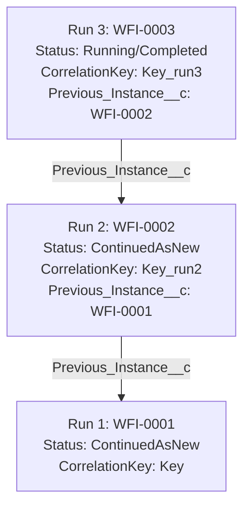

# Design Specification: Continue-As-New Feature for Durable Workflows

## Overview
To support perpetual and long-running workflows (e.g. daemons, poller tasks, or multi-month state machines) without exhausting Salesforce database storage or hitting Apex heap/query governor limits, we implement a native **Continue-As-New** execution pattern. 

This feature allows a running workflow instance to complete its execution chain and immediately trigger a fresh successor run under a clean, reset step history while carrying over state and linking the execution lineage.

---

## Architectural Schema & Schema Updates



### 1. Database Schema Additions
* **`Previous_Instance__c`** (Lookup to `Workflow_Instance__c`): Stores the predecessor run ID.
* **`Status__c` Picklist Update**: Add **`ContinuedAsNew`** as a terminal status.

---

## Apex Class Changes

### 1. `StepResult.cls`
We add `CONTINUE_AS_NEW` to the `ActionType` enum and expose overloaded static constructor methods.

```java
public class StepResult {
    public enum ActionType { COMPLETE, SUSPEND, YIELD, RETRY, SLEEP, START_CHILD, WAIT_FOR_APPROVAL, SPLIT, CONTINUE_AS_NEW }
    
    public String nextInputJson { get; set; }
    public String newCorrelationKey { get; set; }

    /**
     * Completes current execution and triggers a new run. Suffix is automatically incremented.
     */
    public static StepResult continueAsNew(Object nextInput) {
        StepResult r = new StepResult();
        r.action = ActionType.CONTINUE_AS_NEW;
        r.nextInputJson = (nextInput != null) ? JSON.serialize(nextInput) : null;
        r.newCorrelationKey = null;
        return r;
    }

    /**
     * Completes current execution and triggers a new run under a custom correlation key.
     */
    public static StepResult continueAsNew(Object nextInput, String customKey) {
        StepResult r = new StepResult();
        r.action = ActionType.CONTINUE_AS_NEW;
        r.nextInputJson = (nextInput != null) ? JSON.serialize(nextInput) : null;
        r.newCorrelationKey = customKey;
        return r;
    }
}
```

### 2. Suffix Resolution & Engine Integration (`WorkflowEngine.cls`)
When processing `CONTINUE_AS_NEW`, the engine resolves the new key and starts the successor instance.

```java
// Suffix Parsing Helper
private static String resolveContinueAsNewKey(String currentKey, String customKey) {
    if (String.isNotBlank(customKey)) {
        return customKey;
    }
    if (String.isBlank(currentKey)) {
        return 'Run_' + System.currentTimeMillis();
    }
    
    // Pattern to look for suffix '_run(\d+)'
    Pattern p = Pattern.compile('^(.*)_run(\\d+)$');
    Matcher m = p.matcher(currentKey);
    if (m.matches()) {
        String base = m.group(1);
        Integer nextNum = Integer.valueOf(m.group(2)) + 1;
        return base + '_run' + nextNum;
    }
    return currentKey + '_run2';
}
```

#### Transition Execution Flow:
1. Mark the predecessor step execution log as `Completed`.
2. Transition the current instance status to `ContinuedAsNew` and clear `Current_Step__c`.
3. Resolve the new key via `resolveContinueAsNewKey(instance.Correlation_Key__c, result.newCorrelationKey)`.
4. Create and insert the successor `Workflow_Instance__c`:
   * `Workflow_Name__c = instance.Workflow_Name__c`
   * `Correlation_Key__c = newKey`
   * `Input__c = result.nextInputJson` (using offloading logic if needed)
   * `Previous_Instance__c = instance.Id`
   * `Definition_Version__c = instance.Definition_Version__c`
5. Enqueue `WorkflowOrchestrator` on the successor instance.

---

## LWC Dashboard Integration

### 1. Visual Badging & Filtering
* Render the `ContinuedAsNew` status as a badge using CSS classes `badge badge-blue` or custom colors.
* Calculate active/completed counts by mapping `ContinuedAsNew` to completed metrics.

### 2. Lineage Navigation Links
Add lookups to the details panel:
* **Predecessor Link**: If `Previous_Instance__c` is populated, render a link to open its details.
* **Successor Link**: Query `SELECT Id, Name FROM Workflow_Instance__c WHERE Previous_Instance__c = :currentId LIMIT 1`. If found, render a link to open its details.

---

## Data Purging & Archive

Update the cleanup workflow step `PurgeOldInstancesStep` in `CleanupWorkflow.cls` to include `ContinuedAsNew` in its selection:
```java
            List<Workflow_Instance__c> oldInstances = [
                SELECT Id FROM Workflow_Instance__c
                WHERE Status__c IN ('Completed', 'Failed', 'Compensated', 'Cancelled', 'ContinuedAsNew')
                AND CreatedDate < :threshold
                LIMIT :batchSize
            ];
```

---

## Verification Plan

### Automated Tests
Implement `testContinueAsNew` inside `WorkflowEngineTest.cls`:
* Create `DaemonWorkflow` mock.
* Execute a step that increments a counter from input.
* If `counter < 3`, return `StepResult.continueAsNew(counter)`.
* Run the workflow and assert that:
  1. Three instances are created (two `ContinuedAsNew`, one `Completed`).
  2. The correlation keys are dynamically named: `Key`, `Key_run2`, `Key_run3`.
  3. `Previous_Instance__c` forms a valid chain linking Run 3 $\rightarrow$ Run 2 $\rightarrow$ Run 1.
