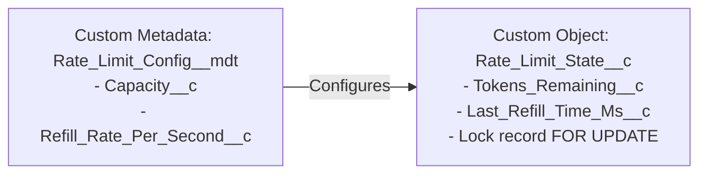

# Design Specification: Dynamic Token Bucket Rate Limiter for Apex

## Overview
To respect external API rate limits and concurrency constraints (e.g. for Salesforce Marketing Cloud or other integrations) within asynchronous workflow steps, we implement a native Apex-level distributed rate limiter.

This design prevents workflows from hitting remote servers once limits are exhausted, proactively sleeping and retrying based on mathematically derived cooldown times with random jitter.

---

## Architectural Schema: The Hybrid Model

To combine configuration deployability with dynamic runtime state updates, we separate configuration from transient state.



### 1. `Rate_Limit_Config__mdt` (Custom Metadata Type)
Stores static parameters deployable across environments:
* **`Capacity__c`** (Number): The max token capacity (burst limit).
* **`Refill_Rate_Per_Second__c`** (Number, Decimal 18, 4): Rate of token refill per second.

### 2. `Rate_Limit_State__c` (Custom Object)
Stores dynamic, serialized token state:
* **`Integration_Key__c`** (Text, Unique, External ID): Matching configuration key (e.g. `SFMC`).
* **`Tokens_Remaining__c`** (Number, Decimal 18, 4): Number of tokens remaining.
* **`Last_Refill_Time_Ms__c`** (Number, 18, 0): Unix epoch timestamp in milliseconds of the last refill/modification.

---

## Apex Implementation

### Service Class (`RateLimiter.cls`)
Encapsulates token bucket math, auto-provisioning, and row locking.

```java
public with sharing class RateLimiter {
    
    public class AcquireResult {
        public Boolean isAllowed { get; private set; }
        public Integer sleepDurationSeconds { get; private set; }
        
        public AcquireResult(Boolean isAllowed, Integer sleepDurationSeconds) {
            this.isAllowed = isAllowed;
            this.sleepDurationSeconds = sleepDurationSeconds;
        }
    }
    
    /**
     * Attempts to acquire 1 token for the specified integration.
     * Uses row-level locking (FOR UPDATE) to prevent race conditions.
     */
    public static AcquireResult acquire(String integrationKey) {
        // 1. Query Config Custom Metadata (Cached reads)
        List<Rate_Limit_Config__mdt> configs = [
            SELECT Capacity__c, Refill_Rate_Per_Second__c 
            FROM Rate_Limit_Config__mdt 
            WHERE DeveloperName = :integrationKey
        ];
        if (configs.isEmpty()) {
            throw new WorkflowEngine.WorkflowException('No rate limit configuration found for: ' + integrationKey);
        }
        Rate_Limit_Config__mdt config = configs[0];
        
        // 2. Query/Lock State Object
        List<Rate_Limit_State__c> states = [
            SELECT Tokens_Remaining__c, Last_Refill_Time_Ms__c 
            FROM Rate_Limit_State__c 
            WHERE Integration_Key__c = :integrationKey
            FOR UPDATE
        ];
        
        Rate_Limit_State__c state;
        Long now = System.currentTimeMillis();
        
        if (states.isEmpty()) {
            // Lazy Auto-provisioning: first-use initialization
            state = new Rate_Limit_State__c(
                Integration_Key__c = integrationKey,
                Tokens_Remaining__c = config.Capacity__c,
                Last_Refill_Time_Ms__c = now
            );
            insert state;
        } else {
            state = states[0];
        }
        
        // 3. Compute Refill
        Decimal elapsed = (Decimal)(now - state.Last_Refill_Time_Ms__c) / 1000.0;
        Decimal calculatedTokens = state.Tokens_Remaining__c + (elapsed * config.Refill_Rate_Per_Second__c);
        Decimal currentTokens = Math.min(config.Capacity__c, calculatedTokens);
        
        // 4. Evaluate & Consume
        if (currentTokens >= 1.0) {
            state.Tokens_Remaining__c = currentTokens - 1.0;
            state.Last_Refill_Time_Ms__c = now;
            update state;
            return new AcquireResult(true, 0);
        } else {
            // Calculate wait time for a single token
            Decimal waitTime = (1.0 - currentTokens) / config.Refill_Rate_Per_Second__c;
            Double jitter = 0.5 + (Math.random() * 1.0); // 0.5 to 1.5 seconds jitter
            Integer sleepSecs = (Integer)Math.ceil(waitTime + jitter);
            return new AcquireResult(false, sleepSecs);
        }
    }
}
```

---

## Developer Step Usage Example

Integrating rate-limiting inside step execution is extremely clean:

```java
public class SendMarketingCloudEmailStep implements WorkflowStep {
    public StepResult execute(StepContext ctx) {
        // Evaluate rate limit
        RateLimiter.AcquireResult check = RateLimiter.acquire('SFMC');
        if (!check.isAllowed) {
            // Reschedules step execution after exact dynamic cooldown wait time
            return StepResult.sleep(check.sleepDurationSeconds);
        }
        
        // Execute HTTP Callout ...
        return StepResult.complete(null, '{"status": "Sent"}');
    }
}
```

---

## Verification Plan

### Unit Testing
* **Happy Path**: Confirms tokens are successfully decremented upon calls when capacity is available.
* **Token Replenishment**: Inserts a state record, simulates elapsed time, and verifies the mathematically replenished token counts.
* **Depletion and Cooldown**: Simulates calls exceeding capacity, asserting that it returns `isAllowed = false` with a dynamically calculated `sleepDurationSeconds` (including jitter).
* **Auto-Provisioning**: Confirms that calling `acquire()` for a key with no prior state record successfully creates the corresponding `Rate_Limit_State__c` row.
