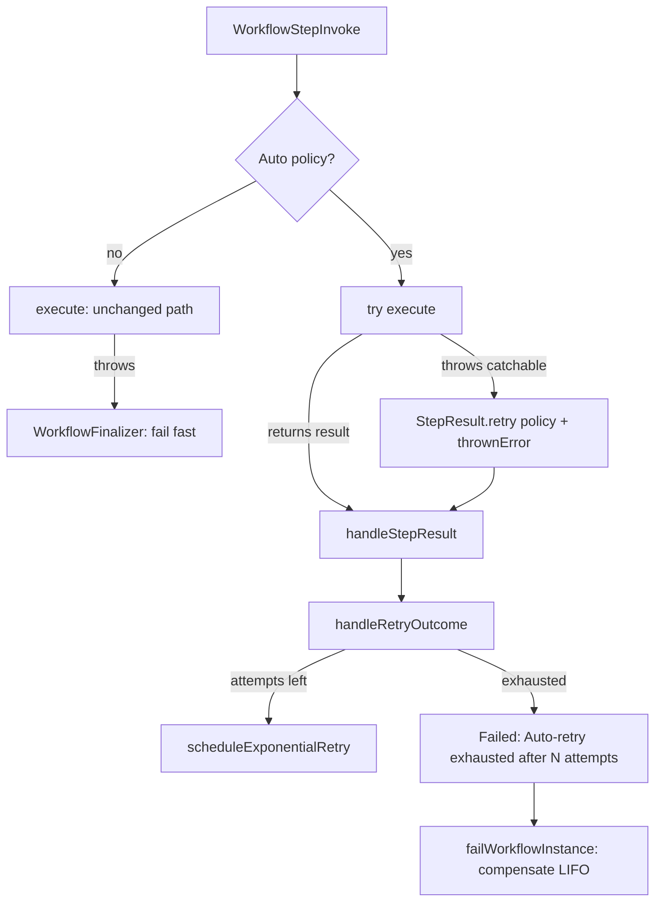

# Auto-Retry Thrown Step Errors (Issue #101)

## Problem

A step that throws fails the workflow at once. A saga then rolls back all
completed steps. One short network error can undo a full saga.

## Goal

An author declares a default `RetryPolicy` for thrown exceptions. The engine
retries a thrown step with backoff. The workflow fails only after the policy
is exhausted.

## 1. Brainstorming

| Idea | Keep? | Reason |
|---|---|---|
| New optional interface `AutoRetryConfigurable` on a step or a definition | Yes | Additive. Same pattern as `TimeoutConfigurable`. |
| Reuse `RetryConfigurable` for thrown errors | No | Changes behavior of existing steps. Breaks back-compat. |
| Catch the exception in the finalizer (`handleCrash`) | No | Cannot tell a step error from an engine error. Loses captures. |
| Catch around `execute()` and convert to `StepResult.retry(policy)` | Yes | Uses the existing `handleRetryOutcome` path. Issue asks for this boundary. |
| Carry the exception to the exhausted branch | Yes | Keeps the original message and stack in `Error_Details__c`. |
| New failure-category picklist value | No | `RETRIES_EXHAUSTED` exists. A message prefix tells the two cases apart. |
| Show the auto policy in `ctx.retry().maxAttempts` on attempt 1 | Yes | `ctx.isFinalAttempt()` must be correct on the first attempt. |

## 2. Reverse Brainstorming (How can we make this fail?)

| Bad design | Result | Prevention |
|---|---|---|
| Catch `Exception` for every step | Existing workflows change behavior | Catch only when a policy is declared. No policy: no `try/catch`. |
| Set a savepoint before `execute()` | A step that makes a callout gets "uncommitted work pending" | Do not set a savepoint. |
| Retry `LimitException` | Retry storm that burns async slots | Apex cannot catch it. It stays on the finalizer fail-fast path. |
| Auto policy overrides `fail()` or `retry()` | Author intent is lost | Engine uses the policy only when `execute()` throws. A returned result always wins. |
| Retry count on a new row | Audit trail grows. Retry count resets | Reuse the same row and `Retry_Count__c`. |
| Exhausted message looks like a crash | Operators cannot tell the cases apart | Prefix `Auto-retry exhausted after N attempts:` and category `RETRIES_EXHAUSTED`. |
| Compensate on each thrown attempt | Spurious LIFO rollback | Compensate only when retries are exhausted. |
| Definition constructor throws in the hot path | New crash for a workflow with no policy | Catch the resolve error. Treat it as "no policy". |

## 3. Six Thinking Hats

- **White (facts):** Retry is opt-in today. A throw goes to `WorkflowFinalizer`
  → `handleCrash` → fail. `handleRetryOutcome` already increments
  `Retry_Count__c`, schedules backoff, and fails at `maximumAttempts`.
  No Salesforce CLI is in this container. Apex tests run in CI or a scratch org.
- **Red (feelings):** Authors expect a 503 to retry. They do not expect a
  full rollback.
- **Black (risks):** Partial DML from `execute()` before the throw stays in the
  database. This is the same as a manual `try/catch` that returns `retry()`.
  A step must be safe to run again. A savepoint can block callouts, so we do not
  use one.
- **Yellow (benefits):** Fewer spurious saga rollbacks. Captures, progress and
  claimed-signal rollback use the graceful retry path. Circuit breaker counts
  each failed attempt.
- **Green (options):** Step-level policy overrides definition-level policy. A
  step that returns `null` from `getAutoRetryPolicy()` opts out.
- **Blue (process):** RED tests first. Then GREEN code. Then REFACTOR and docs.
  Then a multi-angle review.

## 4. Design

- `AutoRetryConfigurable.getAutoRetryPolicy()` on a step or a definition.
- `WorkflowAutoRetry.resolvePolicy(instance, step)`: step first, then
  definition, else `null`.
- `WorkflowStepInvoke` catches only when a policy exists.
- `StepOutcomeContext.thrownError` carries the exception.
- `handleRetryOutcome` writes the exhausted message when `thrownError` is set.

## 5. Test Plan (`WorkflowAutoRetryTest`)

1. Throw once, then succeed: `Completed`, zero compensation, `Retry_Count__c = 1`.
2. Throw always: exhaust at 3, compensate LIFO, one `Failed` row with prefix,
   message and stack.
3. No policy: fail fast on first throw, `STEP_EXCEPTION`, no retry.
4. `fail()` with policy: `EXPLICIT_FAIL`, zero retries.
5. `retry(max 2)` with default max 5: exhaust at 2, standard message.
6. Step policy overrides definition policy. Step `null` opts out.
7. Injected-blip harness (`failStepOnce`): with policy completes, without
   policy compensates.
8. `ctx.retry().maxAttempts` shows the auto policy on attempt 1.
9. Unit tests for `WorkflowAutoRetry` helpers.
