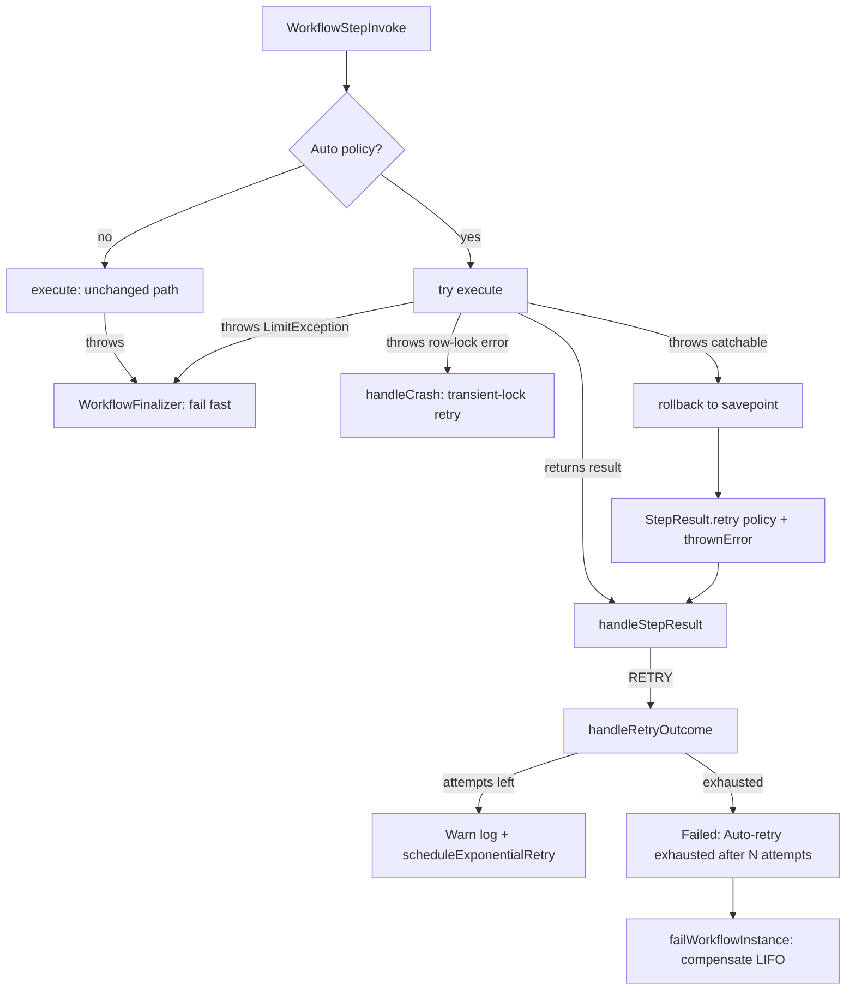

# Auto-Retry Thrown Step Errors (Issue #101)

## Problem

A step that throws an exception fails the workflow at once. A saga then rolls back all
completed steps. One short network error can undo a full saga.

## Goal

An author declares a default `RetryPolicy` for thrown exceptions. The engine
retries the step with backoff. The workflow fails only when all attempts
fail.

## 1. Brainstorming

| Idea                                                                     | Keep? | Reason                                                                     |
| ------------------------------------------------------------------------ | ----- | -------------------------------------------------------------------------- |
| New optional interface `AutoRetryConfigurable` on a step or a definition | Yes   | Additive. Same pattern as `TimeoutConfigurable`.                           |
| Reuse `RetryConfigurable` for thrown errors                              | No    | Changes behavior of existing steps. Breaks back-compat.                    |
| Catch the exception in the finalizer (`handleCrash`)                     | No    | Cannot tell a step exception from an engine exception. Loses captures.     |
| Catch around `execute()` and convert to `StepResult.retry(policy)`       | Yes   | Uses the existing `handleRetryOutcome` path. Issue asks for this boundary. |
| Carry the exception to the exhausted branch                              | Yes   | Keeps the original message and stack in `Error_Details__c`.                |
| New failure-category picklist value                                      | No    | `RETRIES_EXHAUSTED` exists. A message prefix tells the two cases apart.    |
| Show the auto policy in `ctx.retry().maxAttempts` on attempt 1           | Yes   | `ctx.isFinalAttempt()` must be correct on the first attempt.               |

## 2. Reverse Brainstorming (How can we make this fail?)

| Bad design                                         | Result                                    | Prevention                                                                          |
| -------------------------------------------------- | ----------------------------------------- | ----------------------------------------------------------------------------------- |
| Catch `Exception` for every step                   | Existing workflows change behavior        | Catch only when a policy is declared. No policy: no `try/catch`.                    |
| No savepoint before `execute()`                    | Partial step DML stays after compensation | Set a savepoint. Roll back on a thrown exception.                                   |
| Savepoint in a step that makes a callout           | "Uncommitted work pending"                | No savepoint for a `CalloutStep`. A plain step fails fast with guidance.            |
| Row-lock error uses the business retry budget      | Lock contention fails the workflow        | Rethrow it. The transient-lock path handles it.                                     |
| Retry of a timeout fallback run                    | The retry loses the timeout marker        | No auto-retry for a timeout fallback run.                                           |
| Parallel branch uses `Current_Step__c` as its name | Error shows "A,B"                         | Use the step row name.                                                              |
| Retry `LimitException`                             | Retry storm that burns async slots        | Apex cannot catch it. It stays on the finalizer fail-fast path.                     |
| Auto policy overrides `fail()` or `retry()`        | Author intent is lost                     | Engine uses the policy only when `execute()` throws. A returned result always wins. |
| Retry count on a new row                           | Audit trail grows. Retry count resets     | Reuse the same row and `Retry_Count__c`.                                            |
| Exhausted message looks like a crash               | Operators cannot tell the cases apart     | Prefix `Auto-retry exhausted after N attempts:` and category `RETRIES_EXHAUSTED`.   |
| Compensate on each thrown attempt                  | Spurious LIFO rollback                    | Compensate only when retries are exhausted.                                         |
| Definition constructor or policy getter throws     | New crash for a workflow with no policy   | Catch the error. Treat it as "no policy".                                           |

## 3. Six Thinking Hats

- **White (facts):** Retry is opt-in today. A throw goes to `WorkflowFinalizer`
  → `handleCrash` → fail. `handleRetryOutcome` already increments
  `Retry_Count__c`, schedules backoff, and fails at `maximumAttempts`.
- **Red (feelings):** Authors expect a 503 to retry. They do not expect a
  full rollback.
- **Black (risks):** Partial DML from a failed attempt. A savepoint undoes it,
  but a savepoint prevents a callout. So a `CalloutStep` gets no savepoint.
  The engine also retries exceptions that always fail (bounded by the policy).
- **Yellow (benefits):** Fewer spurious saga rollbacks. Captures, progress and
  claimed-signal rollback use the graceful retry path. Circuit breaker counts
  each failed attempt.
- **Green (options):** A step policy has priority over a definition policy. A
  step that returns `null` from `getAutoRetryPolicy()` opts out. A Warn log
  records each retried attempt.
- **Blue (process):** RED tests first. Then GREEN code. Then REFACTOR and docs.

## 4. Design

- `AutoRetryConfigurable.getAutoRetryPolicy()` on a step or a definition.
- `WorkflowAutoRetry.resolvePolicy(instance, step)`: step first, then
  definition, else `null`.
- `WorkflowStepInvoke` sets a savepoint and catches only when a policy exists.
- `StepOutcomeContext.thrownError` carries the exception.
- `handleRetryOutcome` writes the exhausted message when `thrownError` is set.
- `WorkflowStepContext` uses the persisted `__maxAttempts` when a policy exists.

## 5. Test Plan (`WorkflowAutoRetryTest`)

1. Throw once, then succeed: `Completed`, zero compensation, `Retry_Count__c = 1`.
2. Throw always: exhaust at 3, compensate LIFO, one `Failed` row with prefix,
   message and stack.
3. No policy: fail fast on first throw, `STEP_EXCEPTION`, no retry.
4. `fail()` with policy: `EXPLICIT_FAIL`, zero retries.
5. `retry(max 2)` with default max 5: exhaust at 2, standard message.
6. Step policy overrides definition policy. Step `null` opts out.
7. Injected-blip harness (`failStepOnce`): with policy completes, without
   policy compensates.
8. `ctx.retry().maxAttempts` shows the auto policy on attempt 1.
9. `ctx.retry().maxAttempts` follows the policy of the last retry.
10. Savepoint undoes step DML. A blocked callout fails fast with guidance.
11. Row-lock error keeps the transient-lock path.
12. Timeout fallback run does not auto-retry.
13. Parallel branch failure names the branch.
14. Unit tests for `WorkflowAutoRetry` helpers.
