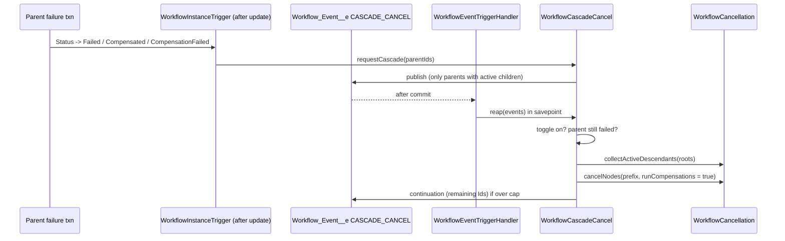

# Cascade-Cancel Children on Parent Failure (Issue #94)

**Goal:** When a parent instance fails, cancel its in-flight descendants. Use the cancel path that exists.

**Terminal failure states:** `Failed`, `Compensated`, `CompensationFailed`.

---

## 1. Brainstorming (options)

| #   | Option                                                                                                                                                                                    | Result                                                                                                                                           |
| --- | ----------------------------------------------------------------------------------------------------------------------------------------------------------------------------------------- | ------------------------------------------------------------------------------------------------------------------------------------------------ |
| A   | Call the cancel from each failure call site (`WorkflowFailureService`, `WorkflowCompensationOutcome`, `WorkflowDeadlineSweep`, `WorkflowTimeoutStepFailer`, `WorkflowParallelJoin`, ...). | Rejected. More than eight sites. A new site can forget the call.                                                                                 |
| B   | Detect the transition in `WorkflowInstanceTrigger` (after update).                                                                                                                        | **Selected.** One chokepoint. It sees all paths.                                                                                                 |
| C   | Reap the children in the same transaction as the parent failure.                                                                                                                          | Rejected. The parent failure path is hot. It is often near its limits. A cascade error must not roll back the parent.                            |
| D   | Publish a `CASCADE_CANCEL` `Workflow_Event__e`. Reap in the event transaction.                                                                                                            | **Selected.** Own governor limits. `PublishAfterCommit` sends no event if the parent write rolls back. Same pattern as child-completion signals. |
| E   | Watchdog sweep that finds children of failed parents.                                                                                                                                     | Rejected. It also reaps orphans from old runs. That is out of scope.                                                                             |
| F   | New per-node reaper for the cascade.                                                                                                                                                      | Rejected. AC 1 forbids a new reaping path.                                                                                                       |
| G   | Make `WorkflowCancellation` set-based. Use it for `cancel()` and for the cascade.                                                                                                         | **Selected.** One reaping path. Cost is constant per generation.                                                                                 |

## 2. Reverse brainstorming (how can this fail?)

| Failure mode                                                                                    | Control                                                                                                             |
| ----------------------------------------------------------------------------------------------- | ------------------------------------------------------------------------------------------------------------------- |
| The cascade error rolls back the parent failure.                                                | Async event. The handler uses a savepoint and a catch.                                                              |
| A redelivered event cancels a child two times.                                                  | Skip descendants in `Cancelling`. The cancel path skips terminal ones.                                              |
| An operator redrives the parent before the event arrives. Children of a live run are cancelled. | The handler reads the parent again. It reaps only when the parent is still in a failure state.                      |
| A wide tree uses all SOQL or DML.                                                               | Set-based cancel. Node cap per pass (`maxNodesPerPass`). The remainder goes to a continuation event.                |
| The continuation cannot reach the remainder because a reaped node is now terminal.              | The continuation event carries the remaining target Ids. They are the new roots.                                    |
| A child is cancelled before its parent and wakes the parent with `ChildFailed`.                 | Root-first order. The cap takes a prefix of the BFS order.                                                          |
| An error drops the cascade forever.                                                             | Republish with an attempt count. Maximum 3 attempts.                                                                |
| A failed event publish rolls back the parent.                                                   | Budget guard and catch in the publisher (same as `WorkflowLifecyclePublisher`).                                     |
| Each failure spends a platform event, also with no children.                                    | One guarded SOQL filters to parents with active children.                                                           |
| Orgs that need the old behavior break.                                                          | `Cascade_Cancel_Children_On_Failure__c` toggle. Default is on. The handler reads the toggle again.                  |
| The bulk refactor changes explicit `cancel()`.                                                  | Keep the same order, messages, branches, exception and enqueue calls. Existing cancel tests are the regression net. |

## 3. Six Thinking Hats

- **White (facts):** `WorkflowCancellation.cancelInstanceTree` does a BFS with one SOQL per level. `cancelSingleInstance` costs about five SOQL and three DML for each node. There is no after-update trigger on `Workflow_Instance__c`. `Workflow_Event__e` is `PublishAfterCommit`.
- **Red (feelings):** Automatic cancellation is a strong action. Operators must see why a child stopped. The toggle gives them control.
- **Black (risks):** The bulk refactor touches a proven path. We cannot run Apex in this environment. The old per-node cost is a real governor risk for wide trees.
- **Yellow (benefits):** No orphaned children. `cancel()` also becomes bulk-safe. One reaping path.
- **Green (ideas):** Per-child policy (Temporal `ParentClosePolicy`) is a later option. The event type can carry other policies.
- **Blue (process):** RED: write `WorkflowCascadeCancelTest`. GREEN: toggle, trigger, publisher, handler, set-based cancel. REFACTOR: shared status sets, docs. Then a multi-angle review.

## 4. Design

### Rules

1. Trigger on the change of `Status__c` into the failure set. Insert does not trigger.
2. The cascade does not change the parent.
3. Targets: active descendants from the BFS, except `Cancelling` and `CompensationFailed`. The BFS still walks through them.
   - Decision: a `CompensationFailed` child is a stalled rollback. It runs no forward work and holds no Queueable chain. An operator decides to resume or cancel it. An automatic resume can loop on a bad compensation. An explicit `cancelWithCompensations()` still resumes it.
4. Cancel mode: `runCompensations = true`.
5. Cap: `maxNodesPerPass` nodes in BFS order. Continuation roots are also targets.
6. Retry: at most 3 attempts for each event.

## 5. Tasks

1. RED: `WorkflowCascadeCancelTest` for all AC.
2. Field `Revenant_Config__mdt.Cascade_Cancel_Children_On_Failure__c` (default on). Load it in `WorkflowEngine`.
3. `WorkflowInstanceTrigger` after update. `WorkflowInstanceTriggerHandler.handleAfterSave`.
4. `WorkflowCascadeCancel`: `requestCascade`, `reap`.
5. `WorkflowEventTriggerHandler`: route `CASCADE_CANCEL`.
6. `WorkflowCancellation`: multi-root BFS, set-based `cancelNodes`.
7. Set-based helpers: `WorkflowCompensation.preCreateFirstCompensationSteps`, `WorkflowCompensationStepLog.appendCompensationRetrySteps`.
8. Docs: README §6, `ARCHITECTURE.md`, `docs/workflow-lifecycle-event.md` if needed.
