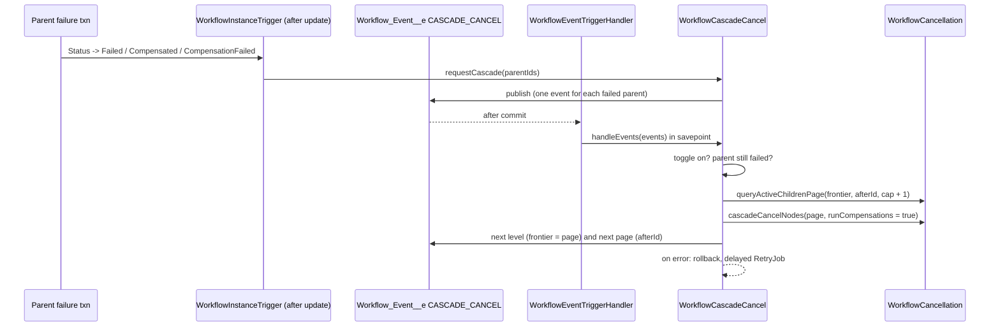

# Cascade-Cancel Children on Parent Failure (Issue #94)

**Goal:** When a parent instance fails, cancel its in-flight descendants. Use the cancel path that exists.

**Terminal failure states:** `Failed`, `Compensated`, `CompensationFailed`.

---

## 1. Brainstorming (options)

| #   | Option                                                                                                                                                                                    | Result                                                                                                                                           |
| --- | ----------------------------------------------------------------------------------------------------------------------------------------------------------------------------------------- | ------------------------------------------------------------------------------------------------------------------------------------------------ |
| A   | Call the cancel from each failure call site (`WorkflowFailureService`, `WorkflowCompensationOutcome`, `WorkflowDeadlineSweep`, `WorkflowTimeoutStepFailer`, `WorkflowParallelJoin`, ...). | Rejected. More than eight sites. A new site can forget the call.                                                                                 |
| B   | Detect the transition in `WorkflowInstanceTrigger` (after update).                                                                                                                        | **Selected.** One chokepoint. It sees all paths.                                                                                                 |
| C   | Reap the children in the same transaction as the parent failure.                                                                                                                          | Rejected. The parent failure path is hot. It is often near its limits. A cascade error must not roll back the parent.                            |
| D   | Publish a `CASCADE_CANCEL` `Workflow_Event__e`. Reap in the event transaction.                                                                                                            | **Selected.** Own governor limits. `PublishAfterCommit` sends no event if the parent write rolls back. Same pattern as child-completion signals. |
| E   | Watchdog sweep that finds children of failed parents.                                                                                                                                     | Rejected. It also reaps orphans from old runs. That is out of scope.                                                                             |
| F   | New per-node reaper for the cascade.                                                                                                                                                      | Rejected. AC 1 forbids a new reaping path.                                                                                                       |
| G   | Make `WorkflowCancellation` set-based. Use it for `cancel()` and for the cascade.                                                                                                         | **Selected.** One reaping path. Cost is constant per generation.                                                                                 |

## 2. Reverse brainstorming (how can this fail?)

| Failure mode                                                                                               | Control                                                                                                                                                                                                      |
| ---------------------------------------------------------------------------------------------------------- | ------------------------------------------------------------------------------------------------------------------------------------------------------------------------------------------------------------ |
| The cascade error rolls back the parent failure.                                                           | Async event. The handler uses a savepoint and a catch.                                                                                                                                                       |
| A redelivered event cancels a child two times.                                                             | Skip descendants in `Cancelling`. The cancel path skips terminal ones.                                                                                                                                       |
| An operator redrives the parent before the event arrives. Children of a live run are cancelled.            | The handler reads the parent again. It reaps only when the parent is still in a failure state.                                                                                                               |
| A wide tree uses all SOQL rows or DML.                                                                     | Paged walk: each event reads one page (`maxNodesPerPass` + 1 rows) of one level. Set-based cancel.                                                                                                           |
| A later page reaps the children of a redriven parent.                                                      | Every event carries the failed parent. Each pass re-checks it.                                                                                                                                               |
| A running child wakes from `ChildFailed` because its parent is still live.                                 | Root first: a node is cancelled before its children. The next-level event is published only after its page is cancelled. (A `Cancelling` parent still gets `ChildFailed`, as with explicit cancel.)          |
| A row lock or a bad node drops the cascade.                                                                | Delayed `RetryJob`: each request alone, backoff 1, 2, 4, 8 minutes, 5 attempts.                                                                                                                              |
| A failed event publish rolls back the parent, or a lost next-level event orphans the rest of the tree.     | The request publish is best-effort with a budget guard. The next-level publish throws, so the pass rolls back and retries.                                                                                   |
| A pre-filter query misses a child linked after it runs. It also costs rows in the hot failure transaction. | No pre-filter. One event for each failed parent. A childless parent costs one cheap pass.                                                                                                                    |
| Orgs that need the old behavior break.                                                                     | `Cascade_Cancel_Children_On_Failure__c` toggle. Default is on. The handler reads the toggle again.                                                                                                           |
| The bulk refactor changes explicit `cancel()`.                                                             | Keep the same outcomes, messages, branches and exception. One bulk enqueue replaces the per-node enqueue. Timeout arming for resumed rollbacks is best-effort. Existing cancel tests are the regression net. |

## 3. Six Thinking Hats

- **White (facts):** `WorkflowCancellation.cancelInstanceTree` does a BFS with one SOQL per level. `cancelSingleInstance` costs about five SOQL and three DML for each node. There is no after-update trigger on `Workflow_Instance__c`. `Workflow_Event__e` is `PublishAfterCommit`.
- **Red (feelings):** Automatic cancellation is a strong action. Operators must see why a child stopped. The toggle gives them control.
- **Black (risks):** The bulk refactor touches a proven path. We cannot run Apex in this environment. The old per-node cost is a real governor risk for wide trees.
- **Yellow (benefits):** No orphaned children. `cancel()` also becomes bulk-safe. One reaping path.
- **Green (ideas):** Per-child policy (Temporal `ParentClosePolicy`) is a later option. The event type can carry other policies.
- **Blue (process):** RED: write `WorkflowCascadeCancelTest`. GREEN: toggle, trigger, publisher, handler, set-based cancel. REFACTOR: shared status sets, docs. Then a multi-angle review.

## 4. Design

### Rules

1. Trigger on the change of `Status__c` into the failure set. Insert does not trigger.
2. The cascade does not change the parent.
3. Targets: active descendants from the walk, except `Cancelling`. The walk still goes through them.
   - Decision: a `CompensationFailed` child is not terminal (AC 1, AC 3). The cascade resumes its rollback under the cancel phase, as `cancelWithCompensations()` does (AC 2). A second undo failure stops it again as `CompensationFailed`. No loop occurs: a child failure does not re-trigger the parent.
4. Cancel mode: `runCompensations = true`.
5. Paging: one pass reads one page of one level per event and cancels at most `maxNodesPerPass` nodes. Every event carries the failed parent, the frontier and an Id cursor.
6. Retry: a failed pass rolls back. A delayed `RetryJob` runs each request alone. Maximum 5 attempts.

## 5. Tasks

1. RED: `WorkflowCascadeCancelTest` for all AC.
2. Field `Revenant_Config__mdt.Cascade_Cancel_Children_On_Failure__c` (default on). Load it in `WorkflowEngine`.
3. `WorkflowInstanceTrigger` after update. `WorkflowInstanceTriggerHandler.handleAfterUpdate`.
4. `WorkflowCascadeCancel`: `requestCascade`, `handleEvents`, `RetryJob`.
5. `WorkflowEventTriggerHandler`: route `CASCADE_CANCEL`.
6. `WorkflowCancellation`: `queryActiveChildrenPage`, set-based `cancelNodes`.
7. Set-based helpers: `WorkflowCompensation.preCreateFirstCompensationSteps`, `WorkflowCompensationStepLog.appendCompensationRetrySteps`.
8. Docs: README §6 and config list, `ARCHITECTURE.md`.
