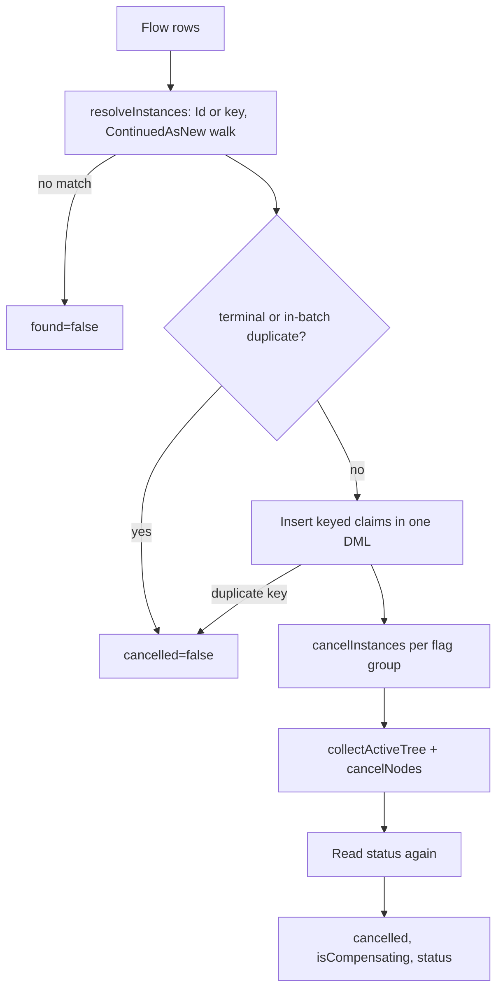

# Cancel Workflow Invocable Action (Issue #107)

## Goal

Give Flow Builders a **Cancel Workflow** action. The action cancels one workflow instance per row. It can run saga compensations. It adds no new engine behavior and no new schema.

## Facts About The Engine

- `WorkflowCancellation.cancelNodes` cancels a set of nodes. It locks the nodes (`FOR UPDATE`). It skips terminal nodes. Its SOQL and DML cost does not grow with the node count.
- `collectActiveTree` finds the active children of many roots. It uses one query for each tree level.
- A cancel with compensations sets `Cancelling`. When the stack is empty, the engine sets `Cancelled`, not `Compensated`. Each rolled-back step row gets `Compensated`.
- A cancel without compensations sets `Cancelled` at once.
- A second compensating cancel on a `Cancelling` node starts the rollback again. The cascade path prevents this: it skips `Cancelling`.
- A keyed cancel writes a `Consumed` tombstone in `Workflow_Signal__c`. The key is `deriveSignalDedupKey(instanceId, idempotencyKey)`. A unique field stops a second claim.
- `WorkflowStatusInvocableAction` finds an instance by Id or by correlation key. By key, it follows the `ContinuedAsNew` chain.
- The current keyed-cancel batch path cancels one instance at a time. That is not bulk-safe.

## Brainstorming (options)

| #   | Idea                                                                                                                                | Keep?                                                                                       |
| --- | ----------------------------------------------------------------------------------------------------------------------------------- | ------------------------------------------------------------------------------------------- |
| B1  | Wrap the Signal action with the name `Cancel` and a JSON payload.                                                                   | No. The batch cancel path runs one cancel for each row. Not bulk-safe.                      |
| B2  | Call `WorkflowEngine.cancel(Id)` for each row.                                                                                      | No. SOQL and DML grow with the row count.                                                   |
| B3  | Add `WorkflowCancellation.cancelInstances(List<Id>, Boolean)`. It uses `collectActiveTree` and `cancelNodes` for all roots at once. | Yes. Same cancel code. Constant cost.                                                       |
| B4  | Split rows into two groups by the Run Compensations flag. One engine call per group.                                                | Yes. Two calls at most.                                                                     |
| B5  | Find the instance with the same code as Get Workflow Status.                                                                        | Yes. Add `resolveInstances(List<String>)`. Status and Cancel use it.                        |
| B6  | Keyed dedup: reuse the tombstone row and key of `claimKeyedCancel`. Insert all claims in one DML.                                   | Yes. No new field. Signal and Cancel keys share one namespace.                              |
| B7  | Make `WorkflowEngine.cancel(Id, Boolean)` public.                                                                                   | Yes. The issue names it. It is a thin call.                                                 |
| B8  | Change the engine so a cancel rollback ends `Compensated`.                                                                          | No. The owner chose to keep the engine. See ADR 0004.                                       |
| B9  | Output `isCompensating`. A Flow can see that a rollback runs.                                                                       | Yes.                                                                                        |
| B10 | Output a text outcome code.                                                                                                         | No. `found`, `cancelled` and `status` are sufficient.                                       |
| B11 | Run Compensations empty means `true`.                                                                                               | Yes. Same default as the Cancel signal.                                                     |
| B12 | Add a custom permission gate.                                                                                                       | No. The Signal action can cancel with no gate. Keep parity. Apex class access controls use. |

## Reverse Brainstorming (how can this fail?)

| Way to fail                                                     | Prevention                                                                                                    |
| --------------------------------------------------------------- | ------------------------------------------------------------------------------------------------------------- |
| A retried Flow runs the rollback two times.                     | A compensating cancel skips nodes in `Cancelling` or `Compensating` under the lock. A keyed retry is a no-op. |
| Two rows in one batch target one instance with different flags. | The first row wins. Later rows return `cancelled=false`.                                                      |
| A cancel on a terminal instance throws.                         | Filter terminal rows before the engine call. The engine also skips them under the lock.                       |
| A key that matches nothing faults the Flow.                     | Return `found=false`.                                                                                         |
| A blank or null row faults the Flow.                            | Return `found=false`.                                                                                         |
| The key finds a stale `ContinuedAsNew` predecessor.             | Use the Status action chain walk.                                                                             |
| 200 rows use 200× the SOQL.                                     | Set-based code. A test checks that 1 row and 200 rows use the same SOQL count.                                |
| A claim fails for a reason that is not a duplicate.             | Roll back to the savepoint and throw.                                                                         |
| The engine throws after the claims.                             | Roll back the claims and the cancel. Then throw.                                                              |
| A claim is written for a terminal instance.                     | Claim only rows that pass the terminal filter.                                                                |
| The child cascade misses a grandchild.                          | `collectActiveTree` walks all levels. A test checks a parent and child.                                       |
| The result shows an old status.                                 | Read the status again after the cancel (one query).                                                           |

## Six Thinking Hats

- **White (facts):** The engine has the cancel logic. It lacks a bulk public entry and a Flow action. Cancel with rollback ends `Cancelled`.
- **Red (feelings):** Admins fear a silent no-op. A clear `cancelled` output removes that fear.
- **Black (risks):** An invocable contract is permanent. Keep few fields. The AC says `Compensated`, but the engine says `Cancelled`. Record this in an ADR.
- **Yellow (benefits):** One labeled action. No JSON. No internal signal names. Set-based cost.
- **Green (ideas):** Share the tombstone key with the Signal path, so the two paths dedup each other.
- **Blue (process):** Plan, then RED tests, then GREEN code, then REFACTOR. Then a review from many angles. Then an AC evidence table.

## Design

## Contract

| Input              | Type             | Note                                           |
| ------------------ | ---------------- | ---------------------------------------------- |
| `workflowKeyOrId`  | String, required | Instance Id or correlation key.                |
| `runCompensations` | Boolean          | Empty means `true`.                            |
| `idempotencyKey`   | String           | Optional. Same key space as the Signal action. |

| Output               | Note                                     |
| -------------------- | ---------------------------------------- |
| `found`              | `false` when nothing matches.            |
| `workflowInstanceId` | Resolved instance.                       |
| `cancelled`          | `true` when this row started the cancel. |
| `isCompensating`     | `true` when a rollback runs.             |
| `status`             | Status after the call.                   |

## Test Plan

1. Happy path: Id, no compensations → `Cancelled`.
2. Key, with compensations → `Cancelling`, then `Cancelled`. Step rows `Compensated`, LIFO.
3. Parent cancel → child `Cancelled`.
4. Each terminal status → `cancelled=false`, no fault.
5. No match, blank, null row → `found=false`.
6. Key after `ContinuedAsNew` → successor is cancelled.
7. 200 rows → same SOQL count as 1 row.
8. Same idempotency key two times → one rollback.
9. Compensating cancel on `Cancelling` → no second rollback.
10. In-batch duplicate rows → first wins.
11. Empty Run Compensations → rollback.
12. `WorkflowEngine.cancel(Id, Boolean)` both modes.
