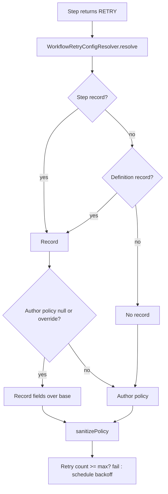

# Retry Policy Override Through Custom Metadata (Issue #103)

## Problem

A `RetryPolicy` is Apex code. To change retry pacing or the attempt limit, an
operator must deploy code. During an incident, this takes hours or days.

## Goal

An operator changes the retry policy of a workflow or a step in Setup. The
change applies at the next retry outcome. No deploy is necessary.

## 1. Brainstorming

| Idea                                                                   | Keep? | Reason                                                                  |
| ---------------------------------------------------------------------- | ----- | ----------------------------------------------------------------------- |
| New CMDT `Workflow_Retry_Config__mdt`                                  | Yes   | Same pattern as the rate-limit, alert and concurrency configs.          |
| Match by `DeveloperName` (40 characters)                               | No    | Workflow name plus step name is often longer than 40 characters.        |
| Match by text fields `Workflow_Definition__c` and `Step_Name__c`       | Yes   | No length problem. Blank step name means "all steps".                   |
| Read with `getAll()`                                                   | Yes   | `getAll()` uses no SOQL. It reads the metadata cache.                   |
| New no-argument `StepResult.retry()`                                   | No    | `StepResult` then has 20 public members (PMD `ExcessivePublicCount`).   |
| New marker `RetryPolicy.fromConfig()`                                  | Yes   | "No author policy". `StepResult.retry(...)` does not change. Additive.  |
| Treat `new RetryPolicy()` as "no author policy"                        | No    | Cannot tell it from an author who wants the defaults.                   |
| Route `RetryConfigurable` and auto-retry policies through the resolver | Yes   | `fromConfig()` and the override then work on every retry path.          |
| `Override_Author_Policy__c` checkbox                                   | Yes   | Required by the issue. Default `false` keeps author intent.             |
| Blank CMDT field keeps the value of the lower layer                    | Yes   | Operator can set only `Maximum_Attempts__c` during an incident.         |
| Merge step record and definition record field by field                 | No    | Harder to explain. The issue asks "most specific record wins".          |
| Resolve the policy at each retry outcome                               | Yes   | A new transaction reads the new CMDT value. Next retry outcome uses it. |
| Show an override in `ctx.isFinalAttempt()`                             | Yes   | A step that checks the final attempt must see the operator cap.         |
| LWC editor for the config                                              | No    | Out of scope. The Setup UI is sufficient.                               |

## 2. Reverse Brainstorming (How can we make this fail?)

| Bad design                                 | Result                                | Prevention                                                             |
| ------------------------------------------ | ------------------------------------- | ---------------------------------------------------------------------- |
| SOQL on the CMDT in the retry path         | Retries use the 100-query limit       | Use `getAll()`. A test checks `Limits.getQueries()`.                   |
| CMDT always wins over the author policy    | Author intent is lost with no warning | CMDT wins over an author policy only when `Override_Author_Policy__c`. |
| Bad CMDT value (0, negative, backoff < 1)  | Retry storm or no retry               | Ignore a bad field. Keep the value of the lower layer.                 |
| Two records for the same key               | Random result                         | Lowest `DeveloperName` wins. Documented.                               |
| Case or blank spaces in names              | Record does not match                 | Compare trimmed, lower-case values.                                    |
| Cache the index across transactions        | CMDT change does not apply            | Cache only in a static variable (one transaction).                     |
| Update old step rows to the new policy     | Audit trail changes                   | Resolver does no DML. A test checks `Limits.getDmlStatements()`.       |
| Change `StepResult.retry(policy)` behavior | Existing workflows change             | No record, or no override: same result as before.                      |
| Org with no records behaves differently    | Upgrade risk                          | No record: sanitized author policy, or 5 s, 2.0, 5 attempts. Tested.   |
| Test depends on org records                | Flaky tests                           | Test mock list replaces `getAll()` fully.                              |

## 3. Six Thinking Hats

- **White (facts):** `WorkflowContinueAsNew.handleRetryOutcome` and
  `WorkflowCompensationOutcome.handleCompensationRetry` sanitize
  `directive().retry.policy`. `sanitizePolicy(null)` gives the default.
  `StepResult.retry(policy)` rejects `null`. Each retry attempt runs in a new
  transaction. `StepResult` has 19 public members. The PMD limit is 20.
- **Red (feelings):** Operators want one fast control during an incident.
  Authors do not want their policy changed with no warning.
- **Black (risks):** A cap that is lower than the current retry count fails
  the step at the next retry outcome. This is the wanted incident result.
  A pending retry job keeps its old delay. The new delay applies to the next
  schedule.
- **Yellow (benefits):** Time to mitigate goes from a deploy cycle to one
  Setup edit. No SOQL. No schema change on existing objects.
- **Green (options):** A definition-wide record gives a default for all steps.
  A step record gives a specific value. The override flag is for incidents.
- **Blue (process):** SPEC (truth table below). RED tests. GREEN code.
  REFACTOR. Docs, ADR, example. Code review. AC evidence.

## 4. Specification

Verus is for Rust. Apex has no Verus, so the truth table below is the spec. The tests
check each row.

**Match:** step record for `(workflow, step)` > definition record for
`(workflow, blank step)` > no record.

"No author policy" means `null` or `RetryPolicy.fromConfig()`.

| Author policy | Record match | Override flag | Effective policy                      |
| ------------- | ------------ | ------------- | ------------------------------------- |
| none          | none         | -             | engine default 5 s, 2.0, 5 attempts   |
| none          | yes          | any           | record fields over the engine default |
| set           | none         | -             | author policy                         |
| set           | yes          | `false`       | author policy                         |
| set           | yes          | `true`        | record fields over the author policy  |

**Invariants:**

1. The result is always sanitized: attempts ≥ 1, interval ≥ 1, backoff ≥ 1.0.
2. A blank or bad record field never replaces a value.
3. Resolution uses 0 SOQL and 0 DML.
4. Same inputs give the same result (duplicate keys: lowest `DeveloperName`).

## 5. Tasks

1. **SPEC:** CMDT object and fields. Plan and truth table (this file).
2. **RED:** `WorkflowRetryConfigResolverTest` (truth table, match order,
   case, duplicates, bad values, 0 SOQL, 0 DML). `StepResultValidationTest` for
   `RetryPolicy.fromConfig()`. Integration tests with `WorkflowTestHarness`: default,
   definition record, step record, override, no override, change between
   attempts, compensation retry, `isFinalAttempt()`.
3. **GREEN:** `WorkflowRetryConfigResolver`. `RetryPolicy.fromConfig()`. Wire the
   resolver into the forward and compensation retry outcomes and the two
   context builders.
4. **REFACTOR:** Format with Prettier. Remove duplicate code.
5. **Docs:** `docs/retry-config.md`, ADR 0003, README, ARCHITECTURE.
6. **Example:** `RetryConfigWorkflowExample` with a test that caps attempts
   in the middle of an incident.
