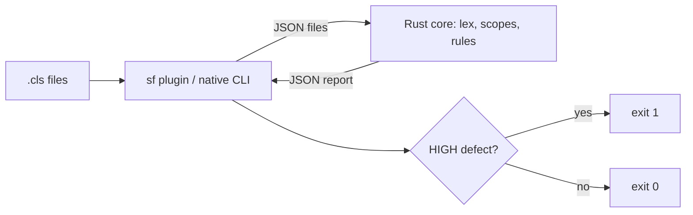

# Deploy-Time Determinism Lint (Issue #135)

## Goal

Find replay-unsafe calls in step classes before deploy. Point the author to `once()`. Fail a CI gate on a HIGH defect.

## Facts

- The engine runs `execute()` again after a wait, `RETRY`, `SLEEP` or `YIELD`. See [strict-determinism.md](../strict-determinism.md).
- The remedy is `ctx.captures().once(key, producer)`. The producer is a class that implements `CaptureProducer`. Apex has no lambdas. Thus a wrapped call is in the body of a producer class.
- `WorkflowValidator` is `public`. A subscriber org cannot call it. A new Apex entry point must be `global`, a permanent contract.
- `ApexClass.Body` is hidden for managed classes. Apex has no parser. A regex scan in Apex uses CPU and heap limits.
- The repo already has `@apexdevtools/apex-parser` for `scripts/global-api`.
- A step class implements `WorkflowStep` or `CompensatableStep`, directly, through a base class, or through a sub-interface. A definition names its steps in `getSteps()`.

## Brainstorming

| # | Idea | Keep? |
|---|------|-------|
| B1 | Apex analyzer: query `ApexClass.Body`, regex after comment strip, return defects. | No. Needs a new `global` API. Regex in Apex. Runs only in an org. |
| B2 | Add defect codes to `WorkflowValidator`. | No. Same as B1. Mixes DAG shape with source scan. |
| B3 | `sf` CLI plugin. Scans local source before deploy. | Yes. No org, no Apex API, no governor limits. Fits CI. |
| B4 | Rust core with an Apex lexer. The lexer drops comments and strings as tokens, not by regex. | Yes. Exact comment and string rules. Fast. Testable with property tests. |
| B5 | Compile the Rust core to WebAssembly. The plugin loads one `.wasm` file. | Yes. One artifact for all OSes. No native binary per platform. |
| B6 | Also ship a native `revenant-lint` binary. | Yes. Pre-commit hooks and CI without Node. Thin wrapper on the library. |
| B7 | Use tree-sitter or the Java parser. | No. C or JVM build. Harder to build for wasm. The rules need tokens and class scopes only. |
| B8 | Find step classes by supertype (transitive in the scanned source) and by `getSteps()` string literals. | Yes. Covers base classes and sub-interfaces. |
| B9 | Exempt code in the body of a class that implements `CaptureProducer`. | Yes. That is the `once()` remedy. |
| B10 | Exclude a file when its top-level class name ends with `Test` (any case). | Yes. As the issue says. |
| B11 | Suppress one finding with `revenant-lint-disable-line` or `revenant-lint-disable-next-line` in a comment. | Yes. The issue asks for author suppression. Report the suppressed count. |
| B12 | Severity: HIGH for clock, random, user context, async enqueue. MEDIUM for SOQL and SOSL. | Yes. SOQL is common and often safe. The gate fails on HIGH by default. |
| B13 | Scan helper classes that a step calls. | No. Out of scope (issue). |
| B14 | Auto-fix. | No. Out of scope (issue). |
| B15 | SARIF output. | No. Later, if needed. JSON is enough for v1. |
| B16 | Fail closed on a lex error (`SOURCE_UNREADABLE`, HIGH). | Yes. An unscanned file must not pass the gate. |

## Reverse Brainstorming (how can this fail?)

| Way to fail | Prevention |
|-------------|-----------|
| `Datetime.now()` in a comment or string gives a defect. | The lexer makes comments and strings their own tokens. Rules read code tokens only. |
| An escaped quote (`'it\'s'`) ends the string too early. | The lexer reads `\` escapes. Test. |
| `/* ... */` with no end hides the rest of the file. | Lex error. `SOURCE_UNREADABLE`, HIGH. |
| Apex is case-insensitive. `DATETIME.NOW()` passes. | Match names without case. Test. |
| `this.userInfo.getName()` is a false positive. | A qualifier after `.` does not match, except after `System.`. |
| `System.Math.random()` is a false negative. | `System.` before the qualifier is allowed. Test. |
| `Account.class` starts a false class scope. | `class` after `.` is not a declaration. Test. |
| A step extends an abstract base step. It is not found. | Supertype closure in the scanned source, plus `getSteps()` literals. |
| A step implements a sub-interface of `WorkflowStep`. | Same closure over interfaces. |
| A step nested in a step gives two reports. | Each token belongs to the innermost step class. |
| A producer class nested in the step is scanned. | Skip bodies of producer classes. |
| A producer is a sibling class in the same file. | Scan only step class bodies. Siblings are not in the scan. |
| A `getSteps()` name is in a managed package. The author thinks it was scanned. | `STEP_SOURCE_NOT_FOUND`, LOW. |
| Non-ASCII text breaks the lexer or the columns. | Lex by `char`. Property test: the lexer is total on any string. |
| The output order changes between runs. CI diffs are noisy. | Sort by file, line, column, rule. Property test: file order does not change the report. |
| The `.wasm` file is missing. The plugin crashes. | Clear error with the build command. |
| The wasm memory API leaks or reads the wrong bytes. | One `rl_alloc`/`rl_free` pair. Round-trip test from Node. |
| The gate misses a HIGH defect because of `--fail-on`. | Default is `high`. Test exit codes for each level. |

## Six Thinking Hats

- **White (facts):** `force-app` and `examples` hold about 100 step classes. `@apexdevtools/apex-parser` and Rust 1.97 with `wasm32-unknown-unknown` are available. Verus is not reachable from this container.
- **Red (feelings):** Authors fear a noisy gate. Keep HIGH rules few and exact. SOQL is MEDIUM.
- **Black (risks):** A heuristic has false negatives: aliases, helper classes, dynamic Apex. The lint does not replace strict mode (#102). The docs say this.
- **Yellow (benefits):** A production divergence becomes a CI error. No schema change. No `global` change. No org needed. Sub-second on a full repo.
- **Green (ideas):** Later: SARIF output for GitHub code scan alerts, helper-class analysis, an org mode that reads `ApexClass.Body` through the Tooling API.
- **Blue (process):** Plan and ADR. Red: Rust and Node tests that fail. Green: least code. Refactor with tests on. Review with agents. Fix findings.

## Design

- `tools/revenant-lint`: Rust crate. Library, `revenant-lint` binary, and a `cdylib` for wasm.
- `tools/sf-plugin-revenant`: `sf revenant lint determinism`. Walks the package directories. Calls the wasm core.

### Defect contract (stable)

| Field | Value |
|-------|-------|
| `code` | `NON_DETERMINISTIC_SOURCE`, `STEP_SOURCE_NOT_FOUND`, `SOURCE_UNREADABLE` |
| `rule` | `CLOCK_READ`, `RANDOM_VALUE`, `USER_CONTEXT`, `ASYNC_ENQUEUE`, `SOQL_READ`, or empty |
| `severity` | `HIGH`, `MEDIUM`, `LOW` |
| `className`, `file`, `line`, `column`, `api`, `message`, `remedy` | Location and text |

### Invariants (property tests; Verus is not available here)

1. The lexer is total. It does not panic on any input. Token spans are in order and in bounds.
2. Hazard text in a comment or a string literal adds no defect.
3. A hazard in a `CaptureProducer` body adds no defect.
4. The file order does not change the report.
5. Each defect line is in the file.

## Tasks

1. Red: Rust tests for the lexer, scopes, rules, report, and the seed corpus.
2. Green: lexer, scope model, rules, report, CLI, wasm ABI.
3. Red: Node tests for the wasm bridge and the `sf` command.
4. Green: plugin.
5. Refactor. `cargo fmt`, `cargo clippy -- -W clippy::pedantic -W clippy::nursery`.
6. Docs: `docs/determinism-lint.md`, ADR 0009, README, CLAUDE.md, CI workflow.
7. Review with agents. Fix findings.

## Review Round 1 (four agents)

| Finding | Change |
|---------|--------|
| A class that is a step and a producer was not scanned. | The step wins. Only `produce()` is safe. |
| A producer constructor ran on each replay but was not scanned (Codex). | Only `produce()` is safe in each producer. |
| A nested supertype resolved by simple name in any file. | Resolve as Apex does: enclosing classes, then top level. |
| `FetchLatest` was a test file. `@IsTest` classes were scanned. | `@IsTest`, or a `Test` or `_test` suffix. |
| `Database.getCursor*()`, `Search.find()`, `EventBus.publish()` were not found. | New rule entries. New rule `EVENT_PUBLISH`. |
| `vals[find]` and a map named `userInfo` were findings. | `FIND` needs search text. `UserInfo` methods are a list. |
| A lone `\r` and a BOM moved lines and columns. | The lexer ends a line at `\r`. It skips a BOM. |
| Suppression missed multi-line calls and matched `-disable-line-x`. | Cover the lines of the call. Match a whole marker. |
| An empty scan passed the gate. Errors used exit code 1. | No `.cls` file: exit code 2. Each error that is not a defect: exit code 2. |
| Overlapping paths gave two reports for one file. | Read each real path one time. |
| The JS bridge read the i64 as signed. A trap left a broken instance. | `BigInt.asUintN`. A new instance after a trap. |
| Weak property tests. | Apex-like input, position checks, CRLF, and shuffles with cross-file types. |
