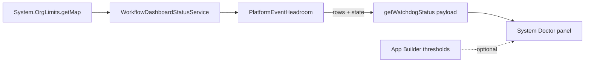

# Platform Event Headroom

Issue #120. The engine uses Platform Events for signal wake-ups,
child-to-parent resumes, parallel fan-in and lifecycle events. All apps in
the org share the Platform Event allocation. When the allocation is full,
the platform can drop events and the engine gets no error. System Doctor
shows the headroom, so the operator gets a warning before this occurs.

## How It Works

1. **Read.** Each System Doctor load reads `System.OrgLimits.getMap()` one
   time. The read does no SOQL, no DML, no async enqueue and no event
   publish.
2. **Keys.** The panel shows one card for each key that the org has, in this
   order:

   | Key                                           | Measures                          |
   | --------------------------------------------- | --------------------------------- |
   | `HourlyPublishedPlatformEvents`               | High-volume publish (Revenant)    |
   | `DailyDeliveredPlatformEvents`                | Delivery to CometD / Pub/Sub      |
   | `HourlyPublishedStandardVolumePlatformEvents` | Legacy standard-volume publish    |
   | `DailyStandardVolumePlatformEvents`           | Legacy standard-volume allocation |

   A key that is not there, or has a limit of 0, gives no card.

3. **State.** Each card shows used and remaining, as a number and a percent.

   | Condition                       | State             |
   | ------------------------------- | ----------------- |
   | `used × 100 ≥ critical × limit` | **Critical**      |
   | `used × 100 ≥ warning × limit`  | **Warning**       |
   | Else                            | **Healthy**       |
   | No card                         | **Not available** |

   The panel badge shows the worst card state. The used percent rounds down,
   so a card never shows the threshold before its state changes.

4. **Consequence.** At Warning or Critical, the panel shows: suspended
   workflows can fail to wake, child-to-parent resumes can stop, and
   lifecycle events can fail to publish.

## Thresholds

The defaults are Warning at 80 % and Critical at 95 %. To change them, edit
the Lightning page that holds the **Workflow Orchestrator Dashboard** in App
Builder. Set **Platform Event Warning %** and **Platform Event Critical %**.

- Blank uses the default.
- The Warning value must be more than 0 and less than the Critical value.
  The Critical value must be 100 or less. Else the panel uses the defaults.
- App Builder properties do not apply to a Lightning tab (`lightning__Tab`).
  A tab uses the defaults.

## Limits Of This Feature

- The allocation is org-wide. A Warning can come from other apps. The panel
  does not show the Revenant share.
- The panel does not send alerts and does not slow the engine.
- The state changes only when you load System Doctor again.

See [ADR 0006](adr/0006-platform-event-headroom.md).
