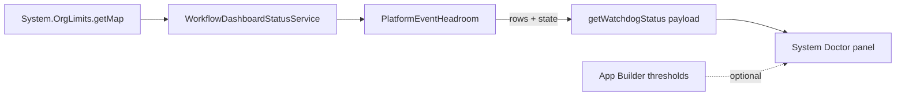

# Platform Event Allocation

Issue #120. The engine uses Platform Events for signal wake-ups,
child-to-parent resumes, parallel fan-in and lifecycle events. All apps in
the org share the Platform Event allocation. When the allocation is full, a
publish can fail. The engine does not see a failure that occurs after commit.
System Doctor shows the used and the remaining allocation. Thus, the operator
sees a warning before the engine loses a wake-up.

## How It Works

1. **Read.** Each time System Doctor loads, it reads
   `System.OrgLimits.getMap()` one time. The read uses no SOQL query, no DML
   statement, no async job and no Platform Event.
2. **Keys.** The panel shows one card for each key in the map, in this
   order:

   | Key                                           | Counts                                              | Impact            |
   | --------------------------------------------- | --------------------------------------------------- | ----------------- |
   | `HourlyPublishedPlatformEvents`               | High-volume events published in one hour            | `PUBLISH`         |
   | `DailyDeliveredPlatformEvents`                | Delivery to CometD, Pub/Sub API and empApi clients  | `DELIVERY`        |
   | `MonthlyPlatformEventsUsageEntitlement`       | Monthly delivery entitlement (add-on orgs only)     | `DELIVERY`        |
   | `HourlyPublishedStandardVolumePlatformEvents` | Standard-volume events published in one hour        | `STANDARD_VOLUME` |
   | `DailyStandardVolumePlatformEvents`           | Standard-volume delivery to CometD clients in 1 day | `STANDARD_VOLUME` |

   All Revenant events are high-volume. Delivery to Apex triggers does not
   use a delivery allocation. If the map does not contain a key, or the
   limit is 0, the panel shows no card for that key.

3. **State.** Each card shows `used / limit`, the used percent, the
   remaining number and the remaining percent.

   | Condition                       | State             |
   | ------------------------------- | ----------------- |
   | `used × 100 ≥ critical × limit` | **Critical**      |
   | `used × 100 ≥ warning × limit`  | **Warning**       |
   | Not Warning and not Critical    | **Healthy**       |
   | No card                         | **Not available** |

   The panel badge shows the worst card state. The panel rounds both
   percents down. Thus, a card does not show the threshold value before its
   state changes, and it does not show more headroom than the org has.

4. **Consequence.** At Warning or Critical, the panel shows the risk for
   each impact that is at risk:
   - `PUBLISH`: suspended workflows can stay suspended. Child-to-parent
     resumes and parallel fan-in can stop. The engine can fail to publish
     lifecycle events.
   - `DELIVERY`: external subscribers can stop receiving events, for example
     `Workflow_Lifecycle__e`. The engine does not stop.
   - `STANDARD_VOLUME`: events of other apps can fail. Revenant does not
     use this allocation.

## Thresholds

The defaults are Warning at 80% and Critical at 95%. To change them, edit
the Lightning page that holds the **Workflow Orchestrator Dashboard** in App
Builder. Set **Platform Event Warning %** and **Platform Event Critical %**.

- If you leave a property blank, the panel uses the default.
- The Warning value must be more than 0 and less than the Critical value.
  The Critical value must be 100 or less. If a value is not valid, the panel
  uses the defaults and shows "Page settings ignored".
- When a page setting applies, the panel shows "(page setting)".
- On a Lightning tab (`lightning__Tab`), you cannot set the properties. The
  tab uses the defaults.

## Limits Of This Feature

- The allocation is for the full org. A Warning can come from other apps.
  The panel does not show the Revenant share.
- The panel does not send alerts and does not slow the engine.
- The state changes only when you load System Doctor again.
- To see the same values outside Salesforce, use the REST `/limits`
  resource.

See [ADR 0006](adr/0006-platform-event-headroom.md).
