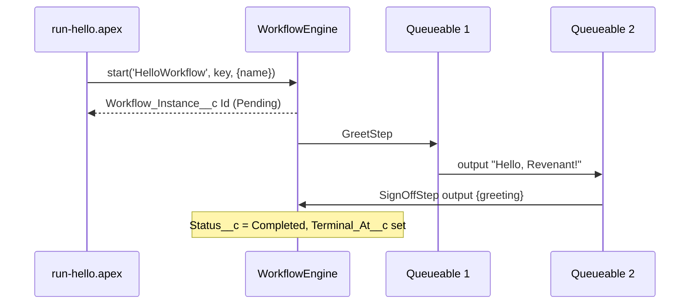

# Quickstart: Your First Durable Workflow

From the deploy to a `Completed` run: less than 10 minutes. CI measures this time on each run. You need no Revenant knowledge.

You deploy the engine and a two-step workflow, `HelloWorkflow`. You start it. Each step runs in its own Queueable. Then a check shows that the run is `Completed` and how long it took.

This path changes no engine code. It uses only the public start API.

## Before You Start

- Node.js 20 or later. The one-command path needs no `npm install`.
- The Salesforce CLI (`sf`). To install it: `npm install --global @salesforce/cli`.
- A Dev Hub org. If you do not have one, sign up for a free Developer Edition org. Then go to Setup > Dev Hub > Enable.
- Log in to the Dev Hub: `sf org login web --set-default-dev-hub --alias devhub`.
- A clone of this repository with its submodule: `git clone --recursive https://github.com/madmax983/revenant.git`. If you cloned without `--recursive`, run `git submodule update --init`. The deploy needs every folder in `sfdx-project.json`.
- Run all commands from the repository root.

## Steps

### 1. Make a scratch org

```bash
sf org create scratch --definition-file config/quickstart-scratch-def.json --alias hello --set-default --duration-days 1 --wait 15
```

You can use a different org, for example a Developer Edition org. Make it the default org: `sf config set target-org <alias>`.

### 2. Deploy the engine and the example

```bash
sf project deploy start --source-dir force-app --source-dir examples/quickstart
```

### 3. Give yourself access

```bash
sf org assign permset --name Revenant_Admin
```

A deploy gives no field access. The check in step 5 reads the engine objects, so it needs this access. If the CLI says `Duplicate PermissionSetAssignment`, you already have it.

### 4. Start the workflow

```bash
sf apex run --file scripts/apex/run-hello.apex
```

The output is a debug log. Look for `HELLO_INSTANCE_ID=`. The value is the `Workflow_Instance__c` Id. To see only the debug lines, add `| grep USER_DEBUG` (macOS, Linux) or `| findstr USER_DEBUG` (Windows). You do not need to copy the Id: the verify reads the latest run.

### 5. Verify

```bash
sf apex run --file scripts/apex/verify-hello.apex
```

Look for the `USER_DEBUG` line with `HELLO_VERIFY:`, for example `HELLO_VERIFY: a01... Completed in 2.3 s`. (The log also shows the source line of the script. Ignore it.) The time is from the start to the terminal status.

If the output shows an error with `is still Pending` or `is still Running`, the run is not done. Wait 10 seconds. Then run the script again.

## One Command

After step 1, one command does steps 2 to 5:

```bash
npm run quickstart
```

It prints the time from the deploy start to `Completed`. It fails if the time is more than 600 s. A slow org can go over 600 s. The run is good if the verify line shows `Completed`. To see the options, run `npm run quickstart -- --help`.

## Run the Tests

```bash
sf apex run test --class-names HelloWorkflowTest --class-names HelloWorkflowCheckTest --wait 10
```

The tests make their own user with `Revenant_Admin`.

## What Happened



- `WorkflowEngine.start` makes a `Workflow_Instance__c` record. If you start again with the same correlation key, you get the same instance.
- Each step runs in a new Queueable, with new governor limits.
- The engine writes one `Workflow_Step_Execution__c` row for each step. This is the audit trail.

## Read the Code

| File                                                 | What it shows                        |
| ---------------------------------------------------- | ------------------------------------ |
| `examples/quickstart/classes/HelloWorkflow.cls`      | A definition and two steps.          |
| `examples/quickstart/classes/HelloWorkflowTest.cls`  | A harness test and a step unit test. |
| `scripts/apex/run-hello.apex`                        | The start call.                      |
| `examples/quickstart/classes/HelloWorkflowCheck.cls` | A read-only check of the run.        |

## Next

- Write your own workflow: the [Developer Guide](../README.md#developer-guide).
- Test it: [testing.md](testing.md).
- See signals, sagas and child workflows: `examples/main/default/classes/OnboardingWorkflowExample.cls`.

## Troubleshooting

| Symptom                                         | Cause                                           | Fix                                                      |
| ----------------------------------------------- | ----------------------------------------------- | -------------------------------------------------------- |
| `sf org create scratch` fails.                  | The org is not a Dev Hub.                       | Setup > Dev Hub > Enable Dev Hub. Log in again.          |
| The verify says `No such column` or no access.  | Step 3 is not done.                             | Do step 3.                                               |
| The verify says `No HelloWorkflow run`.         | Step 4 is not done, or it used a different org. | Do step 4 on the same org.                               |
| The verify says `is still Pending` for minutes. | The async Apex queue is busy.                   | Setup > Apex Jobs. Wait, then run the verify again.      |
| The verify says `ended Failed: <message>`.      | A step threw an error.                          | Read the message. To see each step, run the query below. |
| The verify says `is Held` or `is Paused`.       | An operator stopped the run.                    | Resume it, or run step 4 again.                          |

To see each step of a run, use the Id from step 4:

```bash
sf data query --query "SELECT Step_Name__c, Status__c, Error_Details__c FROM Workflow_Step_Execution__c WHERE Workflow_Instance__c = '<Id>'"
```

## CI

The workflow `.github/workflows/quickstart.yml` runs when a push to `main` or a pull request changes the engine or the quickstart files. You can also start it by hand (Actions > Quickstart > Run workflow).

- **Static checks**: Node tests of the runner and of this page. apex-ls compiles the Hello classes and the two scripts.
- **Scratch org smoke**: a new scratch org, then `scripts/quickstart/smoke.mjs`. The job summary shows the time from deploy start to `Completed`. The job fails if that time is more than `QUICKSTART_MAX_SECONDS` (600). If the smoke passes, the job runs the Hello Apex tests.

The smoke job needs the repository secret `DEVHUB_SFDX_AUTH_URL`. To get the value: `sf org display --verbose --target-org devhub`, then copy **Sfdx Auth Url**. Without the secret, the smoke job skips with a warning, and CI records no time. Each smoke run also uploads its result as the `quickstart-smoke` artifact (JSON): the times, or the error.
