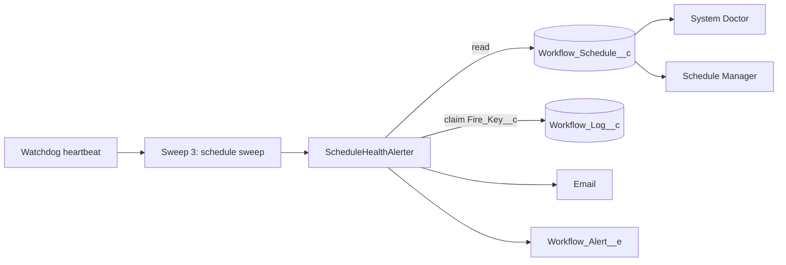

# Schedule Health

Issue #126. A 0-slot schedule can stop firing, and nothing reports it. This
feature finds a schedule that did not fire in its window (**overdue**). It
also finds a schedule whose last fire failed (**last fire failed**). System
Doctor and the Schedule Manager show both. Each problem sends one alert.

## How It Works

1. **Rules.** `ScheduleHealth.assess()` does no SOQL and no DML.

   | Condition                                                           | Result                   |
   | ------------------------------------------------------------------- | ------------------------ |
   | `Enabled__c = false`                                                | `DISABLED`, not reported |
   | `Last_Outcome__c` is `Error`, `Invalid cron` or `Invalid time zone` | last fire failed         |
   | All overdue conditions below are true                               | overdue                  |

   Overdue conditions:
   - The schedule is not dedicated.
   - `Last_Fired_Window__c` is before `Next_Fire_Window__c`.
   - now − reference > one sweep interval.
   - A sweep ran at or after the reference.

   Terms:
   - Reference = the later of `Next_Fire_Window__c` and `LastModifiedDate`.
     A blank cursor uses `LastModifiedDate`. Any edit starts one new grace
     interval.
   - One sweep interval = the larger of the recorded cadence and
     `Watchdog_Delay_Minutes__c`.
   - The rule compares UTC instants. DST and zone offsets have no effect.
   - A schedule can be overdue and failed at the same time. Each flag sends
     its own alert.

2. **Last sweep.** The heartbeat uses its own time as the last sweep. A
   dashboard read uses `Last_Sweep_At__c` when the watchdog is `HEALTHY`.
   Thus a read between two sweeps shows no false overdue. When the watchdog
   is `STALE` or `UNKNOWN`, a read uses the current time.
3. **Alert.** The heartbeat runs `ScheduleHealthAlerter` after Sweep 3. It
   does not report a schedule that this sweep fired. For each new problem,
   it inserts a `Workflow_Log__c` claim row with a unique key
   (`Log_Type__c` = `ScheduleHealthAlert`). Only one transaction can insert
   a key. That transaction sends the alert.

   | Problem          | Key                                                 | `Alert_Reason__c`      |
   | ---------------- | --------------------------------------------------- | ---------------------- |
   | Overdue          | `ScheduleOverdue:<Id>:<Next_Fire_Window__c ms>`     | `Schedule Overdue`     |
   | Last fire failed | `ScheduleFailed:<Id>:<outcome>:<last good fire ms>` | `Schedule Fire Failed` |
   - Last good fire = the newest `Started`, `Skipped` or `Deduped` scheduled fire log
     of the schedule (`ScheduleFire` or `ScheduleDedicatedFire`). A manual
     **Run Now** does not end a failure streak. No log gives `0`.
   - A missed window keeps its key until the window fires. It sends one
     alert.
   - A failure streak keeps its key until a good fire. It sends one alert.
   - A new missed window, a good fire followed by a new failure, or a
     different failure outcome gives a new key.
   - If no channel sends the alert, the alerter deletes the claim and
     upserts an attempt row (`Log_Type__c` = `ScheduleHealthAlertAttempt`,
     key + `:attempt`). The next sweep tries again.
   - Order for the cap: alerts never tried go first, then the oldest
     attempt. Thus an alert whose channel fails cannot block the alerts
     after it.

4. **Dashboard.** System Doctor shows a **Schedule Health** panel. It shows
   the counts and one row for each unhealthy schedule (maximum 50). A row
   has an **Overdue** (red) badge, a **Last fire failed** (orange) badge, or
   both. When the read fails, the panel shows "Schedule health is not
   available". The Schedule Manager shows a **Health** column. Its list is
   cached, so click **Refresh** to calculate it again.
5. **Audit.** The claim row has `Schedule__c`. Thus **View Logs** in the
   Schedule Manager shows each alert (`Outcome__c` = `Overdue` or
   `Fire failed`).

## Configure

- Alerts are off by default. Create a `Workflow_Alert_Config__mdt` record
  named for the schedule's workflow (the same `DeveloperName` convention as
  failure alerts), or use `Default`. Set `Enable_Alerts__c`. Set
  `Email_Recipients__c`, `Publish_Alert_Event__c`, or both.
- The failure thresholds (`Consecutive_Failures_Limit__c`,
  `Failure_Count_Limit__c`) do not apply to schedule alerts.
- An org with an enabled `Default` config gets schedule alerts after you
  deploy this feature.

## Cost

- Heartbeat, all schedules healthy: 1 query. No DML.
- When an unhealthy schedule with an alert config exists: 1 more query on
  each sweep. A failed schedule adds 1 aggregate query. When a candidate
  page is full (200 rows), the alerter reads the next page, to a maximum of
  5 pages (1,000 rows).
- For each new problem: 1 claim insert, 1 email invocation for each
  recipient list, 1 event publish, and 1 delete plus 1 attempt upsert when
  no channel sends the alert.
- The alerter keeps 10 DML statements and 10 queries free. It sends a
  maximum of 10 alerts in each sweep. The next sweep sends the rest.
- Each event has its own publish result. A partial publish failure releases
  only the claims of the events that failed.
- No new scheduled job, custom object or field.

## Limits

- The heartbeat runs the check. When the watchdog is dead, the check does
  not run. The watchdog stall alert (#113) covers that case. System Doctor
  still shows the overdue schedules.
- After a watchdog outage, the sweep fires only the latest window of each
  schedule. The alerter does not report the windows that the outage
  skipped.
- Dedicated schedules get only the failed check. Their `CronTrigger` uses
  the time zone of the user who armed it, not `Time_Zone__c`. The manager
  shows "Dedicated (not armed)" for a dedicated schedule without a job.
- When more than 50 schedules are due at the same time, some fire late.
  The alerter can report them as overdue.
- The alerter reads a maximum of 1,000 unhealthy candidates in each sweep.
  System Doctor reads the first 200.
- A fix saved in the UI does not clear `Last_Outcome__c`. The schedule
  shows "Last fire failed" until its next fire.
- If cleanup deletes a claim row while the problem stays, the problem sends
  a second alert.
- Detection time: the first sweep after the window plus one interval.
  Thus the alert comes a maximum of one sweep interval (plus the queue
  delay) after the window counts as missed.
- The alert does not fire a missed window again.
