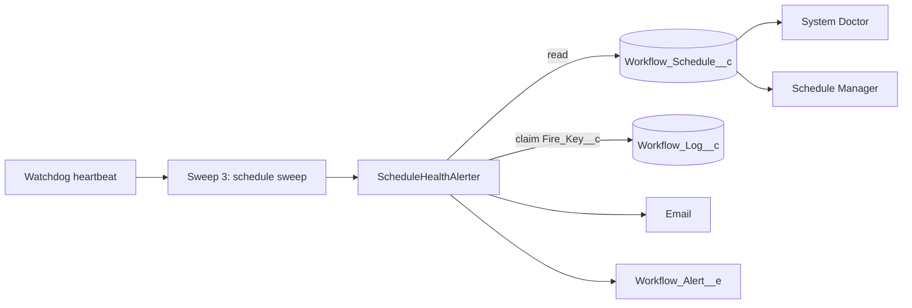

# Schedule Health

Issue #126. A 0-slot schedule can stop firing and nothing reports it. This
feature finds a schedule that did not fire in its window (**overdue**) and a
schedule whose last fire failed (**last fire failed**). It shows both on the
dashboard. It sends one alert for each problem.

## How It Works

1. **Rules.** `ScheduleHealth.assess()` does no SOQL and no DML.

   | Condition                                                               | Result              |
   | ----------------------------------------------------------------------- | ------------------- |
   | `Enabled__c = false`                                                    | `PAUSED`, no report |
   | `Last_Outcome__c` is `Error`, `Invalid cron` or `Invalid time zone`     | last fire failed    |
   | Not dedicated, now − reference > one sweep interval, window not handled | overdue             |
   - Reference = the later of `Next_Fire_Window__c` and `LastModifiedDate`.
     A blank cursor uses `LastModifiedDate`. Thus a schedule enabled outside
     the UI gets one interval of grace.
   - "Window not handled" = `Last_Fired_Window__c` is before
     `Next_Fire_Window__c`.
   - One sweep interval = the larger of the recorded and the configured
     `Watchdog_Delay_Minutes__c`.
   - The rule compares UTC instants. DST and zone offsets have no effect.
   - A schedule can be overdue and failed at the same time. Each flag gives
     its own alert.

2. **Alert.** The heartbeat runs `ScheduleHealthAlerter` after Sweep 3. A
   schedule that this sweep fired is not reported. For each new problem, the
   alerter inserts a `Workflow_Log__c` row (`Log_Type__c =
ScheduleHealthAlert`) with a unique key. Only one transaction can insert
   the key. That transaction sends the alert.

   | Problem          | Key                                                       | `Alert_Reason__c`      |
   | ---------------- | --------------------------------------------------------- | ---------------------- |
   | Overdue          | `ScheduleOverdue:<Id>:<Next_Fire_Window__c ms>`           | `Schedule Overdue`     |
   | Last fire failed | `ScheduleFailed:<Id>:<outcome>:<Last_Fired_Window__c ms>` | `Schedule Fire Failed` |

   A problem that stays keeps its key, so it sends no second alert. A new
   missed window or a new failed fire has a new key. If no channel sends the
   alert, the alerter deletes the claim, and the next sweep tries again.

3. **Dashboard.** System Doctor shows a **Schedule Health** panel: counts,
   and one row for each problem with an **Overdue** (red) or **Last fire
   failed** (orange) badge. The Schedule Manager shows a **Health** column.
   Each read calculates the state.
4. **Audit.** The claim row has `Schedule__c`, so **View Logs** in the
   Schedule Manager shows each alert (`Outcome__c = Overdue` or `Fire
failed`).

## Configure

- Alerts are off by default. Create a `Workflow_Alert_Config__mdt` record
  named for the schedule's workflow (the same `DeveloperName` convention as
  failure alerts), or use `Default`. Set `Enable_Alerts__c`. Set
  `Email_Recipients__c`, `Publish_Alert_Event__c`, or both.
- The failure thresholds (`Consecutive_Failures_Limit__c`,
  `Failure_Count_Limit__c`) do not apply to schedule alerts.
- An org that has an enabled `Default` config gets schedule alerts after
  this deploy.

## Cost

- Heartbeat: 1 SOQL query when all schedules are healthy. No DML.
- For new problems: 1 more query, 1 insert, 1 email invocation for each
  recipient list, 1 event publish, and 1 delete when a channel fails.
- The alerter keeps 10 DML statements and 10 queries free. It sends at most
  10 alerts for each sweep. The next sweep sends the rest.
- No new scheduled job, custom object or field.

## Limits

- The heartbeat runs the check. When the watchdog is dead, the check does
  not run. The watchdog stall alert (#113) covers that case. System Doctor
  still shows overdue schedules.
- Dedicated schedules are not checked for overdue. Their `CronTrigger` uses
  the time zone of the user who armed it, not `Time_Zone__c`. Their failed
  fires are reported.
- A backlog of more than 50 due schedules can make true overdue reports.
- If cleanup deletes a claim row while the problem stays, the problem sends
  a second alert.
- The alert does not refire a missed window.
