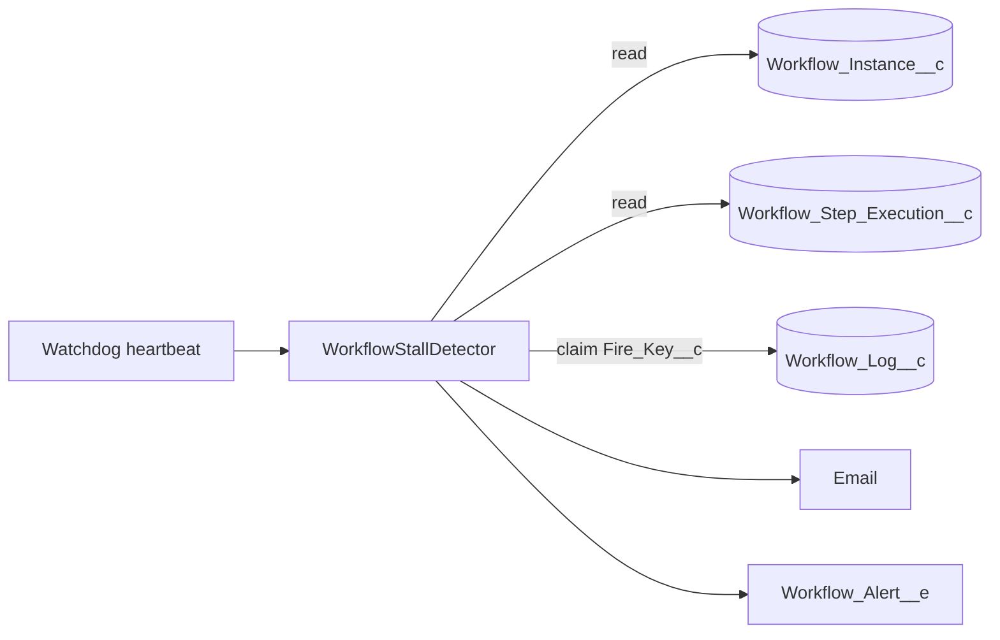

# Stall Alerts

Issue #139. An instance can stop and stay non-terminal: a child that never
reports, a lost signal, a lost approval, or a sleep whose job did not run.
Failure alerts do not find this. This feature sends one alert when an
instance makes no progress for longer than a threshold that you set.

## How It Works

1. **Where.** The watchdog heartbeat runs the detector (step 7 of
   `WorkflowHeartbeatService`). There is no new scheduled job. The detector
   does not touch the Queueable chain.
2. **Progress clock.** The clock is the `CreatedDate` of the newest
   `Workflow_Step_Execution__c` row. If there is no step, the clock is the
   instance `CreatedDate`. If `Sleep_Until__c` is in the past and is later
   than the clock, the clock is `Sleep_Until__c`.
3. **Stall.** All of these are true:
   - `Status__c` is `Pending`, `Running`, `Suspended`, `Compensating`,
     `Cancelling` or `DefinitionChanged`.
   - A `Suspended` instance has no future `Sleep_Until__c`. A future value
     is an engine timer, not a stall.
   - The definition is not paused. It is not an engine workflow.
   - now − clock ≥ `Stall_Threshold_Minutes__c`.
4. **Claim.** The detector inserts one `Workflow_Log__c` row
   (`Log_Type__c = WorkflowStallAlert`) with the unique key
   `Stall:<instanceId>:<clockMillis>`. If the insert fails because another
   sweep has the key, this sweep does not send.
   A new step gives a new clock, so a new stall can alert again.
5. **Send.** One email for each stall to `Email_Recipients__c`. It shows
   the definition, instance, correlation key, status, current step and idle
   time. If `Publish_Alert_Event__c` is set, the detector also publishes a
   `Workflow_Alert__e` with `Alert_Reason__c = Stall`.
6. **Release.** If a channel is set but nothing sends, the detector deletes
   the claim. The next sweep tries again. With no channel, the row stays as
   the only record of the stall.

## Configure

Set `Stall_Threshold_Minutes__c` on a `Workflow_Alert_Config__mdt` record.

| Record found for the workflow             | Result                                    |
| ----------------------------------------- | ----------------------------------------- |
| Name match, alerts on, threshold > 0      | Uses this threshold                       |
| Name match, alerts off or threshold blank | No stall alert. `Default` does not apply. |
| No name match, `Default` has a threshold  | Uses the `Default` threshold              |
| No record has a threshold                 | The detector does no query and no DML     |

The name match uses the failure-alert rule: the workflow name with each
non-alphanumeric character changed to `_`. The match ignores case.

## Limits

- One query reads at most 1000 idle instances. An anti-join drops each
  instance with a step newer than the smallest threshold. The most recently
  changed instances come first. The detector does 1 query, or 2 when the
  pause cache is not loaded.
- The query uses the smallest threshold for all definitions. More than 1000
  idle instances that are below their own threshold, or that already have an
  alert, can delay the check of other instances.
- One sweep sends at most 25 alerts. The next sweep sends the rest.
- One email call for each sweep. The detector keeps one email call,
  `WatchdogLiveness.DML_RESERVE` DML statements and queries, and 5000 query
  rows free. With no budget, it sends nothing and the next sweep tries again.
- Before the claim, the detector checks the daily email limit
  (`Messaging.reserveSingleEmailCapacity`). With no capacity, it claims
  nothing and logs one error.
- The detector writes only `Workflow_Log__c` rows. It never writes step
  rows or `Terminal_At__c`.

## Not Included

- `Held` and `Paused`. An operator parked these.
- `CompensationFailed`. A failure alert covers it.
- A force fail or a cancel (issue #95).
- Business hours (issue #118). The threshold is wall-clock minutes.
- Slack or webhook channels. Use `Workflow_Alert__e`.

See [ADR 0013](adr/0013-stall-alert.md).
