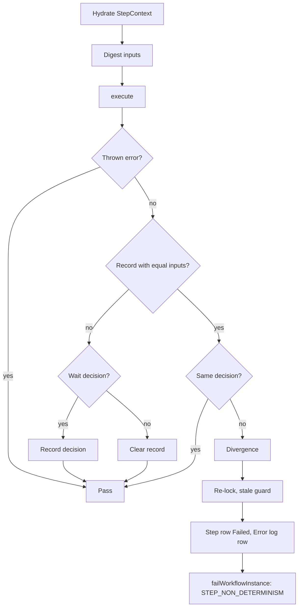

# Strict Determinism Mode

Issue #102. The engine can find a step that makes a different routing decision when it runs again with the same inputs. It fails the instance before it writes that decision. Use this mode in development and staging.

## Why a step runs again

The engine runs `execute()` again on the same step row after each wait:

- `SUSPEND`, `WAIT_FOR_APPROVAL`, `START_CHILD` and `START_CHILDREN` run the step again when it wakes. A duplicate delivery, an operator resume or a reclaim also wakes it.
- `SLEEP`, `YIELD` and `RETRY` run the step again later.

Each run must make the same decision from the same inputs. When a step reads data that changes, and does not wrap the value in `once()`, the new run can route to another step. The history and the compensation stack then do not agree with the work that the step did.

## Replay-safe operations

| Operation in `execute()` | Replay-safe? | What to do |
|--------------------------|--------------|------------|
| Read `ctx.workflowInputJson`, `ctx.inputJson`, `ctx.previousStepOutput` | Yes | - |
| Read `ctx.attempt` | Yes | - |
| Read `ctx.stepStateJson` | Yes | Do not use it to skip a wait. Repeat the wait until a new input arrives. |
| Read signals, approvals, child outcomes (`ctx.signals()`) | Yes | - |
| Read a value from `ctx.captures().once(...)` | Yes | - |
| `Datetime.now()`, `Date.today()`, `System.now()` | No | Wrap in `once()`. |
| `Crypto` random values, generated ids or UUIDs | No | Wrap in `once()`. |
| SOQL on records that other processes change | No | Wrap the value in `once()`, or send a signal. |
| A callout response that routes the step | No | Wrap the result in `once()`. |
| A branch on user, org or custom setting data that can change | No | Wrap in `once()`. |

A value in `once()` does not change between runs. Thus, a decision that uses it does not change.

A waiting step must repeat the same wait until a new signal, approval or child outcome arrives. The examples in `examples/` obey this rule.

## Turn on the mode

Set `Revenant_Config__mdt.Strict_Determinism__c` to checked on the **Default** record. The default is off.

When the mode is off, the engine does no work for it: no SOQL, no DML.

When the mode is on, each step run costs one aggregate SOQL on `Workflow_Signal__c`.

## What the engine records

The engine records a wait decision in `Workflow_Step_Execution__c.Decision_Record__c`. The wait handler saves the row, so the record costs no extra DML.

The record holds:

| Key | Value |
|-----|-------|
| `v` | Format version (`1`). |
| `inputs` | SHA-256 digest of the step inputs before the run. |
| `decisionHash` | SHA-256 digest of the full decision text. |
| `decision` | The decision text. Max 255 characters. |

The step inputs are:

- Step input and previous step output.
- `ctx.attempt`.
- The timeout-resume flag.
- The signals of the instance: status, count and newest `CreatedDate` for each status. Signals carry approvals and child outcomes.

Captures and step state are not inputs. A `once()` value is stable by contract. The engine writes wait state from the recorded decision.

The decision text holds routing data only:

| Action | Decision text |
|--------|---------------|
| `COMPLETE` | Next step and the compensation flag. |
| `SPLIT` | Sorted target steps. |
| `SUSPEND` | Timeout step. |
| `WAIT_FOR_APPROVAL` | Key, role and timeout step. |
| `START_CHILD` | Child workflow and key. |
| `START_CHILDREN` | Sorted child workflows and keys. |
| Other actions | The action name. |

Payloads, step state and durations are not routing.

## What the engine checks



A new signal, approval or child outcome changes the inputs. The step can then make a new decision.

## What a divergence does

1. It sets the step row to `Failed`. `Error_Details__c` shows the recorded and the new decision.
2. It writes an Error `Workflow_Log__c` row with `Log_Type__c` = `StepNonDeterminism`.
3. It fails the instance through the normal failure path:
   - No compensation stack: `Failed`, with `Failure_Category__c` = `STEP_NON_DETERMINISM`.
   - A compensation stack: LIFO rollback.
   - An `ErrorRoutingWorkflow`: the error step. `StepError.errorMessage` starts with `Step non-determinism: `.

The divergent decision writes no new step row and no compensation push. The engine does not publish the step's buffered events. Claimed signals go back to `Received`.

Query the log rows to find all divergences, also the ones that error routing or compensation handled:

```sql
SELECT Workflow_Instance__c, Message__c, CreatedDate
FROM Workflow_Log__c
WHERE Log_Type__c = 'StepNonDeterminism'
```

## Operator retry

A retry clears `Decision_Record__c`. The step then makes a fresh decision. Correct the step code before you retry.

## Limits

- The engine compares only when the inputs are equal. A step that reads changed data after a new signal is not found.
- The engine does not check side effects that do not change routing.
- The engine does not check `compensate()`.
- A thrown error is not a decision. Auto-retry handles it.
