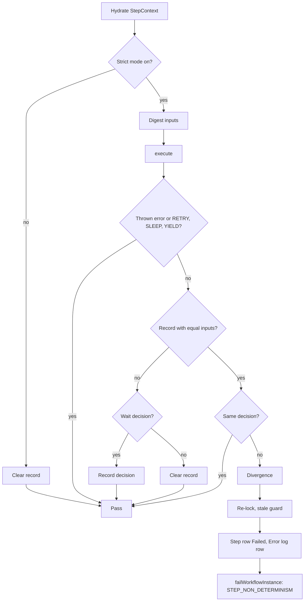

# Strict Determinism Mode

Issue #102. The engine can find a step that makes a different routing decision when it runs again with the same inputs. It fails the instance before the decision is written. Use this mode in development and staging. To find replay-unsafe calls before deploy, use the [determinism lint](determinism-lint.md).

## Why a step runs again

The engine runs `execute()` again on the same step row after these results:

- `SUSPEND`, `WAIT_FOR_APPROVAL`, `START_CHILD` and `START_CHILDREN`. A signal, an approval, a child outcome or a resume wakes the step. A duplicate delivery, an operator resume or a reclaim also wakes it, with no new input.
- `SLEEP`, `YIELD` and `RETRY`. The engine runs the step again later.

Each run must make the same decision from the same inputs. A step can read data that changes, without `once()`. The next run can then route to another step. The history and the compensation stack then do not agree with the work that the step did.

## Replay-safe operations

| Operation in `execute()` | Replay-safe? | What to do |
|--------------------------|--------------|------------|
| Read `ctx.workflowInputJson`, `ctx.inputJson`, `ctx.previousStepOutput` | Yes | - |
| Read `ctx.stepStateJson` (also a resume payload) | Yes | - |
| Read `ctx.attempt`, `ctx.isFinalAttempt()`, `ctx.idempotencyKey` | Yes | - |
| Read signals, approvals, child outcomes (`ctx.signals()`) | Yes | - |
| Read a value from `ctx.captures().once(...)` | Yes | - |
| `ctx.shouldYield()` | No | Return `YIELD` only. Do not use it to select a wait. |
| `ctx.isCancellationRequested()` | No | Return early only. The engine drops the result. |
| `Datetime.now()`, `Date.today()`, `System.now()` | No | Wrap in `once()`. |
| `Crypto` random values, generated ids or UUIDs | No | Wrap in `once()`. |
| SOQL on records that other processes change | No | Wrap the value in `once()`. Or make the other process send a signal. |
| SOQL on child `Workflow_Instance__c` status | No | Use `ctx.signals().getChildOutcomes(...)`. |
| A callout response that routes the step | No | Wrap the result in `once()`. |
| A branch on user, org or custom setting data that can change | No | Wrap in `once()`. |

A value in `once()` does not change between runs. Thus, a decision that uses it does not change.

A waiting step must repeat the same wait until a new input arrives.

## Turn on the mode

On the **Default** record of `Revenant_Config__mdt`, select the `Strict_Determinism__c` check box. The default is off.

The Default record is in the source. A deploy of the source sets the mode to off again. Set it again after each deploy.

In an Apex test, set `WorkflowEngine.strictDeterminism = true`.

## Cost

When the mode is off, the engine does no SOQL and no extra DML statement for it. It clears an old record in the step row save that occurs anyway.

When the mode is on, each step run costs:

- Two SOQL queries (three over 20 live signals): the live signals, and the child statuses (one aggregate row for each status).
- One query row for each live signal (`Received` or `Processing`). Max 21 rows. Over 20, one more `COUNT()` query.
- The heap holds the stored name and payload of the first 20 live signals. A payload has max 131,072 characters, so the heap cost is bounded.
- Up to two more queries for an offloaded step input, previous output or step state: the file links, and the checksums. The engine does not load the file content.
- Before it reports a divergence, the engine reads the inputs again. This repeats all the queries above.
- One SHA-256 digest of the stored inputs.

## What the engine records

The engine records a wait decision in `Workflow_Step_Execution__c.Decision_Record__c`. The wait handler saves the row, so the record costs no extra DML.

| Key | Value |
|-----|-------|
| `v` | Format version (`1`). |
| `inputs` | SHA-256 digest of the step inputs before the run. |
| `decisionHash` | SHA-256 digest of the full decision text. |
| `decision` | The decision text. Max 255 characters. |

The step inputs are:

- The stored step input, previous output and step state. A resume payload is step state. The digest holds no decoded payload.
  - For an offloaded value, the digest holds the checksum of the file. A new marker with equal file content is an equal input.
  - The engine reads a checksum only for a file that is linked to the instance.
  - A file with no checksum keeps the marker text.
- `ctx.attempt` and the timeout-resume flag.
- The live signals of the instance (`Received` or `Processing`): Id, status, stored name and stored payload. Signals carry approvals and child outcomes. An edit of a live signal is a new input.
- Each value is a typed JSON value. Thus a null value and the text `null` are different inputs.
- The count of child instances for each status.

Captures are not inputs. A `once()` value is stable by contract.

A wait can write new step state. The next run then has new inputs, and the engine records again. After such a wait, the engine compares from the second duplicate run.

The decision text holds routing data only. Each value is JSON.

| Action | Decision text |
|--------|---------------|
| `COMPLETE` | Next step hint and the compensation flag. |
| `SPLIT` | Sorted target steps. |
| `SUSPEND` | Timeout step. |
| `WAIT_FOR_APPROVAL` | Key, role and timeout step. |
| `START_CHILD` | Child workflow and key. |
| `START_CHILDREN` | Sorted child workflows and keys. |
| `FAIL`, `CONTINUE_AS_NEW` | The action name. |

The decision text does not include payloads, step state or durations. The engine records only wait decisions. The text of other decisions shows in the error message.

`RETRY`, `SLEEP` and `YIELD` are not decisions. The engine keeps the record and compares the next decision. `RETRY` increases the attempt, so the next run has new inputs. A thrown error is not a decision.

## What the engine checks



## What a divergence does

1. The engine sets the step row to `Failed`. `Error_Details__c` shows the recorded and the new decision.
2. The engine writes an Error `Workflow_Log__c` row with `Log_Type__c` = `StepNonDeterminism`.
3. The engine fails the instance through the normal failure path:
   - No compensation stack: `Failed`, with `Failure_Category__c` = `STEP_NON_DETERMINISM`.
   - A compensation stack: LIFO rollback. The category stays blank.
   - An `ErrorRoutingWorkflow`: the error step. `StepError.errorMessage` starts with `Step non-determinism: `.

The engine does not write a new step row. It does not push the step onto the compensation stack. It does not publish the buffered step events. Claimed signals go back to `Received`. Other observed signals stay `Received`.

To find all divergences, query the log rows. The query also finds divergences that error routing or compensation handled:

```sql
SELECT Workflow_Instance__c, Message__c, CreatedDate
FROM Workflow_Log__c
WHERE Log_Type__c = 'StepNonDeterminism'
```

## When the engine clears a record

- An operator retry, and a re-drive of a parallel branch.
- A release of a `DefinitionChanged` instance.
- A step run while the mode is off.

Correct the step code before you retry. A deploy of changed step code can change the decision of a waiting step. Turn the mode off until the waiting instances move on.

## Limits

- The engine compares only when the inputs are equal. The engine does not compare a run that follows a new input.
- The engine does not check side effects that do not change routing.
- The engine does not check `compensate()`.
- With a payload codec, each wait that writes step state writes new stored state. The engine then compares less often.
- An approval, child or timed wait writes step state. The first duplicate run after it has new inputs. The engine compares from the second duplicate run.
- Over 20 live signals, the engine digests the first 20 (by Id) and the total count. An edit of a newer signal does not change the digest.
- A compensated or error-routed divergence keeps a blank `Failure_Category__c`. Use the log query above.
- An input can arrive during the run. Before it reports a divergence, the engine reads the inputs again. It does not report when an input that the step read changed.
  - The step read a live signal when it matched the signal, looked up its name, or read the full list.
  - A change to another live signal does not stop the report. The step cannot see that signal.
  - A change to the step state, the children or the count over the signal cap always stops the report.
  - Over 20 live signals, an edit of a read signal beyond the first 20 does not change the digest. The engine can then report a legal route change.
