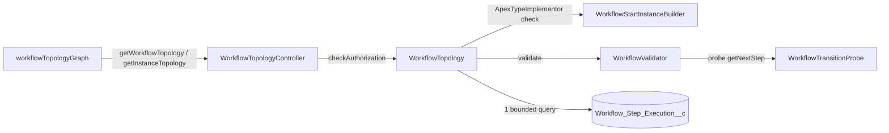

# Workflow Topology Graph

Issue #141. The dashboard shows the step graph of a workflow definition.
For an instance, the graph also shows the path of the run, the current step
and its state. You do not read `getNextStep` source and you do not run the
workflow.

## Where To Find It

- **Instance detail:** open an instance. The **Workflow Graph** section is
  above **DAG Execution Path**. A summary at the top gives the current step,
  the state, the awaited signal and the possible next steps.
- **Catalog:** click **Graph** on a definition. No run is necessary. Use it
  to find routing bugs before you deploy.

## How It Works



1. **Gate.** The graph accepts only a deployed workflow definition. It reads
   `ApexTypeImplementor` before it makes an instance of the class.
2. **Nodes.** One node for each step in `getSteps()`, in declared order.
3. **Edges.** `WorkflowValidator` runs its transition probe. It calls
   `getNextStep` with two `COMPLETE` results for each step (and each version
   of a `VersionedWorkflow`). Each successor that it returns is an edge. The
   validator keeps these edges on its result.
4. **Overlay.** For an instance, one query reads the newest 200 step rows.
   The path shows them oldest first. A `<step>_Compensate` row shows as a
   rollback of its step.

## What The Graph Shows

| Mark                   | Meaning                                                    |
| ---------------------- | ---------------------------------------------------------- |
| **Start** (blue)       | The initial step.                                          |
| **Can end** (green)    | `getNextStep` returned no successor for a probe.           |
| **Rollback**           | The step implements `CompensatableStep`.                   |
| **?** (orange, dots)   | `getNextStep` threw for a probe. Its routes are not known. |
| Dashed border          | No known route goes from the initial step to this step.    |
| **Not declared** (red) | A route or the run goes to a step that `getSteps()` omits. |
| Thick border           | The current step. The color gives the state.               |
| Blue edge              | A known edge that this run used.                           |

States: Running, Suspended awaiting a signal, Suspended waiting on a timer,
Failed, Rollback in progress, Parked, Ended.

## Best-Effort Routing

`getNextStep` can use step output. The probe does not have that output.
Thus the graph can miss routes. The graph never shows a missing route as
"no path":

- A step where `getNextStep` threw shows **?**, not **Can end**.
- When the graph knows that it misses routes, it shows the notice
  **Routing is not fully known statically**, with the reasons:
  - `ROUTING_THREW`: `getNextStep` threw for a probe.
  - `UNREACHED_STEPS`: a declared step has no known route to it.
  - `UNDECLARED_STEPS`: a route or the run goes to an undeclared step.
  - `VERSIONS_UNRESOLVED`: `getLatestVersion()` threw.
  - `DEFINITION_UNRESOLVED`: the name is not a deployed definition, or
    `getSteps()` gave no step.
- Each graph also shows: "Edges come from a best-effort probe".
- The overlay adds no edge from the order of the step rows. Parallel
  branches (`SPLIT`) put their rows in one sequence, so such an edge can be
  false. A known edge that the run used shows in blue.

To make more routes visible, fail closed: throw on an unknown value instead
of a default route. The graph then shows **?** for that step. See
[BranchingOrderWorkflowExample](../examples/main/default/classes/BranchingOrderWorkflowExample.cls).

## The Awaited Signal

For a signal wait, the summary and the current node show the awaited
signal, for example `Approve:OrderReview`. The value is the #84 descriptor
that the instance detail already reads. A timed approval has a timer, but
its descriptor still shows it as a signal wait.

## Apex API

```apex
WorkflowTopology.Graph g = WorkflowTopology.build('OrderWorkflow');
WorkflowTopology.Graph run = WorkflowTopology.forInstance(instanceId);
```

The DTO shape is pinned by `WorkflowTopologyTest.dtoShapeIsPinned`:

- `Graph`: `workflowName`, `initialStep`, `nodes`, `edges`,
  `routingFullyKnown`, `incompleteReasons`, `defects`, `overlay`.
- `Node`: `name`, `label`, `declared`, `initial`, `terminal`,
  `compensatable`, `routingUnknown`, `reachable`.
- `Edge`: `source`, `target`.
- `Overlay`: `instanceId`, `instanceStatus`, `currentStep`, `currentState`,
  `path`, `traversedEdges`, `nextSteps`, `pathTruncated`.
- `PathEntry`: `stepName`, `status`, `compensation`.

`WorkflowTopology` does no authorization check. The LWC endpoints are on
`WorkflowTopologyController`. They use the dashboard view gate.
`Revenant_Operator` and `Revenant_Admin` give access to the controller.

## Contract

- **Read-only.** No DML, no Platform Event, no job. It does not change
  `Compensation_Stack__c`. A test checks this.
- **Bounded.** The graph costs 1 SOQL (the type check, cached) plus the
  probe: 2 `getNextStep` calls for each step and version. The overlay adds
  2 SOQL: the instance and 1 step query with `LIMIT 201`. The cost does not
  grow with the step history.
- **No schema.** No new object, field, event or metadata type.

## Limits

- The validator makes an instance of each step class. Keep step and
  definition constructors free of side effects. The engine has the same rule.
- The graph shows the union of the routes of all versions.
- The graph is static. Refresh the instance to see a new position.
