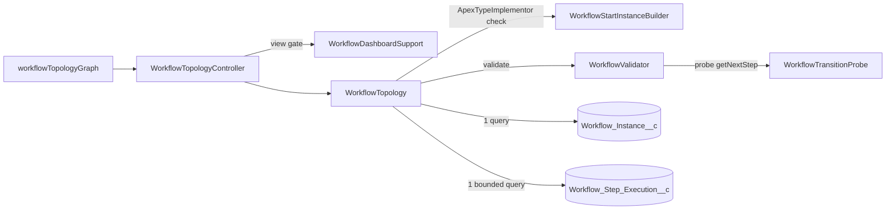

# Workflow Topology Graph

Issue #141. The dashboard shows the step graph of a workflow definition.
For an instance, the graph also shows the path of the run, the current step
and its state. It is not necessary to read `getNextStep` or to run the
workflow.

## Where To Find It

- **Instance detail:** open an instance. The **Workflow Graph** section is
  above **DAG Execution Path**. A summary at the top gives the current step,
  the state, the awaited signal and the possible next steps. The graph reads
  again each time the detail refreshes.
- **Catalog:** click **Graph** on a definition. A run is not necessary. Use
  the graph to find routing bugs before you deploy.

## Try It

1. Deploy the `examples` package.
2. Run `sf apex run --file scripts/apex/seed-branching-orders.apex`. It
   starts three runs of `BranchingOrderWorkflowExample` (three decision
   points).
3. Open the `review` run. The summary shows `ManualReviewStep`, the state
   "Suspended, awaiting a signal" and the signal `Approve:OrderReview`.

## How It Works



1. **Gate.** The graph accepts only a deployed, concrete workflow
   definition. It reads `ApexTypeImplementor` before it makes an instance
   of the class.
2. **Nodes.** One node for each step in `getSteps()`, in declared order.
3. **Edges.** `WorkflowValidator` runs its transition probe. The probe calls
   `getNextStep` with two `COMPLETE` results for each step. For a
   `VersionedWorkflow`, it also does this for each of the newest 50
   versions. Each successor that it gets is an edge. The validator keeps
   these edges on its result.
4. **Overlay.** For an instance, one query reads the newest 200 step rows.
   The path shows them oldest first. A `<step>_Compensate` row shows as a
   rollback of its step, unless `getSteps()` declares that name.

## What The Graph Shows

| Mark                      | Meaning                                                       |
| ------------------------- | ------------------------------------------------------------- |
| **Start** (blue border)   | The initial step.                                             |
| **End** (green border)    | `getNextStep` gave no successor for a probe. The run can end. |
| **Rollback** (pink fill)  | The step implements `CompensatableStep`.                      |
| **?** (orange dots)       | The routes of the step are not fully known.                   |
| Dashed border             | No known route goes from the initial step to this step.       |
| **Undeclared** (red dash) | A route or the run goes to a step that `getSteps()` omits.    |
| **▶** line, thick border  | The current step. The line gives the state as text.           |
| Blue fill                 | The run visited the step.                                     |

States: Running, Suspended awaiting a signal, Suspended until a timer or a
job ends, Failed, Rollback runs, Parked, Ended.

## Best-Effort Routing

`getNextStep` can use step output. The probe does not have step output, so
the graph can miss routes. The graph does not show a missing route as
"no path":

- A step gets **?** when `getNextStep` throws for a probe, or when the two
  probes give different successors. A step with **?** shows **End** only
  when a probe also gave no successor.
- When the graph finds a gap, `gapsFound` is true. The graph then shows
  the notice **Routing is not fully known statically**, with each reason:
  - `ROUTING_THREW`: `getNextStep` threw for a probe.
  - `ROUTING_VARIES`: `getNextStep` gave different successors for the
    probes.
  - `UNREACHED_STEPS`: a declared step has no known route to it.
  - `UNDECLARED_STEPS`: a route or the run goes to an undeclared step.
  - `VERSIONS_UNRESOLVED`: `getLatestVersion()` threw.
  - `VERSIONS_CAPPED`: the probe did not read the versions older than the
    newest 50.
  - `DEFINITION_UNRESOLVED`: the name is not a deployed definition, or
    `getSteps()` gave no step.
- `gapsFound = false` does not prove that the graph is complete. Each graph
  shows: "Edges come from a best-effort probe of getNextStep. A missing edge
  does not prove that no route exists."
- The overlay does not mark an edge as used by the run. The step rows have
  no branch data. Parallel branches (`SPLIT`) mix their rows, so two
  adjacent rows do not prove a transition. The numbered path and the visited
  steps show the run.

To mark a data-dependent step, make `getNextStep` throw for an unknown
value. Do not return a default route. The graph then shows **?** for that
step. See
[BranchingOrderWorkflowExample](../examples/main/default/classes/BranchingOrderWorkflowExample.cls).

## The Current Step

- **SPLIT:** `currentSteps` has one entry for each branch.
- **Rollback:** a rollback runs (`Compensating`, `Cancelling`) or is
  parked (the newest row is a compensation row). The step of the newest
  compensation row is current. The graph shows no next step.
- **End:** the graph shows no next step.
- **Signal wait:** the summary and the current node show the awaited
  signal, for example `Approve:OrderReview`. The value is the #84
  descriptor that the instance detail reads. A timed approval has a
  descriptor and a timer. The graph shows it as a signal wait.

## Apex API

`WorkflowTopology` is `public`, not `global`. A subscriber org uses the
dashboard. Code in this package can call:

```apex
WorkflowTopology.Graph g = WorkflowTopology.build('OrderWorkflow');
WorkflowTopology.Graph run = WorkflowTopology.forInstance(instanceId);
```

The DTO shape is pinned by `WorkflowTopologyTest.dtoShapeIsPinned`:

- `Graph`: `workflowName`, `initialStep`, `nodes`, `edges`, `gapsFound`,
  `incompleteReasons`, `defects`, `overlay`.
- `Node`: `name`, `label`, `declared`, `initial`, `terminal`,
  `compensatable`, `routingUnknown`, `reachable`.
- `Edge`: `source`, `target`.
- `Overlay`: `instanceId`, `instanceStatus`, `currentSteps`,
  `currentState`, `path`, `nextSteps`, `pathTruncated`.
- `PathEntry`: `stepName`, `status`, `compensation`.

`WorkflowTopology` does no authorization check. The LWC endpoints are on
`WorkflowTopologyController`. They use the dashboard view gate.
`Revenant_Operator` and `Revenant_Admin` give access to the controller. If
you give dashboard access with a custom permission set or a profile, also
give access to this class.

## Contract

- **Read-only.** The engine code does no DML, publishes no Platform Event
  and enqueues no job. It does not change `Compensation_Stack__c`. A test
  checks this. Both endpoints are cacheable, so the platform also stops DML
  from author code in `getSteps()`, `getNextStep` and the constructors. The
  LWC sends a new cache key on each instance read to get the live position.
- **Bounded.** The graph uses 1 SOQL for the type check in each
  transaction. The probe makes 2 `getNextStep` calls for each step, plus 2
  for each step and version (50 versions maximum). The overlay adds 2 SOQL:
  the instance, and 1 step query with `LIMIT 201`. The cost does not grow
  with the step history.
- **No schema.** No new object, field, event or metadata type.

## Limits

- The validator makes an instance of each step class. Keep step and
  definition constructors free of side effects. The engine has the same
  rule.
- The graph shows the union of the routes of the probed versions.
- The graph does not update itself. It reads again when the instance
  detail refreshes.
