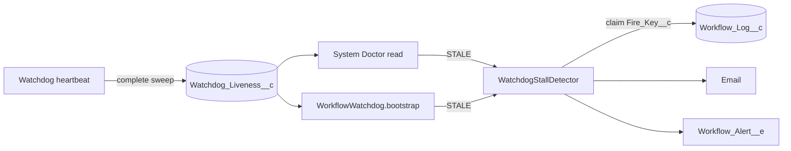

# Watchdog Liveness

Issue #113. The watchdog runs timeouts, sleep resumes, schedules, deadlines
and orphan reclaim. When it stops, all of these stop. This feature shows when
the watchdog stops. It also sends one alert for each stall.

## How It Works

1. **Stamp.** At the end of each complete sweep, the heartbeat writes
   `Last_Sweep_At__c` and `Cadence_Minutes__c` to the org-default row of the
   `Watchdog_Liveness__c` hierarchy custom setting. A sweep that throws does
   not write. The heartbeat does not write when fewer than 11 DML statements
   are free. The write does not throw.
2. **State.** Each read calculates the state. No record keeps it.

   | Condition                                | State     |
   | ---------------------------------------- | --------- |
   | No sweep recorded                        | `UNKNOWN` |
   | Minutes since the last sweep ≤ threshold | `HEALTHY` |
   | Minutes since the last sweep > threshold | `STALE`   |

   Threshold = 2 × the larger of the recorded cadence and
   `Watchdog_Delay_Minutes__c`. This prevents a false alert after an admin
   increases the cadence.

3. **Dashboard.** System Doctor shows the state, the last sweep time and the
   minutes since it. Each read calculates the state, so a dead watchdog shows
   red. When the watchdog record is active but the state is `STALE`, the panel
   tells the operator to cancel the watchdog instance and click **Enqueue
   Watchdog**.
4. **Alert.** `WorkflowWatchdog.bootstrap()` and each System Doctor read run
   the stall detector. When the state is `STALE`, the detector inserts a
   `Workflow_Log__c` row (`Log_Type__c = WatchdogStallAlert`) with the unique
   key `WatchdogStall:<last sweep ms>`. Only one transaction can insert this
   row. That transaction sends the email and the `Workflow_Alert__e` event
   (`Alert_Reason__c = 'Watchdog Stall'`). Then it writes
   `Last_Alert_Sweep_At__c`. If no channel sends the alert, the detector
   deletes the row, and a later call tries again.
5. **Recovery.** The next complete sweep writes a new time. The state changes
   to `HEALTHY`. A new stall has a new key and sends a new alert.

## Configure

- Alerts are off by default. To enable them, create a
  `Workflow_Alert_Config__mdt` record named `WatchdogWorkflow` (or use
  `Default`). Set `Enable_Alerts__c`. Set `Email_Recipients__c`,
  `Publish_Alert_Event__c`, or both.
- `bootstrap()` runs on each orchestrator enqueue (start, step handoff,
  signal, resume), on pause and resume, and on the **Enqueue Watchdog**
  button. In an org with no traffic, the alert comes only when an operator
  opens System Doctor. To get the alert without traffic, schedule the
  existing `WorkflowWatchdog` class (for example, each hour).
- Use a cadence of 2 minutes or more. At 1 minute, the threshold is 2
  minutes. A slow async queue can then cause a false alert.

## Cost

- Heartbeat: one DML statement after all other work. No SOQL.
- `bootstrap()` (also on the orchestrator chain): one custom-setting read.
  When `HEALTHY`, `UNKNOWN`, or `STALE` with the alert sent: 0 SOQL and 0 DML.
- First detection of a stall: up to 4 DML statements, one email invocation
  and one event. The detector keeps 10 DML statements free for the caller.

## Limits

- `UNKNOWN` sends no alert. An org that has not run a sweep since the deploy
  shows `UNKNOWN`.
- A cancelled watchdog restarts on the next `bootstrap()`. It does not become
  `STALE`, so it sends no alert.
- The detector uses the sender of the current transaction. Automated Process
  transactions need a sender address in Process Automation Settings.
- If cleanup deletes the claim row before the next sweep, the same stall can
  send a second alert.
- The dashboard state changes only when you load System Doctor again.
