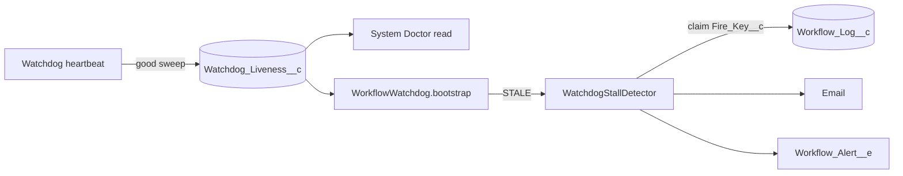

# Watchdog Liveness

Issue #113. The watchdog runs timeouts, sleep resumes, schedules, deadlines
and orphan reclaim. When it stops, all of these stop. This feature shows when
the watchdog stops and sends one alert.

## How It Works

1. **Stamp.** At the end of each good sweep, the heartbeat writes
   `Last_Sweep_At__c` and `Cadence_Minutes__c` to the org-default row of the
   `Watchdog_Liveness__c` hierarchy custom setting. A failed sweep does not
   write. The write skips when the DML budget is low. It never throws.
2. **State.** Readers compute the state. The engine does not store it.

   | Condition                                | State     |
   | ---------------------------------------- | --------- |
   | No sweep recorded                        | `UNKNOWN` |
   | Minutes since the last sweep ≤ threshold | `HEALTHY` |
   | Minutes since the last sweep > threshold | `STALE`   |

   Threshold = 2 × the larger of the recorded cadence and
   `Watchdog_Delay_Minutes__c`. Thus a longer cadence does not give a false
   alert.

3. **Dashboard.** System Doctor shows the state, the last sweep time and the
   minutes since it. The read computes the state, so a dead watchdog shows red.
4. **Alert.** `WorkflowWatchdog.bootstrap()` runs the stall detector. It does
   not run in the watchdog chain. When the state is `STALE`, the detector
   inserts a `Workflow_Log__c` row (`Log_Type__c = WatchdogStallAlert`) with
   the unique key `WatchdogStall:<last sweep ms>`. Only the transaction that
   inserts the row sends the email and the `Workflow_Alert__e` event
   (`Alert_Reason__c = 'Watchdog Stall'`). Thus one stall gives one alert.
5. **Recovery.** The next good sweep writes a new time. The state goes back to
   `HEALTHY`. A new stall has a new key and gives a new alert.

## Configure

- Alerts are opt-in. Create a `Workflow_Alert_Config__mdt` record named
  `WatchdogWorkflow` (or use `Default`). Set `Enable_Alerts__c` and
  `Email_Recipients__c` or `Publish_Alert_Event__c`.
- `bootstrap()` runs on start, signal, resume, pause and the **Enqueue
  Watchdog** button. An org with no traffic can schedule the existing
  `WorkflowWatchdog` class (for example, each hour). This also restarts a
  dead watchdog.

## Cost

- Heartbeat: one DML statement after all other work. No new SOQL.
- `bootstrap()`: one custom-setting read (0 SOQL). DML only for a new stall.
- Orchestrator chain: no change.

## Limits

- `UNKNOWN` gives no alert. An org that has not run a sweep since the deploy
  shows `UNKNOWN`.
- If a cleanup job deletes the claim row while the watchdog stays dead, the
  same stall can alert again.
- The dashboard state changes only when you load System Doctor again.
