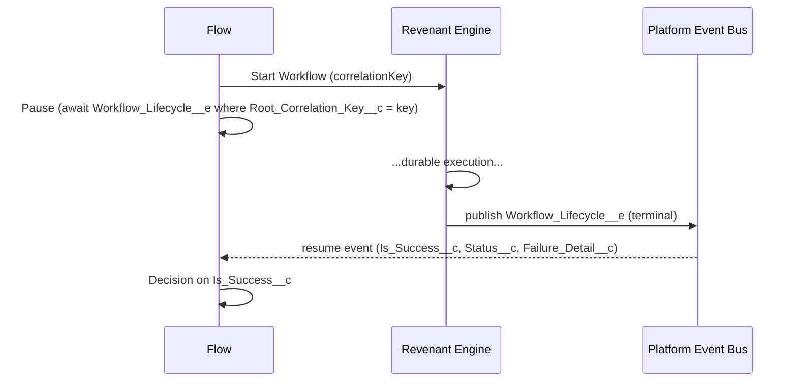

# Outbound `Workflow_Lifecycle__e` Platform Event

Revenant publishes a **`Workflow_Lifecycle__e`** platform event each time a workflow
instance reaches a terminal state. This is the outbound counterpart to the inbound
`Workflow_Event__e` the engine already consumes: instead of polling
`Workflow_Instance__c.Status__c`, Flows and external integrators can **react
event-driven** the instant a workflow finishes.

## When it fires

Exactly one event is published when an instance transitions to an **emitting
terminal state**:

| Terminal status | `Is_Success__c` | `Failure_Detail__c`            |
| --------------- | --------------- | ------------------------------ |
| `Completed`     | `true`          | _(blank)_                      |
| `Failed`        | `false`         | from `Error_Message__c`        |
| `Compensated`   | `false`         | from `Error_Message__c`        |
| `Cancelled`     | `false`         | from `Error_Message__c`        |

`ContinuedAsNew` is **not** an emitting state. A continue-as-new chain therefore
emits **exactly one** event — on the final successor's terminal transition — and
**zero** spurious events on its predecessors. The event's `Workflow_Instance_Id__c`
references the final successor; its `Correlation_Key__c` is the chain's resolved
current key.

## Event payload (metadata, not the full output)

| Field                      | Type     | Meaning                                                                            |
| -------------------------- | -------- | --------------------------------------------------------------------------------- |
| `Workflow_Instance_Id__c`  | Text(18) | Id of the terminal instance (final successor for a chain).                        |
| `Correlation_Key__c`       | Text     | The terminal instance's own correlation key (rewritten per continue-as-new run).  |
| `Root_Correlation_Key__c`  | Text     | Stable key of the chain's first instance; equals `Correlation_Key__c` if no chain.|
| `Workflow_Name__c`         | Text     | Apex `WorkflowDefinition` type name.                                               |
| `Status__c`                | Text     | Terminal status (one of the four above).                                          |
| `Is_Success__c`            | Checkbox | `true` only for `Completed`.                                                       |
| `Terminal_At__c`           | DateTime | Timestamp of the terminal transition (dedupe discriminator — see below).          |
| `Failure_Detail__c`        | Text     | Failure message for non-success outcomes; blank otherwise.                         |

The **full output payload is intentionally not in the event** — platform-event
field-size limits make shipping large/offloaded payloads in-event wrong. Read the
output from `Workflow_Instance__c.Output__c` once you have the instance Id — but see
the rehydration note below: large outputs are offloaded and the raw field holds only
a marker.

### Reading the output (large/offloaded payloads)

When an output exceeds ~100k characters the engine offloads it to `ContentVersion`
and leaves a marker (`{"$attachmentId":...}`) in `Workflow_Instance__c.Output__c`.
Only Apex paths that call `WorkflowPayloadOffload.resolvePayload()` (and the dashboard
helpers) rehydrate the real body. **A Flow/API subscriber that reads `Output__c`
directly will get the marker, not the JSON**, for those runs. To read output
reliably, route through a rehydrating Apex invocable / the #9 read action, or look up
the linked `ContentVersion` — do not bind a Flow directly to the raw `Output__c` field
when outputs can be large.

## At-least-once delivery — subscribers must be idempotent

Platform Event delivery is **at-least-once**, so a subscriber may observe a
redelivery. Dedupe on **`Workflow_Instance_Id__c` + `Status__c` + `Terminal_At__c`**.
The `Terminal_At__c` discriminator matters because a terminal transition is **not**
necessarily once-per-instance: a `Failed` instance resurrected with
`retryWorkflow()` that fails again emits a second, legitimate `Failed` event with the
same instance Id and status — only `Terminal_At__c` distinguishes it from a redelivery
of the first. (Record the triple and no-op if already seen.)

## Operator toggle

Emission is controlled by **`Revenant_Config__mdt.Publish_Lifecycle_Events__c`**
on the `Default` record (checked by default). Uncheck it to suppress the event and
avoid its publishing-allocation cost. Disabling has **no effect** on instance
status, the append-only audit trail, compensation, the `RUN_STEP` chain, or
`WorkflowAlertManager` email alerting — the lifecycle event is purely additive.

## Failure isolation

Publishing is fire-and-forget: the event uses **`PublishAfterCommit`**, so a
rolled-back terminal write produces no event, and a failed `EventBus.publish` is
logged and swallowed — it never rolls back the terminal-state write, never fails
the instance, and never breaks the `RUN_STEP` Queueable chain handoff.

---

## Reference recipe: resume a Flow when a workflow completes

This is the closed loop that polling could never deliver: start a durable workflow,
**Pause** the Flow, and resume the instant that instance reaches a terminal state.

### 1. Start the workflow

In an **autolaunched** (or screen) Flow, add an **Action** element calling the
`WorkflowStartInvocableAction` (Apex action **"Start Revenant Workflow"**):

- **Workflow Name** → your `WorkflowDefinition` type, e.g. `Acme.OnboardingWorkflow`
- **Correlation Key** → a unique key you control, e.g. `{!$Record.Id}` or a generated GUID
- **Input** → the JSON input payload

Store the **Correlation Key** in a Flow variable, e.g. `varCorrelationKey` (you will
match the resume event on it).

### 2. Pause until the lifecycle event arrives

Add a **Pause** element. Configure its **resume event**:

- **Platform Event** → `Workflow Lifecycle` (`Workflow_Lifecycle__e`)
- **Condition (event matching)** → `Root_Correlation_Key__c` **Equals** `{!varCorrelationKey}`
  - Match on **`Root_Correlation_Key__c`**, not `Correlation_Key__c`. For a workflow
    that uses **continue-as-new**, the engine rewrites the successor's
    `Correlation_Key__c` (e.g. `myKey_run2`, `myKey_run3`), and only the final
    successor's terminal transition emits an event. `Root_Correlation_Key__c` carries
    the original start key unchanged across the whole chain, so the Flow that launched
    on `myKey` still matches. (For workflows that never continue-as-new the two keys
    are identical, so this also works for the simple case.)
  - Matching on `Workflow_Instance_Id__c` does **not** work for continue-as-new chains:
    the start action returns the first instance's Id, but the event references the final
    successor's Id.
- Map the resumed event into Flow record variable `evtLifecycle` so its fields are
  available after the Pause.

### 3. Branch on the outcome

After the Pause, add a **Decision**:

- **Succeeded** → `{!evtLifecycle.Is_Success__c}` is `true`
- **Failed / Cancelled / Compensated** → otherwise; surface
  `{!evtLifecycle.Failure_Detail__c}` to the user or route for remediation.

If you need the workflow's **output**, read it via a rehydrating path keyed off
`{!evtLifecycle.Workflow_Instance_Id__c}` (see "Reading the output" above) — a raw
**Get Records** on `Workflow_Instance__c.Output__c` returns the offload marker, not the
JSON, whenever the output was large enough to be offloaded to `ContentVersion`.

### Closed-loop diagram

### Success metric

An **API / CometD subscriber** receives the event within **p95 < 5s** of the
workflow reaching a terminal state. A **paused Flow interview** resumes
asynchronously — Salesforce batches paused-interview resumes on a
platform-controlled schedule, so end-to-end latency for that path is
typically seconds-to-minutes rather than sub-second, and is not directly
controllable. Either way, both replace a scheduled polling Flow that lags by
its full schedule interval and mis-reports offloaded / continue-as-new outcomes.

## Out of scope (by design)

- **Full output payload in the event body** — carry identity + outcome metadata only.
- **Outbound HTTP / external callouts** — the engine publishes the event; calling an
  external system is the subscriber's job.
- **Non-terminal lifecycle events** (`step started`, `suspended`, `retrying`) and
  per-step events — the per-step timeline remains the dashboard's job.
- **Changes to `WorkflowAlertManager`** — the lifecycle event sits alongside email
  alerting, not replacing it.
