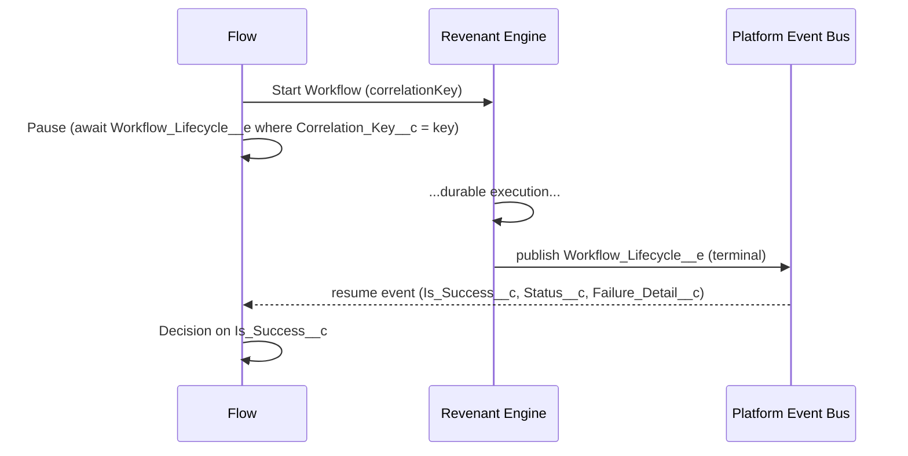

# Outbound `Workflow_Lifecycle__e` Platform Event

Revenant publishes a **`Workflow_Lifecycle__e`** platform event each time a workflow
instance reaches a terminal state. This is the outbound counterpart to the inbound
`Workflow_Event__e` the engine already consumes: instead of polling
`Workflow_Instance__c.Status__c`, Flows and external integrators can **react
event-driven** the instant a workflow finishes.

## When it fires

Exactly one event is published when an instance transitions to an **emitting
terminal state**:

| Terminal status | `Is_Success__c` | `Failure_Detail__c`            |
| --------------- | --------------- | ------------------------------ |
| `Completed`     | `true`          | _(blank)_                      |
| `Failed`        | `false`         | from `Error_Message__c`        |
| `Compensated`   | `false`         | from `Error_Message__c`        |
| `Cancelled`     | `false`         | from `Error_Message__c`        |

`ContinuedAsNew` is **not** an emitting state. A continue-as-new chain therefore
emits **exactly one** event — on the final successor's terminal transition — and
**zero** spurious events on its predecessors. The event's `Workflow_Instance_Id__c`
references the final successor; its `Correlation_Key__c` is the chain's resolved
current key.

## Event payload (metadata, not the full output)

| Field                     | Type     | Meaning                                                     |
| ------------------------- | -------- | ---------------------------------------------------------- |
| `Workflow_Instance_Id__c` | Text(18) | Id of the terminal instance (final successor for a chain). |
| `Correlation_Key__c`      | Text     | External correlation key (may be blank).                   |
| `Workflow_Name__c`        | Text     | Apex `WorkflowDefinition` type name.                       |
| `Status__c`               | Text     | Terminal status (one of the four above).                   |
| `Is_Success__c`           | Checkbox | `true` only for `Completed`.                               |
| `Failure_Detail__c`       | Text     | Failure message for non-success outcomes; blank otherwise. |

The **full output payload is intentionally not in the event** — platform-event
field-size limits make shipping large/offloaded payloads in-event wrong. Read the
output from `Workflow_Instance__c.Output__c` (the engine transparently rehydrates
offloaded `ContentVersion` payloads) once you have the instance Id.

## At-least-once delivery — subscribers must be idempotent

Platform Event delivery is **at-least-once**, so a subscriber may observe a
redelivery. The event carries stable identity — `Workflow_Instance_Id__c` +
`Status__c` — so an idempotent subscriber can safely ignore duplicates (e.g. record
the `(instanceId, status)` pair and no-op if already seen).

## Operator toggle

Emission is controlled by **`Revenant_Config__mdt.Publish_Lifecycle_Events__c`**
on the `Default` record (checked by default). Uncheck it to suppress the event and
avoid its publishing-allocation cost. Disabling has **no effect** on instance
status, the append-only audit trail, compensation, the `RUN_STEP` chain, or
`WorkflowAlertManager` email alerting — the lifecycle event is purely additive.

## Failure isolation

Publishing is fire-and-forget: the event uses **`PublishAfterCommit`**, so a
rolled-back terminal write produces no event, and a failed `EventBus.publish` is
logged and swallowed — it never rolls back the terminal-state write, never fails
the instance, and never breaks the `RUN_STEP` Queueable chain handoff.

---

## Reference recipe: resume a Flow when a workflow completes

This is the closed loop that polling could never deliver: start a durable workflow,
**Pause** the Flow, and resume the instant that instance reaches a terminal state.

### 1. Start the workflow

In an **autolaunched** (or screen) Flow, add an **Action** element calling the
`WorkflowStartInvocableAction` (Apex action **"Start Revenant Workflow"**):

- **Workflow Name** → your `WorkflowDefinition` type, e.g. `Acme.OnboardingWorkflow`
- **Correlation Key** → a unique key you control, e.g. `{!$Record.Id}` or a generated GUID
- **Input** → the JSON input payload

Store the **Correlation Key** in a Flow variable, e.g. `varCorrelationKey` (you will
match the resume event on it).

### 2. Pause until the lifecycle event arrives

Add a **Pause** element. Configure its **resume event**:

- **Platform Event** → `Workflow Lifecycle` (`Workflow_Lifecycle__e`)
- **Condition (event matching)** → `Correlation_Key__c` **Equals** `{!varCorrelationKey}`
  - (If you prefer to match on the instance Id, capture the Id returned by the start
    action into a variable and match `Workflow_Instance_Id__c` instead. For a
    `ContinuedAsNew` chain, match on `Correlation_Key__c` — the event references the
    chain's resolved current key.)
- Map the resumed event into Flow record variable `evtLifecycle` so its fields are
  available after the Pause.

### 3. Branch on the outcome

After the Pause, add a **Decision**:

- **Succeeded** → `{!evtLifecycle.Is_Success__c}` is `true`
- **Failed / Cancelled / Compensated** → otherwise; surface
  `{!evtLifecycle.Failure_Detail__c}` to the user or route for remediation.

If you need the workflow's **output**, use a **Get Records** on `Workflow_Instance__c`
filtered by `Id = {!evtLifecycle.Workflow_Instance_Id__c}` and read `Output__c`.

### Closed-loop diagram

### Success metric

A Flow that Pauses on `Workflow_Lifecycle__e` resumes within **p95 < 5s** of the
target workflow reaching a terminal state, for **100%** of runs — replacing a
scheduled polling Flow that lags by its schedule interval and mis-reports
offloaded / continue-as-new outcomes.

## Out of scope (by design)

- **Full output payload in the event body** — carry identity + outcome metadata only.
- **Outbound HTTP / external callouts** — the engine publishes the event; calling an
  external system is the subscriber's job.
- **Non-terminal lifecycle events** (`step started`, `suspended`, `retrying`) and
  per-step events — the per-step timeline remains the dashboard's job.
- **Changes to `WorkflowAlertManager`** — the lifecycle event sits alongside email
  alerting, not replacing it.
