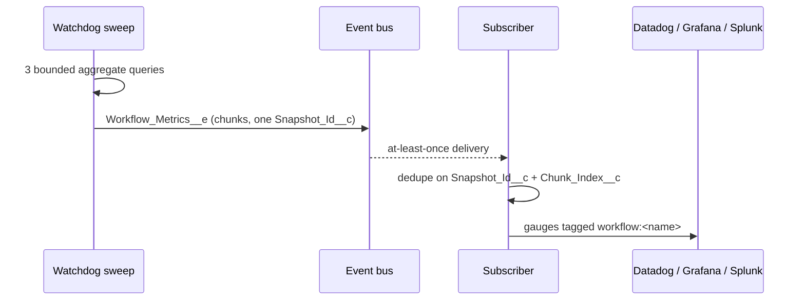

# Engine-Health Metrics Event (`Workflow_Metrics__e`)

Revenant can send an engine-health snapshot on each watchdog sweep. Your
pipeline (CometD, Pub/Sub API, MuleSoft) reads the event and sends the counts
to Datadog, Grafana or Splunk. You do not need SOQL pollers on engine fields.

This page is the **supported, stable contract**. Bind to the fields and the
JSON keys on this page. Do not bind to `Workflow_Instance__c` field names.
They are engine internals and can change.

## Turn it on

1. Open **Setup → Custom Metadata Types → Revenant Config → Default**.
2. Select **Publish Metrics Events** (`Publish_Metrics_Events__c`). Default:
   off.
3. Subscribe to `/event/Workflow_Metrics__e`.

The first snapshot comes on the next sweep. Latency is max one watchdog
cadence (`Watchdog_Delay_Minutes__c`, default 10 minutes).

## Cost

| Item                  | Off | On                                           |
| --------------------- | --- | -------------------------------------------- |
| Scheduled-job slots   | 0   | 0 (the snapshot runs in the watchdog sweep)  |
| SOQL for each sweep   | 0   | max 3, for all fleet sizes                   |
| Query rows            | 0   | one for each group, plus max 10,000 for ages |
| DML for each sweep    | 0   | 1 statement, one row for each chunk          |
| Events for each sweep | 0   | one for each chunk (usually 1)               |

The snapshot keeps 10 SOQL statements, 5,000 query rows and 11 DML statements
free for the sweep. When the budget is too low, it skips the snapshot.

## Event fields (schema version 1)

| Field               | Type      | Meaning                                                                  |
| ------------------- | --------- | ------------------------------------------------------------------------ |
| `Snapshot_Id__c`    | Text(36)  | UUID. All chunks of one snapshot have the same value.                    |
| `Snapshot_At__c`    | DateTime  | Snapshot time. End of the window (included). Reference time for ages.    |
| `Window_Start__c`   | DateTime  | Start of the window (not included). The time of the previous sweep.      |
| `Chunk_Index__c`    | Number    | Chunk number, from 1 to `Chunk_Count__c`.                                |
| `Chunk_Count__c`    | Number    | Number of chunks in this snapshot.                                       |
| `Is_Truncated__c`   | Checkbox  | True when a cap dropped data. All chunks of the snapshot have the value. |
| `Schema_Version__c` | Number    | Contract version. Now `1`.                                               |
| `Metrics_Json__c`   | Long Text | `{"definitions":[ ... ]}`. One row for each workflow definition.         |

## Definition row (JSON keys)

| Key                      | Type          | Meaning                                                                                                                                       |
| ------------------------ | ------------- | --------------------------------------------------------------------------------------------------------------------------------------------- |
| `workflowName`           | string        | Workflow definition name.                                                                                                                     |
| `pending`                | integer       | Instances in `Pending` now.                                                                                                                   |
| `running`                | integer       | Instances in `Running` now.                                                                                                                   |
| `suspended`              | integer       | Instances in `Suspended` now (sleep, signal, child wait).                                                                                     |
| `paused`                 | integer       | Instances in `Paused` now.                                                                                                                    |
| `definitionChanged`      | integer       | Instances in `DefinitionChanged` now.                                                                                                         |
| `cancelling`             | integer       | Instances in `Cancelling` now.                                                                                                                |
| `compensating`           | integer       | Instances in `Compensating` now.                                                                                                              |
| `compensationFailed`     | integer       | Instances in `CompensationFailed` now.                                                                                                        |
| `completedInWindow`      | integer       | Instances that became `Completed` in the window.                                                                                              |
| `failedInWindow`         | integer       | Instances that became `Failed` in the window.                                                                                                 |
| `compensatedInWindow`    | integer       | Instances that became `Compensated` in the window.                                                                                            |
| `cancelledInWindow`      | integer       | Instances that became `Cancelled` in the window.                                                                                              |
| `oldestActiveAgeSeconds` | integer, null | Age of the oldest instance in one of the eight states above. Null when there is no such instance, or when the age scan cap stopped before it. |

Rules:

- A definition is in the snapshot when it has an active instance or a
  counted terminal instance in the window. The definitions are sorted by name.
- The window is `(Window_Start__c, Snapshot_At__c]`. Two windows do not
  overlap. If the previous sweep stamp is not available, the window is one
  cadence.
- `ContinuedAsNew` is a hand-off, not an outcome. The snapshot does not count
  it.
- The age is from the instance `CreatedDate`. A continue-as-new successor is
  a new instance.
- `WatchdogWorkflow` is in the snapshot. Its row shows that the watchdog runs.
- A null `workflowName` is a row with a blank definition name.

## Chunks and truncation

- One `Metrics_Json__c` value holds max 100,000 characters. A large snapshot
  uses more than one event. All chunks have the same `Snapshot_Id__c` and
  `Chunk_Count__c`. A row is never split.
- Caps: 1,999 groups for each grouped query, 10,000 rows for the age scan,
  10 chunks for each snapshot.
- When a cap drops data, each chunk has `Is_Truncated__c = true`. The engine
  also writes one `Warn` row in `Workflow_Log__c` with `Log_Type__c =
'WorkflowMetrics'`. The message tells which cap stopped the data. There is
  no silent drop.

## Delivery and failure

- Delivery is at-least-once. Dedupe on `Snapshot_Id__c` + `Chunk_Index__c`.
- A snapshot is complete when you have `Chunk_Count__c` chunks with the same
  `Snapshot_Id__c`. Gauges from each chunk are correct alone, so you can also
  send each chunk when it arrives.
- The event uses `PublishAfterCommit`. A rolled-back sweep sends no snapshot.
- Fire-and-forget: a failed snapshot never stops the sweep, the watchdog
  continue-as-new chain or a workflow. The engine writes an `Error` row in
  `Workflow_Log__c` (`Log_Type__c = 'WorkflowMetrics'`).
- A commit near the window end can come after the snapshot query. That
  instance is then not in a window count. Use the counts as gauges, not as
  an audit.

## Versions

Version 1 does not change. A new version can add JSON keys and event fields.
It does not remove or rename them. `WorkflowMetricsSnapshot.parse()` ignores
unknown keys. Check `Schema_Version__c` before you use a new key.

## Reference subscriber (Apex)

`WorkflowMetricsSnapshot.parse(event)` gives typed rows. The example class
[`WorkflowMetricsDatadogShaper`](../examples/main/default/classes/WorkflowMetricsDatadogShaper.cls)
shapes one chunk into a Datadog v2 series body (one gauge for each key, tag
`workflow:<name>`). A platform event trigger cannot make a callout. It runs
async, so it can enqueue only one Queueable. The trigger makes one body for
all events of the batch and enqueues one job:

```apex
trigger WorkflowMetricsSubscriber on Workflow_Metrics__e(after insert) {
  String body = WorkflowMetricsDatadogShaper.toSeriesJson(Trigger.new);
  if (body != null) {
    System.enqueueJob(
      new WorkflowMetricsDatadogShaper.PushJob(
        body,
        'callout:Datadog/api/v2/series'
      )
    );
  }
}
```

Setup:

1. Deploy the `examples` package directory, or copy the shaper class.
2. Make a Named Credential `Datadog` for `https://api.datadoghq.com`. Add the
   `DD-API-KEY` header.
3. Deploy the trigger above.
4. Turn on **Publish Metrics Events**.

One body holds all series of the batch. For a large fleet, set a small batch
size with `PlatformEventSubscriberConfig`, so the body stays below the sink
size limit (Datadog: 5 MB).

## Reference subscriber (external)

An external client reads the same event with the Pub/Sub API or CometD. Use
the JSON keys above. Send each row as gauges with the tag `workflow`.



## Out of scope

- Per-step traces or spans.
- Alarm routing (see `Workflow_Alert__e`).
- Dashboard charts in Salesforce.
- A pull or REST endpoint.
- Metrics history in Salesforce. Keep history in your own time-series store.
