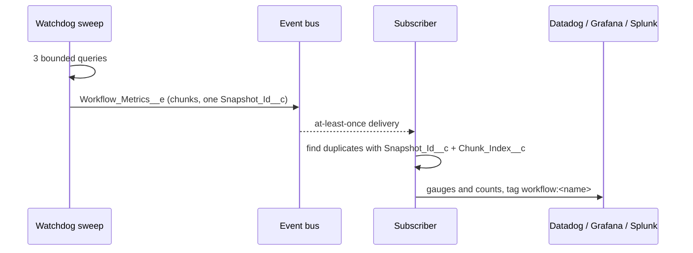

# Engine-Health Metrics Event (`Workflow_Metrics__e`)

When the toggle is on, Revenant sends an engine-health snapshot on each
watchdog sweep. Your pipeline (CometD, Pub/Sub API, MuleSoft) reads the event
and sends the counts to Datadog, Grafana or Splunk. It is not necessary to
poll engine fields with SOQL.

This page is the **supported, stable contract**. Use the fields and the JSON
keys on this page. Do not use `Workflow_Instance__c` field names. These
fields are internal to the engine. They can change.

## Turn it on

1. Open **Setup → Custom Metadata Types → Revenant Config → Default**.
2. Select **Publish Metrics Events** (`Publish_Metrics_Events__c`). Default:
   off.
3. Subscribe to `/event/Workflow_Metrics__e`. The `Revenant_Admin` and
   `Revenant_Operator` permission sets give read access.

The first snapshot comes on the next sweep. The snapshot comes not more than
one watchdog cadence later (`Watchdog_Delay_Minutes__c`, default 10 minutes).

## Cost

| Item                  | Off | On                                                                                              |
| --------------------- | --- | ----------------------------------------------------------------------------------------------- |
| Scheduled-job slots   | 0   | 0 (the snapshot runs in the watchdog sweep)                                                     |
| SOQL for each sweep   | 0   | not more than 3, for all fleet sizes                                                            |
| Query rows            | 0   | one for each group (maximum 2,000 for each grouped query), plus maximum 10,000 for the age scan |
| DML for each sweep    | 0   | 1 statement and one row for each chunk. 2 statements when the engine writes a log row.          |
| Events for each sweep | 0   | one for each chunk (usually 1)                                                                  |

Two queries are aggregate queries. The third query reads the oldest active
rows, not more than 10,000. The snapshot keeps 10 SOQL statements, 5,000
query rows, 11 DML statements and 11 DML rows free for the sweep. It does not
start when CPU time or heap is more than 50% of the limit.

If a budget is too low, the engine does not send the snapshot. It writes one
`Warn` row when the DML budget permits.

`Status__c` and `Terminal_At__c` have no index. On a table with millions of
instances, the queries can be slow. Ask Salesforce Support for custom indexes
on these two fields.

## Event fields (schema version 1)

| Field               | Type      | Required | Meaning                                                                       |
| ------------------- | --------- | -------- | ----------------------------------------------------------------------------- |
| `Snapshot_Id__c`    | Text(36)  | Yes      | UUID. All chunks of one snapshot have the same value.                         |
| `Snapshot_At__c`    | DateTime  | Yes      | Snapshot time. End of the window (included). Reference time for ages.         |
| `Window_Start__c`   | DateTime  | Yes      | Start of the window (not included). The time of the previous complete sweep.  |
| `Chunk_Index__c`    | Number    | Yes      | Chunk number, from 1 to `Chunk_Count__c`.                                     |
| `Chunk_Count__c`    | Number    | Yes      | Number of chunks in this snapshot.                                            |
| `Is_Truncated__c`   | Checkbox  | No       | True when a cap dropped data. All chunks of the snapshot have the same value. |
| `Schema_Version__c` | Number    | Yes      | Contract version. The current value is `1`.                                   |
| `Metrics_Json__c`   | Long Text | No       | `{"definitions":[ ... ]}`. One row for each workflow definition.              |

The Pub/Sub API and CometD send Number fields as doubles (for example `1.0`).

## Definition row (JSON keys)

| Key                      | Type          | Meaning                                                                                         |
| ------------------------ | ------------- | ----------------------------------------------------------------------------------------------- |
| `workflowName`           | string, null  | Workflow definition name. Null for instances that have no definition name.                      |
| `pending`                | integer       | Instances in `Pending` now.                                                                     |
| `running`                | integer       | Instances in `Running` now.                                                                     |
| `suspended`              | integer       | Instances in `Suspended` now (for example sleep, signal, child wait, throttle or breaker park). |
| `paused`                 | integer       | Instances in `Paused` now.                                                                      |
| `definitionChanged`      | integer       | Instances in `DefinitionChanged` now.                                                           |
| `cancelling`             | integer       | Instances in `Cancelling` now.                                                                  |
| `compensating`           | integer       | Instances in `Compensating` now.                                                                |
| `compensationFailed`     | integer       | Instances in `CompensationFailed` now.                                                          |
| `completedInWindow`      | integer       | Instances that became `Completed` in the window and are still `Completed`.                      |
| `failedInWindow`         | integer       | Instances that became `Failed` in the window and are still `Failed`.                            |
| `compensatedInWindow`    | integer       | Instances that became `Compensated` in the window and are still `Compensated`.                  |
| `cancelledInWindow`      | integer       | Instances that became `Cancelled` in the window and are still `Cancelled`.                      |
| `oldestActiveAgeSeconds` | integer, null | Age of the oldest instance that has one of the eight statuses above. See the rules.             |

Rules:

- A definition is in the snapshot when it has an active instance or a
  counted terminal instance in the window. The engine sorts the rows by name.
- **A definition that is not in a complete snapshot has all counts at 0.**
  Send 0 for a definition that you saw before. Then a gauge in your sink goes
  back to 0 and does not keep its last value.
- The counts show the state after the sweep work.
- `oldestActiveAgeSeconds` is null when no active instance exists. It is also
  null when the age scan stopped at its cap first. An active count more than
  0 with a null age means that the scan stopped.
- The age starts at the instance `CreatedDate`. A continue-as-new successor
  is a new instance, so its age starts again at 0.
- `ContinuedAsNew` is a hand-off, not an outcome. The snapshot does not count
  it.
- `WatchdogWorkflow` is in the snapshot. Its row shows that the watchdog runs.

## Windows

- The window is `(Window_Start__c, Snapshot_At__c]`.
  `Window_Start__c` is the previous `Watchdog_Liveness__c.Last_Sweep_At__c`.
  With no earlier stamp, the window is one cadence.
- Usually, `Window_Start__c` is equal to the `Snapshot_At__c` of the previous
  snapshot. If it is not, one of these occurred:
  - The engine did not send a snapshot (low budget). This gives a gap. The
    engine writes a `Warn` row.
  - The liveness stamp write failed. Then the next window starts at the older
    stamp and overlaps the previous window.
- The InWindow counts read the current instance row. An instance that
  became terminal in the window and then started again (for example with
  `retryWorkflow()` or `resumePastStep()`) before the snapshot is not in the
  count. For a count of each terminal transition, subscribe to
  `Workflow_Lifecycle__e`. It sends one event for each transition.
- The window length changes. Send the InWindow values as counts with an
  interval, not as gauges.
- A transaction can commit a terminal status near the window end, after the
  snapshot query. No window then counts that instance. Use the counts for
  monitoring, not for an audit.

## Chunks and truncation

- One `Metrics_Json__c` value holds not more than 100,000 characters. A large
  snapshot uses more than one event. All chunks have the same `Snapshot_Id__c`
  and `Chunk_Count__c`. The engine does not split a row across two chunks.
- Caps: 1,999 groups for each grouped query, 10,000 rows for the age scan,
  10 chunks for each snapshot.
- A group cap can drop some statuses of one definition. That row then shows
  low counts.
- When a cap drops data, each chunk has `Is_Truncated__c = true`. The engine
  also writes one `Warn` row in `Workflow_Log__c` with
  `Log_Type__c = 'WorkflowMetrics'` when the DML budget permits. The message
  identifies the cap.

## Delivery and failure

- Delivery is at-least-once. To find duplicates, compare `Snapshot_Id__c` and
  `Chunk_Index__c`.
- A snapshot is complete when you have `Chunk_Count__c` chunks with the same
  `Snapshot_Id__c`. If a chunk does not arrive within one cadence, use the
  chunks that you have. The values in one chunk are correct without the other
  chunks. You can send each chunk when it arrives.
- The event uses `PublishAfterCommit`. A rolled-back sweep sends no snapshot.
- Fire-and-forget: a failed snapshot does not stop the sweep, the watchdog
  continue-as-new chain or a workflow. The engine writes an `Error` row in
  `Workflow_Log__c` (`Log_Type__c = 'WorkflowMetrics'`).

## Versions

- Version 1 does not change.
- The engine increments `Schema_Version__c` when it adds a key or a field, or
  when it changes the meaning of one. A new version does not remove or rename
  a key or a field.
- Accept a higher version. Ignore the keys that you do not know.
  `WorkflowMetricsSnapshot.parse()` ignores unknown keys.

## Reference subscriber (Apex)

`WorkflowMetricsSnapshot.parse(event)` gives typed rows. The example class
[`WorkflowMetricsDatadogShaper`](../examples/main/default/classes/WorkflowMetricsDatadogShaper.cls)
changes chunks into one Datadog v2 series body:

- Status counts and the age are gauges with the tag `workflow:<name>`
  (`workflow:unnamed` for a blank name).
- InWindow values are counts with `interval` = window length in seconds.
- `revenant.snapshot.truncated` (0 or 1) comes once for each snapshot, also
  for an empty fleet. Put a "no data" monitor on it to find a stopped
  watchdog.
- There is no snapshot id tag. A new tag value on each sweep makes high
  cardinality. Datadog keeps one value for the same series and timestamp, so
  a duplicate delivery does no harm.

A platform event trigger cannot make a callout. It runs asynchronously, so
it can enqueue only one Queueable. The trigger makes one body for all events
of the batch and enqueues one job:

```apex
trigger WorkflowMetricsSubscriber on Workflow_Metrics__e(after insert) {
  String body = WorkflowMetricsDatadogShaper.toSeriesJson(Trigger.new);
  if (body != null) {
    System.enqueueJob(
      new WorkflowMetricsDatadogShaper.PushJob(
        body,
        'callout:Datadog/api/v2/series'
      )
    );
  }
}
```

Setup:

1. Deploy the `examples` package directory, or copy the shaper class.
2. Make a Named Credential `Datadog` for `https://api.datadoghq.com`. Add the
   `DD-API-KEY` header.
3. Deploy the trigger above.
4. Add a `PlatformEventSubscriberConfig` for the trigger. Set a running user
   that has access to the Named Credential. Set a batch size of 10 or less.
   Then one body stays below the Datadog limit of 5 MB.
5. Turn on **Publish Metrics Events**.

## Reference subscriber (external)

An external client reads the same event with the Pub/Sub API or CometD. Use
the JSON keys above. Send each row with the tag `workflow`.



## Success metric

- Latency: not more than one watchdog cadence (default 10 minutes).
- 0 new scheduled-job slots.
- Not more than 3 SOQL for each sweep, for all fleet sizes.

## Out of scope

- Per-step traces or spans.
- Alarm routing (see `Workflow_Alert__e`).
- Dashboard charts in Salesforce.
- A pull or REST endpoint.
- Metrics history in Salesforce. Keep history in your own time-series store.
